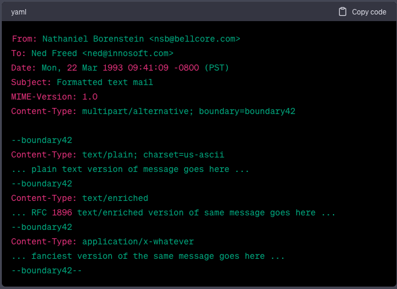
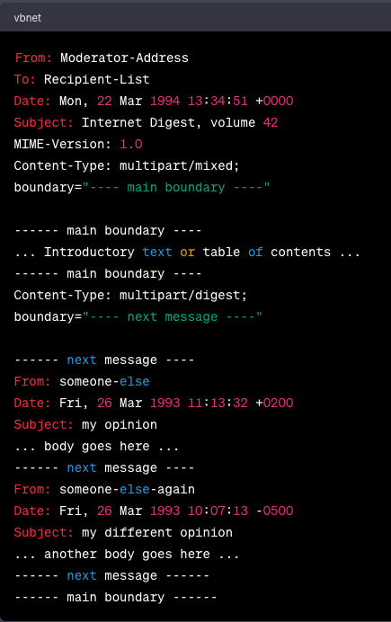

### 5. Composite Media Type Values
Composite media types refer to content types that consist of multiple parts or entities. These types of entities are handled using MIME (Multipurpose Internet Mail Extensions) mechanisms, which provide a standard for encoding and transmitting non-textual data over the internet.

The MIME processor is responsible for handling the body of composite entities. It can parse the different parts of the entity and process them accordingly. The two remaining initial Content-Type values that refer to composite entities are:

1. Multipart/mixed: This content type is used when different types of data are combined or "mixed" together in a single message. Each part of the message is separate and independent, and they are typically displayed in the order they appear. For example, an email with both text and attached files would use the multipart/mixed content type.
    
2. Multipart/alternative: This content type is used when there are multiple representations of the same content, but in different formats or encodings. Each part represents an alternative version of the content, such as plain text, HTML, or rich text format. The recipient can choose the format that best suits their capabilities. Email clients often use the multipart/alternative content type to display emails in the appropriate format based on the recipient's preferences.
    

In both cases, the MIME processor handles the parsing and interpretation of the multipart content, allowing for the combination of different parts or alternatives within a single entity.

### 5.1. Multipart Media Type
In the case of multipart entities, which combine multiple sets of data in a single body, a "multipart" media type field must be present in the entity's header. The body of the entity then contains one or more body parts, each preceded by a boundary delimiter line, and the last one followed by a closing boundary delimiter line.

Each body part in a multipart entity consists of a header area, a blank line, and a body area. The syntax of a body part is similar to an RFC 822 message, but it should not be interpreted as an actual RFC 822 message. Body parts may or may not have header fields, and if a body part starts with a blank line, it is assumed to have default values. If a Content-Type header is absent, the corresponding body is typically assumed to have a content-type of "text/plain; charset=US-ASCII".

The only header fields that have defined meaning for body parts are those starting with "Content-". Other header fields may be ignored or discarded by gateways. While other fields are permitted in body parts, they should not be relied upon. Experimental or private purposes may use "X-" fields, but it should be recognized that the information they contain may be lost at some gateways.

It is important to distinguish between an RFC 822 message and a body part. Gateways and systems that handle both types must be able to differentiate between them. For example, if a body part contains an encapsulated message with its own content-type, it must be specified with "Content-Type: message/rfc822". This distinction allows for the conversion of messages to body parts and vice versa.

Each body part is preceded by a boundary delimiter line that contains the boundary delimiter. The boundary delimiter must not appear inside any of the encapsulated parts. It is crucial for the composing agent to choose a unique boundary parameter value that does not contain the boundary parameter value of an enclosing multipart as a prefix.

All subtypes of the "multipart" type must adhere to the same syntax. While subtypes may differ in their semantics and impose additional restrictions, they must conform to the required syntax for the "multipart" type. This ensures that conformant user agents can recognize and separate the parts of any multipart entity, even if they encounter an unrecognized subtype.

According to the definition of the Content-Transfer-Encoding field, only "7bit", "8bit", or "binary" encoding is allowed for entities of type "multipart". The "multipart" boundary delimiters and header fields are always represented in 7bit US-ASCII, and data within the body parts can be encoded on a part-by-part basis using Content-Transfer-Encoding fields for each appropriate body part.

### 5.1.1. Common Syntax
This section describes the common syntax for subtypes of "multipart" in MIME (Multipurpose Internet Mail Extensions). It explains the use of boundary delimiters and provides examples of multipart messages.

Key points from the section are:

1. The Content-Type field for multipart entities requires a parameter called "boundary." The boundary delimiter line consists of two hyphen characters followed by the boundary parameter value, optional whitespace, and a terminating CRLF (carriage return and line feed).

Example:

css

`Content-Type: multipart/mixed; boundary=gc0p4Jq0M2Yt08j34c0p`

2. The boundary delimiter must occur at the beginning of a line, following a CRLF. It can be followed by zero or more characters of linear whitespace.

Example:
`--gc0pJq0M:08jU534c0p`

3. The boundary delimiter must not appear within the encapsulated material and should be no longer than 70 characters (excluding the hyphens).
4. The last boundary delimiter line is distinguished and indicates the end of the multipart message. It has two additional hyphens after the boundary parameter value.

Example:

`--gc0pJq0M:08jU534c0p--`

5. The multipart message example illustrates two parts: one implicitly typed plain text and one explicitly typed plain text. The parts are separated by the boundary delimiter line.

Example:
```
--simple boundary
This is implicitly typed plain US-ASCII text. 
--simple boundary 
Content-type: text/plain; charset=us-ascii 
This is explicitly typed plain US-ASCII text. 
--simple boundary--
```
6. The use of nested multipart entities is allowed, and each nested entity should use a different boundary delimiter.
    
7. The boundary parameter is the only mandatory global parameter for the "multipart" media type. It should consist of 1 to 70 characters chosen from a set of robust characters and should not end with white space.
    
8. The overall structure of a multipart entity includes a preamble, boundary delimiters, body parts, a close-delimiter, and an optional epilogue.
    
9. Linear white space and comments are not allowed between elements in the defined syntax.
    

These are the main points, and the provided code examples illustrate the syntax for defining multipart messages in MIME. Reviewing the complete section will provide a comprehensive understanding of multipart syntax.

### 5.1.2. Handling Nested Messages and Multiparts
In the context of handling nested messages and multiparts, the section emphasizes the importance of correctly handling entities that are embedded within another "multipart" structure. This is particularly relevant for the "message/rfc822" subtype, which has no specific termination condition other than running out of data.

The section states that improperly truncated "multipart" entities can occur due to mail system malfunctions, where they may lack a terminating boundary marker. In such cases, MIME implementations need to handle these entities correctly, even when they are nested within another "multipart" structure.

To ensure proper handling, MIME implementations are required to recognize outer level boundary markers at any level of inner nesting. Merely checking for the next expected marker or other terminating condition is not sufficient. This ensures that even if there are missing or incomplete boundary markers, the nesting structure can still be properly interpreted and processed.

By enforcing this requirement, MIME implementations can reliably handle nested messages and multiparts, even in the presence of malformed or truncated entities.

### 5.1.3. Mixed Subtype
The "mixed" subtype of "multipart" is designed to be used when the body parts within a multipart entity are independent of each other and need to be presented in a specific order. It is a general-purpose subtype that can be used when a particular subtype is not recognized by an implementation.

In other words, if an implementation encounters a multipart subtype that it doesn't recognize, it should treat it as if it were of subtype "mixed". This ensures that even if a specific subtype is not supported or understood, the body parts can still be processed and presented in the order they appear within the multipart entity. The "mixed" subtype provides a fallback option for handling multipart entities with unrecognized subtypes.

### 5.1.4. Alternative Subtype
The "multipart/alternative" type is syntactically identical to "multipart/mixed," but it has different semantics. In "multipart/alternative," each body part represents an alternative version of the same information.

Systems should recognize that the content of the various parts is interchangeable and should choose the "best" type based on the local environment and references, sometimes even through user interaction. Similar to "multipart/mixed," the order of body parts is significant. In this case, the alternatives appear in an order of increasing faithfulness to the original content. Generally, the best choice is the last part of a type supported by the recipient system's local environment.

For example, "multipart/alternative" can be used to send a message in a fancy text format that can be easily displayed anywhere. In the given example:

Users whose mail systems understand the "application/x-whatever" format would see only the fancy version, while other users would see either the enriched or plain text version, depending on their system's capabilities.

When composing "multipart/alternative" entities, user agents should place the body parts in increasing order of preference, with the preferred format last. For fancy text, the sending user agent should put the plainest format first and the richest format last. Receiving user agents should pick and display the last format they are capable of displaying.

If one of the alternatives is itself of type "multipart" and contains unrecognized sub-parts, the user agent may choose to show that alternative, an earlier alternative, or both.

Note that from an implementor's perspective, it might seem more sensible to reverse the ordering and have the plainest alternative last. However, placing the plainest alternative first is the friendliest option when "multipart/alternative" entities are viewed using non-MIME-conformant viewers. While this approach imposes some burden on conformant MIME viewers, interoperability with older mail readers was considered more important in this case.

In some cases, user agents may recognize multiple formats and prefer to offer the user the choice of which format to view. However, it is critical that the user is not automatically shown multiple versions of the same data. Either the user should be shown the last recognized version or given the choice.

Regarding the semantics of Content-ID in "multipart/alternative," each part of the entity represents the same data, but there may be information loss when mapping between them. If the information content of the parts is not identical, it is recommended that each part has a different Content-ID value. However, if the information content is identical, such as when several parts of type "message/external-body" specify alternate ways to access the identical data, the same Content-ID field value should be used to optimize any caching mechanisms. The Content-ID values used by the parts should not be the same as the Content-ID value that describes the "multipart/alternative" as a whole, if present. One Content-ID value will refer to the "multipart/alternative" entity, while one or more other Content-ID values will refer to the parts inside it.

### 5.1.5. Digest Subtype
The "multipart/digest" subtype is used to create digests, which are collections of messages. It is syntactically the same as "multipart/mixed," but with different semantics. In a digest, the default Content-Type value for each body part is changed from "text/plain" to "message/rfc822." This change allows for a more readable digest format that is compatible with RFC 934, except for the quoting convention.

It is important to note that while it is possible to specify a Content-Type value other than "message/rfc822" for a body part in a digest, such as "text/plain" for a description of the material in the digest, it is generally discouraged. The "multipart/digest" Content-Type is specifically designed for sending collections of messages. If a "text/plain" part is required, it should be included as a separate part within a "multipart/mixed" message.

An example of a digest in this format could be structured as follows:

In this example, the digest starts with an introductory text or table of contents. Each individual message within the digest is represented as a separate part with the "multipart/digest" Content-Type. The boundary markers distinguish between the different messages. The messages themselves follow the "message/rfc822" format and contain their respective headers and bodies. The entire digest is enclosed within the "multipart/mixed" structure using the "---- main boundary ----" boundary marker.

### 5.1.6. Parallel Subtype
The "multipart/parallel" subtype is a variation of the "multipart/mixed" Content-Type. While the syntax remains the same, the semantics differ. In a parallel entity, the order of the body parts is not significant. This means that all the parts can be displayed simultaneously on hardware and software capable of doing so.

The intention behind a parallel entity is to present all the parts together, allowing recipients to view them simultaneously. However, it's important to note that not all mail readers have the capability to display parts in parallel. In such cases, the parts will be shown serially, one after the other.

Composing agents, which are responsible for creating the multipart message, should consider that some mail readers may not support parallel display and may only show the parts sequentially. Therefore, it's essential to structure the content in a way that maintains coherence and readability even if the parallel presentation is not possible.

### 5.1.7. Other Multipart Subtypes
In addition to the defined subtypes of "multipart" such as "mixed," "alternative," "digest," and "parallel," there may be other subtypes introduced in the future. When MIME implementations encounter an unrecognized subtype of "multipart," they should treat it as if it were "multipart/mixed."

This means that if a MIME implementation comes across a "multipart" subtype that it does not recognize, it should handle it as a mixed multipart, treating each body part as independent and bundled in a particular order.

By default, treating unrecognized subtypes as "multipart/mixed" ensures that MIME implementations can still process and handle such multipart messages, even if they are not specifically designed to handle the new subtypes introduced in the future.

### 5.2. Message Media Type
The "message" media type is used to encapsulate another mail message within a message. This is often useful when forwarding or including an RFC 822 message. The "rfc822" subtype of the "message" media type is specifically used to encapsulate RFC 822 messages.

It should be noted that while there have been suggestions to define subtypes of "message" for forwarded or rejected messages, it is recommended to handle such messages as multipart messages instead. In this approach, the first part of the multipart message contains control or descriptive information, while the second part is of type "message/rfc822" and contains the forwarded or rejected message. This method preserves the type information of the original message and ensures proper presentation to the recipient.

Different subtypes of "message" may impose restrictions on the allowed encodings, and these restrictions are specified in conjunction with each specific subtype.

When handling messages of type "message," it is important to note that mail gateways, relays, and other mail handling agents are known to modify the top-level header of an RFC 822 message. However, these operations are explicitly prohibited for the encapsulated headers embedded in the bodies of messages of type "message." This ensures that the original headers are preserved and not altered during the encapsulation process.

### 5.2.1. RFC822 Subtype

### 5.2.2. Partial Subtype


