## Problem: Building a Network
The goal of building a computer network capable of supporting global applications such as teleconferencing, video on demand, electronic commerce, distributed computing, and digital libraries can be achieved by utilizing available technologies as building blocks and designing an effective software architecture for communication services. This book aims to describe these building materials and provide guidance for constructing a network from scratch.

Initially, it's important to understand the concept of a computer network. In the past, networks referred to the serial lines connecting dumb terminals to mainframe computers, or specialized networks like the voice telephone network and cable TV network designed for specific data types. However, computer networks stand out due to their generality. They are built using programmable hardware, not optimized for a particular application, and have the ability to carry various data types, supporting a wide range of applications. Computer networks have essentially replaced single-use networks.

To design a computer network, it is beneficial to consider typical applications and their specific requirements. Fortunately, previous work by the Internet research community provides valuable experience. Leveraging this knowledge, a network architecture can be formulated, identifying available hardware and software components and demonstrating how they can be arranged to create a comprehensive network system.

## 1.1 Applications
The Internet is commonly known through its applications such as the World Wide Web, email, social media, streaming, videoconferencing, and file-sharing. These applications are the primary way in which most people interact with the Internet. However, there are other important groups involved in the Internet ecosystem.

The first group consists of application creators who develop various applications for the Internet. This group has expanded significantly in recent years due to powerful programming platforms and the proliferation of devices like smartphones, which provide opportunities to develop and distribute applications to a large user base.

The second group comprises network operators and managers who handle the behind-the-scenes tasks of operating and managing networks. With the prevalence of home networks, more individuals are also taking on the role of network operators, albeit on a smaller scale.

Lastly, there are the individuals involved in designing and building the devices and protocols that form the infrastructure of the Internet. These individuals are the main focus of networking textbooks and remain crucial to the development and evolution of the Internet. However, this book also considers the perspectives of application developers and network operators.

Understanding these different perspectives allows for a comprehensive understanding of the diverse requirements that networks must meet. Application developers can create more effective applications by understanding how the underlying technology interacts with their applications. Therefore, before delving into network construction, it is important to examine the types of applications that current networks support.

### 1.1.1 Classes of Applications
The Internet is known for its various applications, including the World Wide Web (WWW), streaming audio and video, and real-time audio and video. The WWW is a powerful platform that allows users to navigate web pages through clickable objects known as Uniform Resource Locators (URLs). Each click on a URL initiates a series of message exchanges, involving translation of server names to IP addresses, TCP connection setup, HTTP requests, and TCP connection teardown.

Streaming audio and video applications, such as video on demand and Internet radio, deliver content in a timely manner, allowing users to consume it as it arrives. Unlike static web pages, continuous audio and video streams require a network that can support uninterrupted delivery.

Real-time audio and video applications, like voice-over-IP and video conferencing, have stricter timing constraints than streaming applications. These applications rely on minimal delay to ensure timely interactions among participants. In contrast, video on demand can tolerate several seconds of delay before displaying the first image.

Video conferencing, which has gained widespread use in recent years, exemplifies the complexities involved in fitting video content into low-bandwidth networks and ensuring synchronization between audio and video.

These examples illustrate the diversity of applications built on top of the Internet and highlight the complexity of its design. Throughout the book, a taxonomy of application types will be developed to guide discussions on key design decisions in building and operating networks that support a wide range of applications. The book concludes by revisiting these applications and others to showcase the possibilities offered by today's Internet.

Understanding these typical applications provides a foundation for exploring the challenges involved in constructing a network that can effectively support such diverse application requirements.

## 1.2 Requirements
The goal of this book is to provide a comprehensive understanding of building a computer network from scratch. The approach taken is to start from fundamental principles and ask the relevant questions that arise when constructing an actual network. Existing protocols are used as examples throughout the process, but they are not blindly accepted. The focus is on understanding why networks are designed the way they are.

It is emphasized that simply knowing the current state of network design is insufficient. The underlying concepts and principles must be grasped to adapt to evolving technology and new applications. By understanding the fundamental ideas, it becomes easier to comprehend and adapt to new protocols that may be encountered in the future.

### 1.2.1 Stakeholders
In the past, the focus of networking books was primarily on the perspective of designing networking equipment and protocols, as Internet access was limited and the range of applications was small. However, this book aims to address the perspectives of three key stakeholders: network equipment and protocol designers, application developers, and network operators.

From the perspective of an application programmer, the focus is on the services that an application requires, such as reliable and timely message delivery and the ability to seamlessly switch between network connections.

A network operator's requirements revolve around the ease of administration and management of the network, including fault isolation, adding and configuring devices, and accurate usage accounting.

From the viewpoint of a network designer, the emphasis is on cost-effective design, efficient utilization of network resources, fair allocation of resources to different users, and performance optimization.

This section serves as an overview of the major considerations that drive network design, incorporating the requirements of these different stakeholders. It sets the stage for the challenges addressed throughout the rest of the book.

### 1.2.2 Scalable Connectivity
In network design, one of the primary considerations is providing connectivity among computers. Networks can be built to connect a limited number of machines or aim to connect all computers globally, as seen in the Internet. The ability to support growth to an arbitrarily large size is called scalability.

Connectivity in a network can be established through physical links, which directly connect two or more computers. These links can be either point-to-point (limited to a pair of nodes) or multiple-access (shared by multiple nodes). Wireless links, such as cellular and Wi-Fi networks, are examples of multiple-access links and often serve as the last mile, connecting end users to the network.

To overcome the limitations of direct physical connections, networks can achieve indirect connectivity through cooperating nodes. Switched networks utilize forwarding nodes that forward data received on one link to another, allowing for efficient connectivity. Two common types of switched networks are circuit-switched (used by the telephone system) and packet-switched (widely used in computer networks). Packet-switched networks employ a store-and-forward strategy, where each node receives and stores complete packets before forwarding them to the next node.

In network diagrams, a cloud symbol is often used to represent any type of network, whether it's a single point-to-point link, multiple-access link, or switched network. Switches are the nodes within the cloud that implement the network, while hosts are the nodes outside the cloud that use the network and run applications.

Another way to establish indirect connections is by interconnecting independent networks or clouds, forming an internetwork or internet. Nodes connected to multiple networks, known as routers or gateways, forward messages from one network to another. Internetworks can be recursively built by interconnecting clouds, enabling the creation of larger networks.

Assigning addresses to nodes is essential for achieving host-to-host connectivity. Each node is assigned a unique address, allowing the network to distinguish between them. When a source node wants to communicate with a destination node, it specifies the destination's address, and switches or routers use this address for routing the message. Routing is the process of systematically forwarding messages based on the destination node's address.

Networks should also support multicast and broadcast addresses in addition to unicast addresses. Multicast involves sending a message to a subset of nodes, while broadcast sends a message to all nodes on the network.

This overview provides a foundation for understanding the concepts of connectivity, scalability, physical links, switched networks, internetworking, addressing, routing, and the different types of message transmission in networks.

**Key takeaway**
The main idea to take away from this discussion is that we can define a network recursively as consisting of two or more nodes connected by a physical link, or as two or more networks connected by a node. In other words, a network can be constructed from a nesting of networks, where at the bottom level, the network is implemented by some physical medium. Among the key challenges in providing network connectivity are the definition of an address for each node that is reachable on the network (be it logical or physical), and the use of such addresses to forward messages toward the appropriate destination node(s).

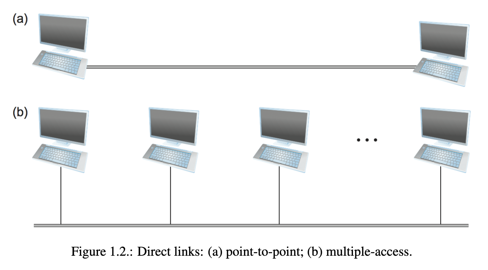
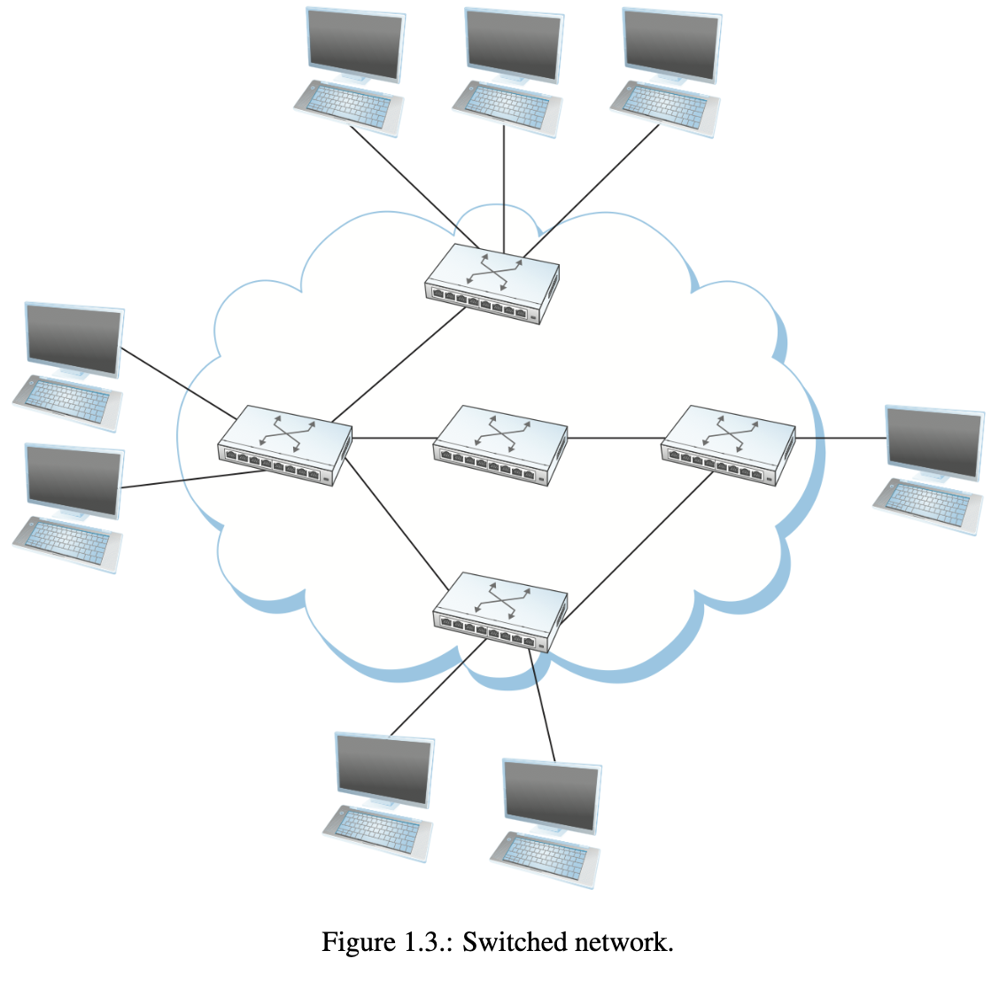
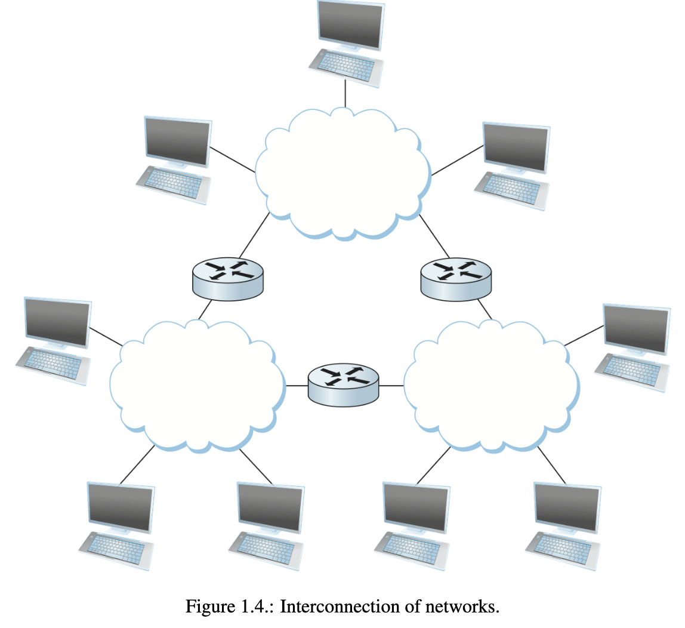

### 1.2.3 Cost-Effective Resource Sharing
In the context of packet-switched networks and resource sharing, Chapter 1.2.3 discusses the concept of multiplexing and the challenges of sharing network resources among multiple hosts.

Multiplexing is the process of sharing a system resource among multiple users. In the case of computer networks, it involves sharing the network among hosts that want to communicate with each other. The chapter introduces the concept of multiplexing using the analogy of a timesharing computer system, where a single processor is shared among multiple jobs.

To illustrate how hosts share a network, the chapter presents a simple network diagram where three sending hosts and three receiving hosts share a single physical link. The data flows between the hosts are multiplexed onto the link using switches. The chapter intentionally leaves the definition of a "flow of data" vague for the discussion.

The chapter explains two common methods of multiplexing: synchronous time-division multiplexing (STDM) and frequency-division multiplexing (FDM). STDM divides time into equal-sized quanta and gives each flow a chance to send its data during its allocated time slot. FDM transmits each flow at a different frequency. However, both methods have limitations, including idle time when a flow has no data to send and a fixed maximum number of flows.

The chapter introduces statistical multiplexing as a more efficient form of multiplexing. With statistical multiplexing, the physical link is shared over time, and data from each flow is transmitted on-demand rather than during predetermined time slots. This avoids idle time and improves efficiency. However, to ensure fairness, statistical multiplexing defines an upper bound on the size of the data block each flow can transmit at a given time, typically referred to as a packet.

The chapter explains that in packet-switched networks, each flow sends a sequence of packets, and the decision of which packet to send next is made on a packet-by-packet basis. Different methods can be used to make this decision, such as first-in, first-out (FIFO) or round-robin. The chapter also mentions the issue of congestion when a switch receives packets faster than it can send them, leading to the need for buffer space and potential packet drops.

Overall, this section introduces the concept of multiplexing and explores various methods of sharing network resources among multiple hosts, highlighting the benefits and limitations of different approaches.

**Key Takeaway**
The bottom line is that statistical multiplexing defines a cost-effective way for multiple users (e.g., host-to-host flows of data) to share network resources (links and nodes) in a fine-grained manner. It defines the packet as the granularity with which the links of the network are allocated to different flows, with each switch able to schedule the use of the physical links it is connected to on a per-packet basis. Fairly allocating link capacity to different flows and dealing with congestion when it occurs are the key challenges of statistical multiplexing.

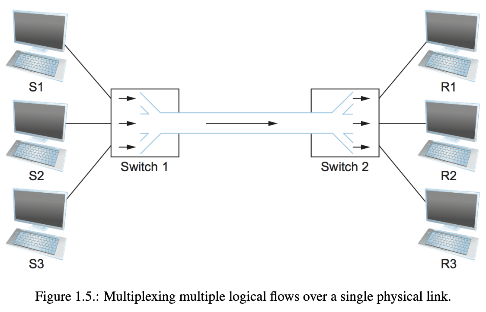
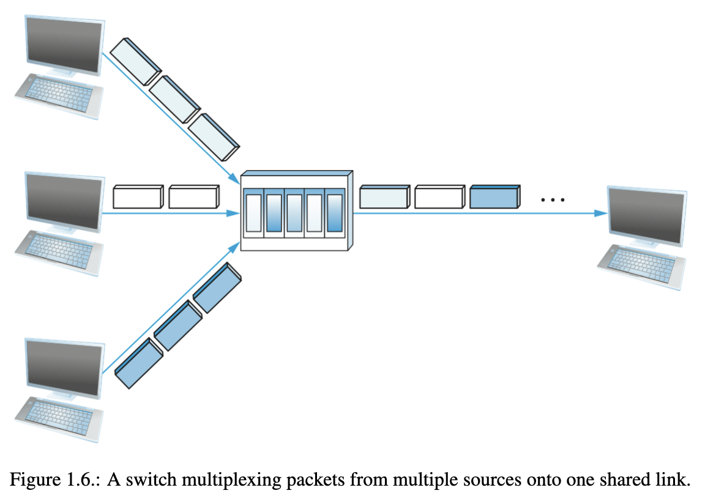

### 1.2.4 Support for Common Services
In Section 1.2.4, the focus shifts to the role of computer networks in supporting common services required by application programs. While the previous section discussed the challenges of connectivity among hosts, it is essential to view a network as a means for distributed application processes to communicate effectively.

Rather than building complex functionality into each application program, it is more logical to implement common services once and allow application designers to utilize those services. The network designer's challenge is to identify the appropriate set of common services that can simplify application development without overly limiting the application designer.

The network is seen as providing logical channels through which application-level processes can communicate with each other, with each channel offering the necessary services for a specific application. This abstraction can be visualized as a channel connecting two processes, with a cloud representing the underlying connectivity between hosts. The channel acts like a pipe, allowing a sending application to transmit data that will be delivered by the network to the receiving application.

Logical process-to-process channels are implemented on top of physical host-to-host channels, demonstrating the concept of layering, which is a fundamental aspect of network architectures.

Defining the functionality of these channels for application programs is crucial. Questions arise regarding the requirements of message delivery guarantees, message ordering, privacy, and other considerations. Different types of channels are provided by the network to cater to various application needs, allowing each application to select the channel type that best suits its requirements.

The section concludes by highlighting that defining useful channels involves thoughtful consideration of the services and functionalities required by application programs.
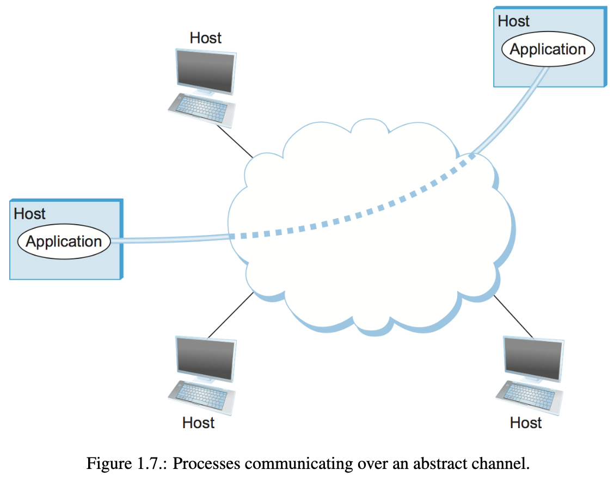

### Identify Common Communication Patterns
In this section, the focus is on identifying common communication patterns and designing abstract channels that meet the communication needs of various applications.

The discussion begins by recognizing that a representative collection of applications should be analyzed to extract their common communication requirements. One such application is a file access program like FTP or NFS, which involves a client process requesting file read/write operations from a server process.

For file reading, the client sends a small request message to the server, and the server responds with a large message containing the file data. File writing follows the opposite approach, with the client sending a large message containing the data to be written, and the server responding with a small confirmation message.

Another example of a sophisticated application is a digital library, which also relies on similar communication services. Users request files, such as journal articles, from the library, and the system responds accordingly.

Considering these examples, two types of channels can be provided: request/reply channels and message stream channels. The request/reply channel guarantees message delivery, prevents duplication, and ensures data privacy and integrity. It is suitable for file transfer and digital library applications.

The message stream channel, on the other hand, is suitable for video applications like video on demand and videoconferencing. It supports one-way and two-way traffic and different delay properties. While it may not guarantee the delivery of all messages, it ensures that the delivered messages arrive in the correct order to maintain the sequence of video frames. Privacy, integrity, and multicast support are also important considerations for this channel.

Although network designers aim to provide a minimal set of channel abstractions that serve multiple applications, it's crucial not to limit the available options. New types of channels may need to be invented or existing channels enhanced to cater to specific application requirements.

Another consideration is where the functionality of a channel is implemented. One approach is to view the underlying network's host-to-host connectivity as a basic bit pipe, with higher-level communication semantics implemented at the end hosts. This keeps the network switches simple but places more responsibility on the end hosts. Alternatively, additional functionality can be placed in the switches, allowing the end hosts to be simpler devices. This partitioning of network services between switches and end hosts is an ongoing issue in network design.

Overall, understanding common communication patterns and designing appropriate channels is essential for supporting a wide range of applications effectively.

### Reliable Message Delivery
In order to provide reliable message delivery, it is crucial to understand the potential failures that can occur in computer networks. Networks operate in an imperfect world where various factors can lead to failures and disruptions. Network designers need to address these failures to ensure applications can operate without being affected or aware of the issues.

There are three general classes of failures that network designers must consider. The first class involves bit errors, where errors occur at the level of individual bits during data transmission over physical links. Bit errors can result from external interference such as lightning strikes, power surges, or other sources. While bit errors are relatively rare, they can occur, and techniques exist to detect and sometimes correct these errors. If errors cannot be corrected, the entire packet may need to be discarded, and the sender may be required to retransmit it.

The second class of failure occurs at the packet level, where entire packets are lost within the network. Packet loss can happen due to uncorrectable bit errors or congestion within network nodes. If a node is overloaded and unable to store the packet, it may drop it. Software errors in packet handling can also lead to lost packets. Distinguishing between packets that are genuinely lost and those that are delayed in reaching their destination poses a challenge in dealing with this type of failure.

The third class of failure pertains to nodes and links within the network. Physical links can be cut or disrupted due to various reasons such as software crashes, power failures, or accidental damage. Failures caused by misconfiguration of network devices are also common. While these failures can have a significant impact on network operations, they do not necessarily disable the entire network. In packet-switched networks, it is possible to route around failed nodes or links. Differentiating between a failed computer and one that is slow, or distinguishing between a cut link and an unstable one introducing numerous bit errors, presents difficulties when dealing with this type of failure.

Understanding these classes of failures allows network designers to implement mechanisms and protocols that address reliability concerns. By detecting and correcting errors, handling congestion, and accommodating failures at the node and link level, networks can provide more reliable communication services to applications.

**Key Takeaway**
The key idea to take away from this discussion is that defining useful channels involves both understanding the applications’ requirements and recognizing the limitations of the underlying technology. The challenge  
is to fill in the gap between what the application expects and what the underlying technology can provide. This is sometimes called the semantic gap

### 1.2.5 Manageability
Network manageability is a crucial requirement that is often overlooked or addressed as an afterthought. Managing a network involves tasks such as equipment upgrades to accommodate growth, troubleshooting issues and performance problems, and adding new features to support emerging applications. Network management has traditionally relied on human intervention, but automation and self-healing designs are increasingly playing a role in addressing these needs.

Scalability is closely tied to network manageability. As the Internet has grown to support billions of users and millions of hosts, maintaining its correct functioning and configuring new devices have become significant challenges. Configuring a single router already requires expertise, and dealing with thousands of routers and diagnosing issues in such large networks can surpass the capabilities of any individual. Automation is therefore becoming increasingly important in network management.

One approach to ease network management is to minimize changes once the network is operational. This mindset highlights the inherent tension between stability and the introduction of new features or capabilities at a rapid pace (feature velocity). The telecommunications industry, as well as university system administrators and corporate IT departments, have historically prioritized stability, leading to slower progress and risk aversion. However, the rise of the cloud has shifted the balance, necessitating a closer alignment between stability and feature velocity. The impact of the cloud on the network is a recurring topic in the book, emphasizing the significance of managing a rapidly evolving network as a central challenge in modern networking.

In summary, network manageability encompasses tasks such as upgrading equipment, troubleshooting, and adding new features. Automation plays an increasing role in addressing these needs, especially in large-scale networks. Balancing stability and feature velocity is crucial, and the management of rapidly evolving networks is a key challenge in networking today.

## 1.3 Architecture
The architecture of a network refers to a blueprint or framework that guides the design and implementation of the network. It provides a structured approach to addressing the complexity of network design and meeting the requirements of connectivity, cost-effectiveness, fairness, robustness, and manageability. Network architectures need to be adaptable to changes in underlying technologies and evolving application demands.

A network architecture consists of a set of central ideas and principles that are common to all network architectures. These ideas serve as guidelines for designing and building networks. Two prominent network architectures are the OSI (Open Systems Interconnection) architecture and the Internet architecture.

The OSI architecture, also known as the 7-layer architecture, is a conceptual framework that defines a series of protocols and services necessary for communication between computers. It divides the network communication process into seven layers, each responsible for a specific function, such as physical transmission, data link, network, transport, session, presentation, and application. The OSI model provides a modular and hierarchical approach to network design and allows for interoperability between different network technologies.

The Internet architecture, on the other hand, refers to the structure and protocols that underpin the Internet, the global network connecting millions of computers worldwide. The Internet architecture is based on the TCP/IP (Transmission Control Protocol/Internet Protocol) suite, which provides a set of protocols for reliable and efficient data transmission. It follows a layered approach similar to the OSI model but with fewer layers. The Internet architecture emphasizes scalability, flexibility, and openness, allowing for the seamless integration of diverse networks and the development of new applications.

These network architectures serve as reference models for network designers and provide a common language and framework for understanding and discussing network design and implementation. While there are other network architectures and variations, the OSI and Internet architectures are among the most widely known and referenced in the field of networking.

### 1.3.1 Layering and Protocols
The concept of abstraction, which involves hiding implementation details behind a well-defined interface, is a fundamental tool used by system designers to manage complexity. Abstractions are models that capture important aspects of a system and encapsulate them in objects with interfaces that can be manipulated by other system components. By hiding the implementation details, abstractions make it easier for users to interact with the objects.

Layering is a natural consequence of using abstractions in network systems. It involves starting with the services provided by the underlying hardware and adding a sequence of layers, each offering a higher level of service. The higher layers build upon the services provided by the lower layers. This approach decomposes the problem of building a network into manageable components and promotes modular design.

Layering in network systems can involve multiple abstractions at each level, with different services provided to the higher layers but relying on the same low-level abstractions. For example, a network system may offer both request/reply and message stream channels as alternative offerings at a certain level.

In network architecture, the abstract objects that make up the layers of a network system are called protocols. A protocol provides a communication service that higher-level objects, such as application processes or higher-level protocols, use to exchange messages. Each protocol defines two interfaces: a service interface for local objects to use the communication services and a peer interface for communication with counterparts on other machines. The service interface specifies the operations that local objects can perform on the protocol, while the peer interface defines the format and meaning of messages exchanged between protocol peers.

Protocols communicate indirectly with their peers by passing messages to lower-level protocols, which deliver the messages to their peers. A network system consists of a suite of protocols represented by a protocol graph. The graph's nodes correspond to protocols, and the edges represent dependencies. The protocol graph illustrates the relationships and dependencies between protocols. For example, a protocol graph may show that protocols RRP (Request/Reply Protocol) and MSP (Message Stream Protocol) depend on the Host-to-Host Protocol (HHP), which provides host-to-host connectivity.

The term "protocol" is used in two different ways: to refer to the abstract interfaces (service interface and peer interface) and to the module that implements those interfaces. Protocol specifications define the abstract interfaces and are expressed using various notations. Different implementations of the same protocol specification should be able to successfully exchange messages and are said to interoperate with each other.

Standardization bodies, such as the Internet Engineering Task Force (IETF) and the International Standards Organization (ISO), establish network architectures by defining the rules and policies for a particular protocol graph. These bodies have procedures for introducing, validating, and approving protocols within their architectures.

In the context of protocol layering, there are still additional aspects to explain, which will be covered in subsequent sections.
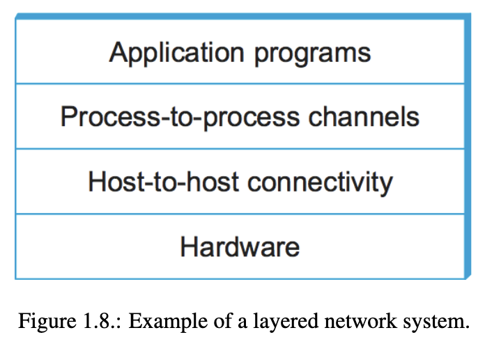
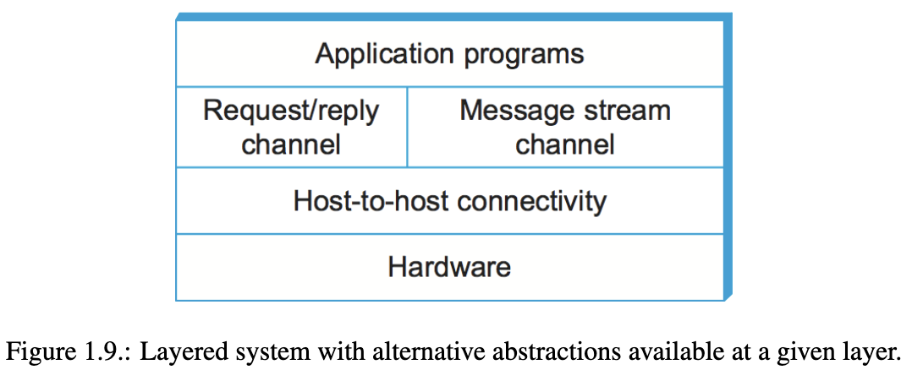
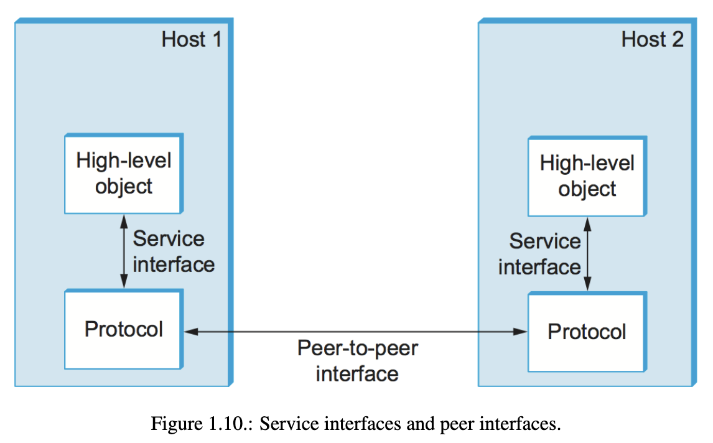
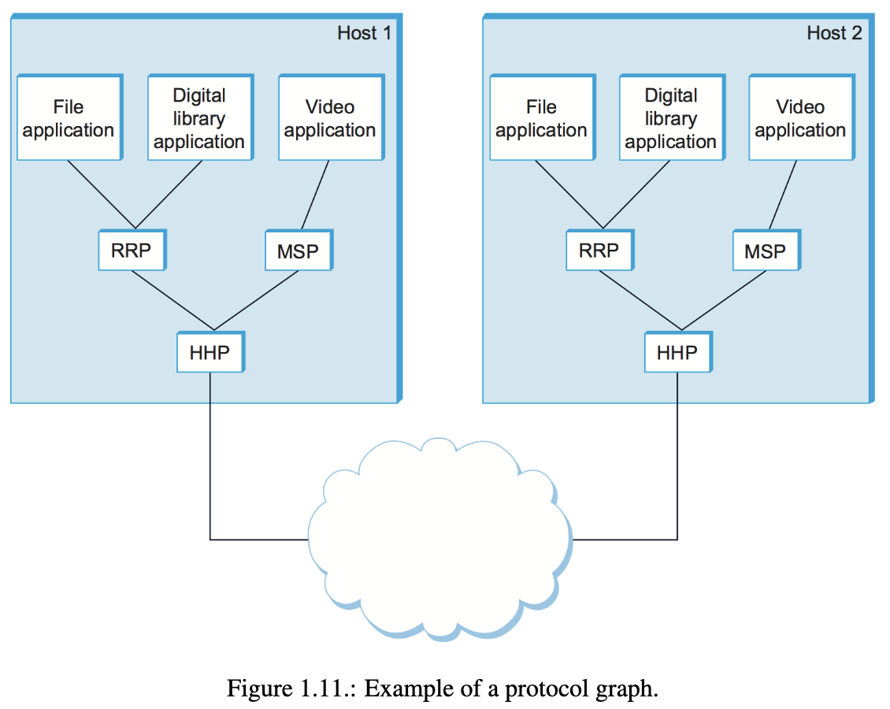

### 1.3.2 Encapsulation
In the process of communication between protocols in a layered network system, encapsulation plays a crucial role. When an application program sends a message to its peer through the RRP protocol, RRP treats the message as an uninterpreted string of bytes. It doesn't concern itself with the specific content of the message, whether it's integers, an email, an image, or anything else. RRP's responsibility is simply to transmit the bytes to its peer. However, RRP needs to provide control information to the peer on how to handle the message upon reception. To accomplish this, RRP attaches a header to the message.

A header is a small data structure, typically a few to a few dozen bytes in size, used for communication between peers. It is usually attached at the front of a message, although in some cases it may be placed at the end as a trailer. The format of the header attached by RRP is defined by its protocol specification. The remaining part of the message, which is the actual data transmitted on behalf of the application, is referred to as the message's body or payload. The application's data becomes encapsulated within the new message created by RRP.

This process of encapsulation is repeated at each layer of the protocol graph. For example, HHP encapsulates RRP's message by attaching its own header. Assuming HHP sends the message over a network to its peer on the destination host, the message is processed in the reverse order. HHP first interprets its own header, takes appropriate action based on its contents, and then passes the message's body (excluding the HHP header) up to RRP. RRP, in turn, interprets its header, takes necessary action indicated by the RRP header attached by its peer, and passes the message's body (excluding the RRP header) up to the application program. The message received by the application on host 2 is identical to the one sent by the application on host 1. The application is unaware of any headers added by lower-level protocols since they are transparent to the application.

It's worth noting that nodes within the network, such as switches and routers, may inspect the HHP header at the front of the message.

When we say a low-level protocol doesn't interpret the message given by a higher-level protocol, it means that the low-level protocol doesn't extract any meaning from the data contained in the message. However, the low-level protocol may apply simple transformations to the entire body of the message, including the original application's data and any headers added by higher-level protocols. These transformations could include compression or encryption of the message.
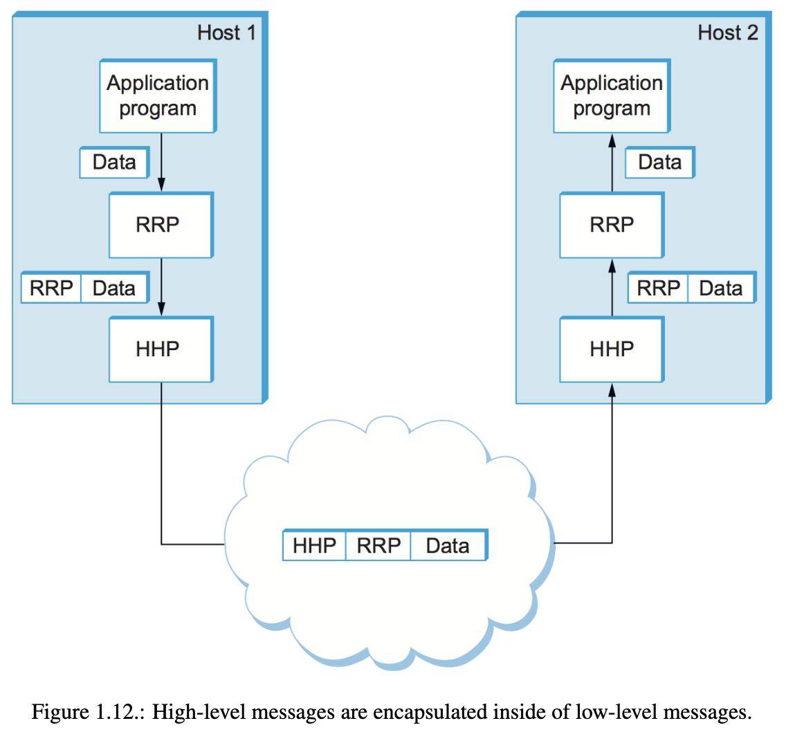

### 1.3.3 Multiplexing and Demultiplexing
Multiplexing and demultiplexing are essential concepts in packet switching, allowing for the transmission of multiple data flows over a single physical link. This concept applies throughout the protocol graph, not just at switching nodes. In the context of Figure 1.11, RRP can be seen as implementing a logical communication channel, where messages from different applications are multiplexed over this channel at the source host and then demultiplexed back to the appropriate application at the destination host.

To achieve this, RRP attaches a header to its messages that includes an identifier known as RRP's demultiplexing key or demux key. This demux key records the application to which the message belongs. At the source host, RRP includes the appropriate demux key in its header. When the message reaches the destination host and is delivered to RRP, it strips the header, examines the demux key, and demultiplexes the message to the correct application.

Multiplexing and demultiplexing are not unique to RRP; they are commonly implemented by most protocols. For instance, HHP also has its own demux key to determine which messages should be passed up to RRP and which should be passed up to MSP. However, there is no universal agreement among protocols, even within a single network architecture, regarding the exact format of a demux key.

Different protocols may use different sizes for the demux key field in their headers. Some protocols use an 8-bit field, allowing support for only 256 high-level protocols. Others may use 16-bit or 32-bit fields. Additionally, protocols may have a single demultiplexing field in their header, while others may have a pair of demultiplexing fields. In the former case, the same demux key is used on both sides of the communication, while in the latter case, each side uses a different key to identify the high-level protocol or application program to which the message should be delivered.

### 1.3.4 7-Layer OSI Model
The OSI (Open Systems Interconnection) architecture, developed by the International Organization for Standardization (ISO), provides a framework for connecting computers and defines a partitioning of network functionality into seven layers. This architecture, illustrated in Figure 1.13, serves as a reference model for a protocol graph. Although OSI-based networks are not prevalent today, the terminology and concepts it introduced are still widely used.

The seven layers of the OSI model are as follows:

1. Physical Layer: This layer deals with the transmission of raw bits over a communication link. It handles the electrical, mechanical, and procedural aspects of physical connections.
    
2. Data Link Layer: The data link layer takes a stream of bits and organizes them into larger units called frames. Network adapters and device drivers in the operating system typically implement this layer. Frames, rather than individual bits, are delivered to hosts.
    
3. Network Layer: The network layer is responsible for routing packets within a packet-switched network. It deals with the logical addressing and routing of data between nodes. The unit of data exchanged at this layer is called a packet.
    
4. Transport Layer: The transport layer establishes process-to-process communication channels. It ensures reliable and efficient data transfer between applications running on different hosts. The unit of data exchanged at this layer is commonly referred to as a message.
    
5. Session Layer: The session layer manages the sessions or connections between applications. It provides a name space that ties together multiple transport streams that belong to a single application.
    
6. Presentation Layer: The presentation layer is concerned with the formatting and representation of data exchanged between peers. It handles tasks such as data encryption, compression, and data format conversions.
    
7. Application Layer: The application layer encompasses the protocols and services used by applications to communicate with each other. It includes protocols like HTTP (Hypertext Transfer Protocol) used for web browsing. Application layer protocols enable specific functionalities required by applications.
    

The lower three layers (physical, data link, and network) are implemented on all network nodes, including switches and hosts. The transport layer and higher layers typically run only on the end hosts and not on intermediate switches or routers.

It's important to note that while the OSI model provides a conceptual framework, actual network architectures often combine or skip some layers based on their specific requirements.

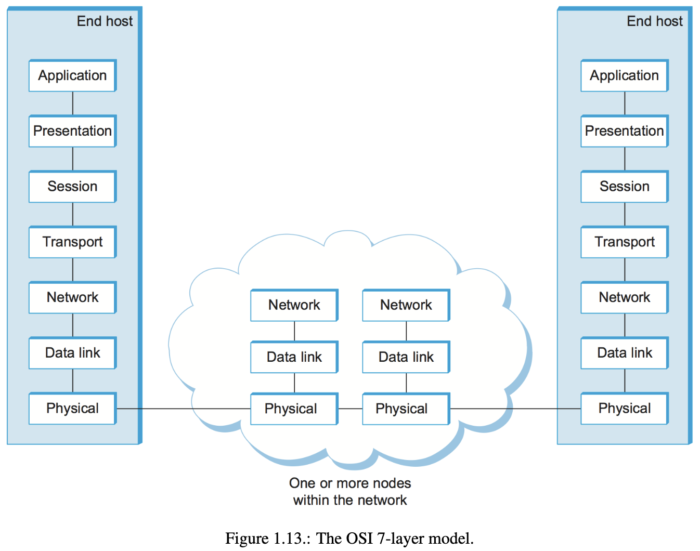

### 1.3.5 Internet Architecture
The Internet architecture, also known as the TCP/IP architecture, is a framework for connecting computers and is based on the protocols TCP (Transmission Control Protocol) and IP (Internet Protocol). It evolved from the experiences with the ARPANET, a packet-switched network funded by the Advanced Research Projects Agency (ARPA) of the U.S. Department of Defense. The Internet architecture predates the OSI architecture and heavily influenced its development.

In contrast to the 7-layer OSI model, the Internet architecture is often represented using a simpler stack. At the lowest level are various network protocols (NET1, NET2, etc.), which are implemented by a combination of hardware (such as network adapters) and software (such as network device drivers). Examples of these protocols include Ethernet and wireless protocols like 802.11 Wi-Fi standards. The next layer is the Internet Protocol (IP), which facilitates the interconnection of different networking technologies into a single internetwork.

Above IP, there are two main protocols: the Transmission Control Protocol (TCP) and the User Datagram Protocol (UDP). TCP provides a reliable byte-stream channel, while UDP offers an unreliable datagram delivery channel. These protocols are often referred to as end-to-end protocols or transport protocols.

The top layer of the Internet architecture consists of application protocols such as HTTP, FTP, Telnet, and SMTP. These protocols enable the interoperability of popular applications. For example, different web browsers (Firefox, Chrome, Safari, etc.) and web servers can communicate with each other using the HTTP protocol.

It's important to note that the Internet architecture does not strictly adhere to layering. Applications are free to bypass the defined transport layers and directly use IP or the underlying networks. Programmers can also define new channel abstractions or applications that run on top of existing protocols.

The Internet architecture is primarily defined and standardized by the Internet Engineering Task Force (IETF). The IETF specifies protocols like TCP, UDP, IP, DNS, and BGP. However, the Internet architecture incorporates protocols from other organizations, including IEEE, W3C, 3GPP, and ITU-T.

One notable characteristic of the Internet architecture is its hourglass shape, as depicted in Figure 1.15. This shape represents the philosophy of the architecture, with IP serving as the focal point for exchanging packets among different networks. Above IP, there can be multiple transport protocols offering different channel abstractions, while below IP, various network technologies can be employed.

In order for a new protocol to be officially included in the Internet architecture, there must be a protocol specification and one or more representative implementations. This emphasis on working software and rough consensus is a cultural aspect of the Internet design community, as exemplified by the quote: "We reject kings, presidents, and voting. We believe in rough consensus and running code" (David Clark).

Standardization and interoperability efforts in the Internet architecture are supported by organizations like the Internet Assigned Numbers Authority (IANA) and the Internet Corporation for Assigned Names and Numbers (ICANN), responsible for unique identifier assignment and overall stewardship of the Internet.
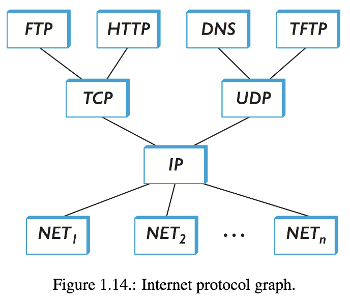
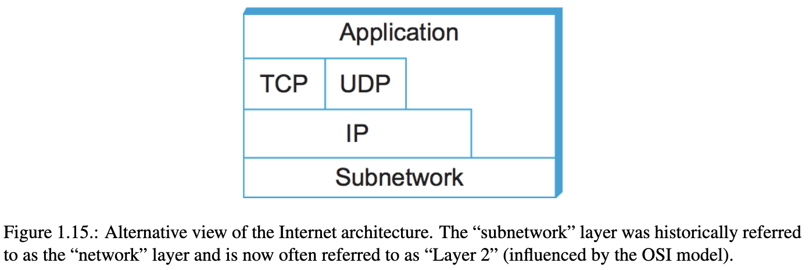

**Key Takeaway**
Of these three attributes of the Internet architecture, the hourglass design philosophy is important enough to bear repeating. The hourglass’s narrow waist represents a minimal and carefully chosen set of global ca-pabilities that allows both higher-level applications and lower-level communication technologies to coexist,  
share capabilities, and evolve rapidly. The narrow-waisted model is critical to the Internet’s ability to adapt to new user demands and changing technologies.

