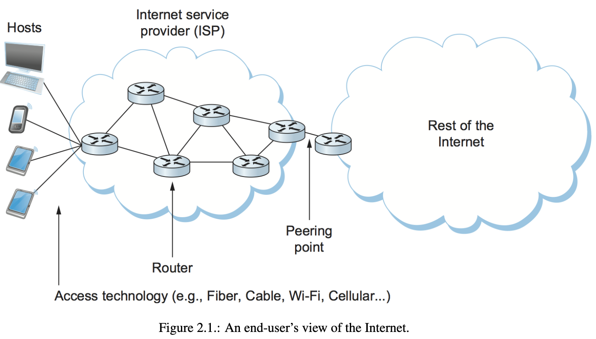
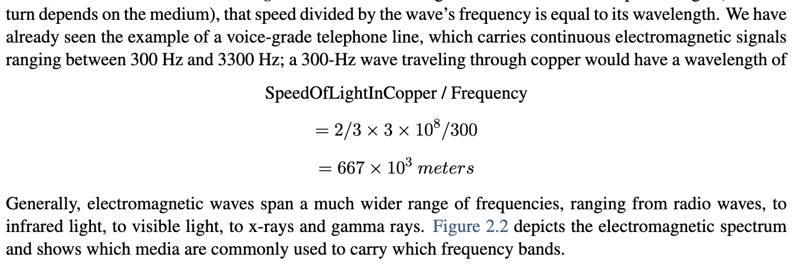
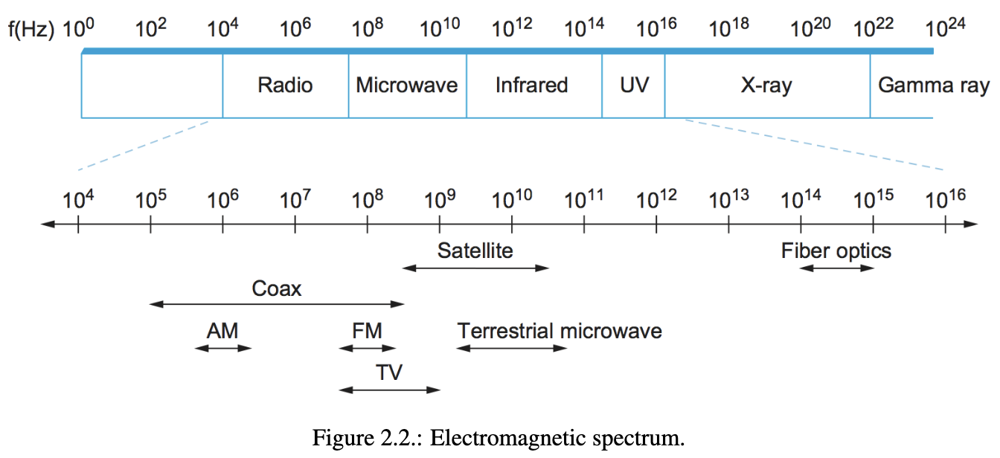
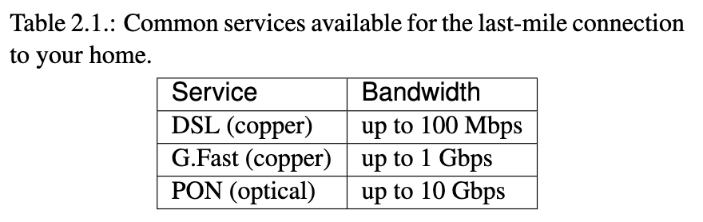
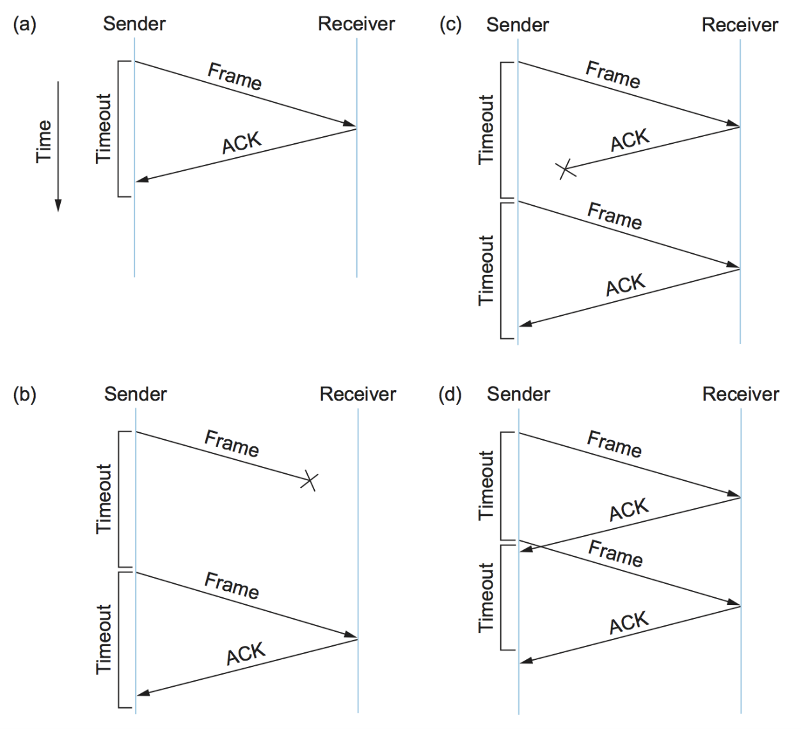
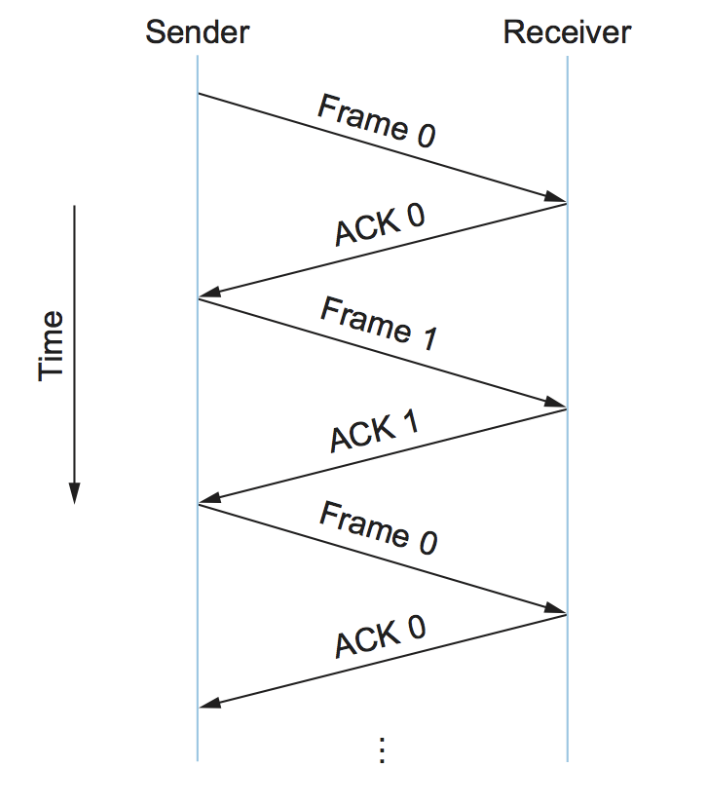
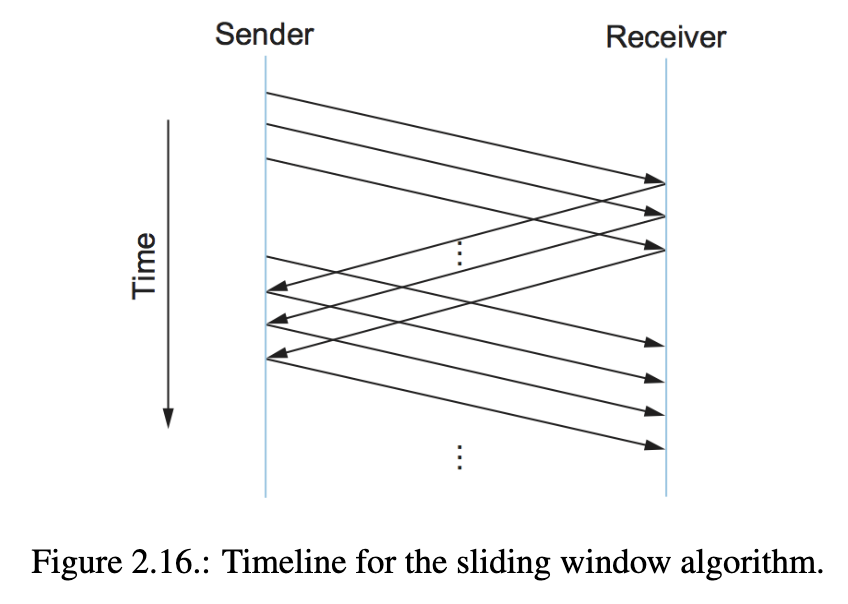
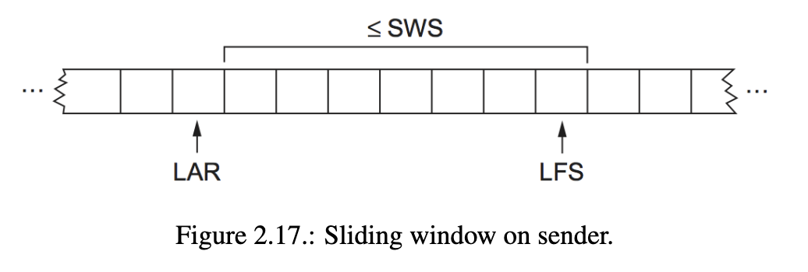
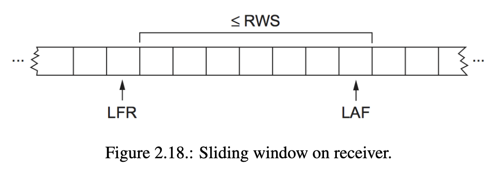

## Problem: Connecting to a Network
In order to connect two nodes together or connect a host to a network, we need to address a set of common issues. These issues apply whether we are creating a small two-node network or connecting a large number of hosts to an existing network like the Internet. The following problems must be addressed to enable successful packet exchange and provide Layer 2 (L2) connectivity:

1. Encoding: The first problem is encoding bits onto the transmission medium in a way that can be understood by the receiving node. This involves converting digital signals into a suitable form for transmission over the physical medium, such as converting bits into electrical or optical signals.
    
2. Framing: Once bits are transmitted over the link, they need to be delineated into complete messages or frames that can be delivered to the end node. Framing defines how the sequence of bits is structured to form meaningful frames for communication.
    
3. Error Detection: Frames can be corrupted during transmission due to noise or other factors. Error detection mechanisms are required to identify and detect these errors. Various techniques, such as checksums or cyclic redundancy checks (CRC), can be used to detect errors in the received frames.
    
4. Reliable Delivery: Even with error detection, some frames may still be corrupted and need to be retransmitted. Reliable delivery mechanisms ensure that frames are delivered correctly and in the correct order. This may involve retransmission of lost or corrupted frames, acknowledgement mechanisms, and flow control mechanisms to manage the rate of data transmission.
    
5. Media Access Control: In cases where the link is shared by multiple hosts, such as in wireless networks, it is necessary to mediate access to the link. Media access control protocols determine how hosts take turns accessing the shared medium to avoid collisions and ensure fair access for all participants.
    

These five issues—encoding, framing, error detection, reliable delivery, and media access control—are fundamental problems addressed by different networking technologies. The chapter explores these issues in the context of specific technologies, including point-to-point fiber links (using technologies like SONET), Carrier Sense Multiple Access (CSMA) networks (such as Ethernet and Wi-Fi), fiber-to-the-home (PON), and mobile wireless networks (4G and evolving into 5G). The goal is to understand the link-level technologies available and how they can be used to build robust and scalable networks.

## 2.1 Technology Landscape
In the context of connecting devices to networks, there is a wide array of link technologies due to the diverse circumstances in which users connect their devices. These circumstances range from global network operators dealing with long-distance links spanning hundreds or thousands of kilometers to typical users connecting their devices to the existing Internet.

The types of links encountered by users can vary greatly, including:

1. Wireless links: Users may connect their devices through wireless links such as Wi-Fi in coffee shops, airports, or universities. Wireless links provide flexibility and mobility.
    
2. Ethernet links: In office buildings or universities, users often connect their devices to the network using Ethernet links. Ethernet is a common local area network (LAN) technology.
    
3. Smartphone cellular links: Smartphones connect to cellular networks to access the Internet. Cellular networks use licensed frequency bands that vary worldwide, with traditional cellular technologies ranging from 700 MHz to 2400 MHz and new allocations at higher frequencies, such as 6 GHz and millimeter-wave (mmWave) bands.
    
4. Fiber optic links: Fiber optic links are used for fiber-to-the-home connections and long-distance links in the Internet's backbone. Optical fiber provides high bandwidth and is increasingly used for high-speed and reliable connectivity.
    
5. Copper wire links: Copper wire links, such as twisted pair and coaxial cables, are still in use for various purposes, including Ethernet connections and landline phones.
    

These diverse link types can be made reliable and useful to higher layers in the protocol stack by employing common strategies. Network architecture provides a common abstraction of these links, allowing devices and routers to interact with the network without needing to be aware of the specific link technology. For example, a laptop or smartphone only needs to know that it has a link to the Internet, regardless of the underlying technology.

Links can be characterized by the medium they use, such as copper wire, optical fiber, or air/free space for wireless links. Another important characteristic is the frequency of the electromagnetic waves used for transmission. Different frequency bands are allocated for various purposes, and each link technology may occupy a specific frequency range.

To transmit binary data (1s and 0s) over these links, the data needs to be encoded onto electromagnetic signals. This involves modulation techniques that vary the frequency, amplitude, or phase of the signal. However, for the purpose of understanding links as building blocks for computer networks, the focus is primarily on the upper layer, which deals with the simpler problem of encoding binary data onto distinguishable signals (e.g., "high" and "low").

Links can also be classified based on their usage. Examples include wireless networks encountered by consumers in public places and last-mile links provided by ISPs to connect homes and businesses. Technologies like DSL, G.Fast, and PON are used for last-mile connections. Mobile or cellular networks, evolving from 4G to 5G, provide connectivity for mobile devices and can also serve as the sole Internet connection in homes or offices. Additionally, there are backbone links for interconnecting cities, typically using fiber optic technology and SONET.

Local area networks (LANs) within buildings or campuses are another type of link, with Ethernet and Wi-Fi being dominant technologies in this space.

This survey of link types highlights the diversity and reasons behind it. Networking protocols can leverage this diversity and provide a consistent view of the network to higher layers, abstracting the underlying complexities and economic factors.

## 2.5 Reliable transmission
Reliable delivery in data communication ensures that frames are successfully delivered despite errors or losses during transmission. It relies on acknowledgments (ACKs) and timeouts. An acknowledgment is a control frame sent back to the sender to confirm the receipt of a frame. If an acknowledgment is not received within a timeout period, the sender retransmits the frame. This approach is known as automatic repeat request (ARQ). Error-correcting codes may not handle all errors, leading to discarded frames. Reliable delivery can be implemented at various layers, and it's common to provide it at higher layers like transport or application. Understanding the concepts of acknowledgments, timeouts, and ARQ algorithms is crucial for ensuring reliable data transmission.

### 2.5.1 Stop and Wait
The stop-and-wait algorithm is a simple automatic repeat request (ARQ) scheme for reliable data transmission. It operates by sending one frame at a time and waiting for an acknowledgment before sending the next frame. If the acknowledgment is not received within a certain time, the sender retransmits the original frame. This approach ensures reliable delivery but limits the sender to having only one outstanding frame on the link at a time. To avoid duplicate frame delivery, a 1-bit sequence number is used in the header, allowing the receiver to distinguish between original and retransmitted frames. However, this algorithm can result in low link utilization since the sender can only transmit one frame per round-trip time (RTT). To fully utilize the link, the sender would need the ability to transmit multiple frames before waiting for an acknowledgment.
**Key takeaway**
The significance of the delay × bandwidth product is that it represents the amount of data that could be in  
transit. We would like to be able to send this much data without waiting for the first acknowledgment. The  
principle at work here is often referred to as keeping the pipe full. The algorithms presented in the following  
two subsections do exactly this.

### 2.5.2 Sliding Window
The sliding window algorithm is used for reliable data transmission. The sender assigns a sequence number to each frame and maintains variables for send window size (SWS), last acknowledgment received (LAR), and last frame sent (LFS). The sender transmits frames and waits for acknowledgments. If an acknowledgment is not received within a specified time, the sender retransmits the frame. The receiver maintains variables for receive window size (RWS), largest acceptable frame (LAF), and last frame received (LFR). When a frame arrives, the receiver checks if it falls within the window and takes appropriate action. The receiver sends cumulative acknowledgments and adjusts its variables accordingly. The sender can have multiple outstanding frames, but the receiver sets a limit on the number of out-of-order frames it accepts. The sender and receiver maintain invariants related to the window sizes. The scheme handles packet losses and retransmissions but may experience decreased data throughput during timeouts. There are variations of the scheme, including the use of negative acknowledgments (NAKs) and selective acknowledgments, which provide additional information to improve performance. The sender and receiver set their window sizes based on desired outstanding frames and buffer capabilities.

When using finite sequence numbers in the sliding window algorithm, the sequence numbers wrap around due to the limited size of the header field. This introduces the challenge of distinguishing between different instances of the same sequence numbers. To handle this, the number of available sequence numbers must be greater than the number of outstanding frames allowed. If the receive window size (RWS) is equal to the send window size (SWS), then the maximum sequence number (MaxSeqNum) should be at least SWS + 1 to avoid confusion. However, if RWS is not equal to SWS, a more general rule is needed. In the case where RWS = SWS, the sending window size can be at most half the number of available sequence numbers, specifically SWS < (MaxSeqNum + 1) / 2. This ensures that the sliding window protocol properly alternates between the two halves of the sequence number space. It's important to note that this rule assumes frames are not reordered in transit. In different environments, additional rules may be necessary.
In addition to reliably delivering frames across an unreliable link, the sliding window algorithm can serve two other roles. One role is to preserve the order in which frames are transmitted. This is achieved by the receiver buffering out-of-order frames and only passing them to the higher-level protocol after all earlier frames have been delivered. The algorithm described in this section maintains frame order, but it's worth considering whether this functionality could be implemented by a higher-level protocol instead.

The third role of the sliding window algorithm is to support flow control, which allows the receiver to throttle the sender to prevent it from transmitting more data than the receiver can handle. Flow control involves the receiver informing the sender of how many frames it has room to receive, based on its available buffer space. However, it's important to determine if flow control is necessary at the link level before incorporating it into the sliding window protocol.

To summarize, the sliding window algorithm can preserve frame order and support flow control in addition to its core function of reliably delivering frames across an unreliable link. The decision to implement these additional functionalities depends on the specific requirements and constraints of the network.

**Key takeaway**
One important concept to take away from this discussion is the system design principle we call separation of concerns. That is, you must be careful to distinguish between different functions that are sometimes rolled together in one mechanism, and you must make sure that each function is necessary and being supported  
in the most effective way. In this particular case, reliable delivery, ordered delivery, and flow control are sometimes combined in a single sliding window protocol, and we should ask ourselves if this is the right thing to do at the link level.

### 2.5.3 Concurrent Logical Channels
The data link protocol used in the original ARPANET offers an alternative to the sliding window protocol. This protocol, known as concurrent logical channels, allows multiple logical channels to be multiplexed onto a single point-to-point link. The stop-and-wait algorithm is applied independently to each logical channel, enabling the sender to keep the link fully utilized.

In the ARPANET protocol, each logical channel is associated with 3 bits of state: a flag indicating whether the channel is busy, a 1-bit sequence number to be used for the next frame sent on the channel, and the expected sequence number for the next arriving frame on that channel. When a node has a frame to send, it chooses the lowest idle channel and behaves like the stop-and-wait algorithm.

In practice, the ARPANET supported 8 logical channels for ground links and 16 for satellite links. The frame header included a 3-bit channel number and a 1-bit sequence number, totaling 4 bits. This number of bits is exactly what the sliding window protocol requires to support up to 8 outstanding frames on the link when the receive window size (RWS) equals the send window size (SWS).

To summarize, the ARPANET protocol utilizes concurrent logical channels to multiplex multiple channels onto a single link, allowing the sender to maintain a fully utilized link using the stop-and-wait algorithm. The protocol does not enforce frame order or incorporate flow control.

