## Problem: Not All Networks are Directly Connected
When it comes to building networks of global scale, a single technology or link type is not sufficient. We need a way to interconnect different types of links and multi-access networks, which is the fundamental concept behind internetworking and the Internet.

To address this, we can break down the internetworking problem into several subproblems. The first subproblem is interconnecting links of the same type, which is often achieved using switches or Layer 2 (L2) switches. These devices receive packets on one input and forward them to the appropriate output to reach their destination. In the context of Ethernet networks, these switches are sometimes referred to as bridges.

Switches can determine the appropriate output for a packet using connectionless or connection-oriented approaches. Both approaches have found significant applications in various scenarios.

However, to interconnect disparate networks and deal with heterogeneity, we need a way to interconnect different types of networks and links. This is where routers or Layer 3 (L3) switches come into play. Routers were previously known as gateways and are responsible for forwarding packets between networks. The Internet Protocol (IP) was specifically designed to address the interconnection of different network types and is the topic of the second section.

Once we have interconnected numerous links and networks using switches and routers, we need to determine efficient paths or routes through the network. This routing problem is essential for effective communication. The chosen paths should be efficient, loop-free, and adaptable to changes in the network, such as node or link failures and additions. The third section of the chapter explores algorithms and protocols developed to address these routing issues.

Finally, the chapter concludes by discussing the implementation of switches and routers. While some switches and routers resemble general-purpose computers, specialized designs are often used, especially at the high end where there is a constant need for increased switching capacity to handle the growing traffic load in the Internet's core.

In summary, building a global network requires interconnecting different types of links and networks, which is achieved through switches and routers. Switches handle the interconnection of links, while routers deal with the interconnection of networks. The Internet Protocol (IP) plays a crucial role in addressing the heterogeneity of networks. Routing algorithms and protocols are used to determine efficient paths through the network, and the implementation of switches and routers can range from general-purpose designs to specialized solutions.

## 3.1 Switching Basics
In simple terms, a switch is a device that allows us to connect links together to form a larger network. It is a multi-input, multi-output device that transfers packets from an input to one or more outputs. By using switches, we can add the star topology to the set of possible network structures.

The star topology has several advantages:

1. Large networks can be built by interconnecting multiple switches, even though each switch has a fixed number of inputs and outputs.
2. Switches can be connected to each other and to hosts using point-to-point links, enabling the construction of networks with large geographic scope.
3. Adding a new host to the network by connecting it to a switch does not degrade the performance of the network for other connected hosts.

Unlike shared-media networks where hosts share the same transmission medium, switched networks provide dedicated links between hosts and switches. This allows multiple hosts to transmit at the full link speed as long as the switch has enough aggregate capacity. Switches aim to provide high aggregate throughput to support many hosts at full speed, making switched networks more scalable than shared-media networks.

It's important to note that the underlying physical transport in wide-area networks is often all-optical, even though we focus on packet-switched networks. Dense Wavelength Division Multiplexing (DWDM) technology allows for the transmission of multiple optical wavelengths (colors) down a single fiber, with each wavelength carrying high data rates (e.g., 100 Gbps). Optical devices called Reconfigurable Optical Add/Drop Multiplexers (ROADMs) connect these fibers, forming an optical transport network. At the packet-switching layer built on top of the optical transport, each wavelength appears as a point-to-point link between switches, enabling the use of protocols like SONET or Ethernet.

A switch is connected to a set of links and uses the appropriate data link protocol to communicate with the node at the other end of each link. The main function of a switch, which corresponds to the network layer or Layer 2 in the OSI architecture, is to receive incoming packets on one link and transmit them on another. The switch determines the output link for each packet by examining the packet's header for an identifier. There are two common approaches: datagram or connectionless approach, and virtual circuit or connection-oriented approach. Another approach called source routing is less common but has some applications.

In any network, it is necessary to have a way to identify end nodes, which are typically referred to as addresses. Ethernet addresses, for example, are 48-bit unique identifiers assigned to each Ethernet card to ensure global uniqueness. It is assumed that each host in the network has a globally unique address. Additionally, there needs to be a way to identify the input and output ports of each switch, which can be done by numbering each port.

In summary, switches interconnect links to form larger networks, and they forward packets from an input to one or more outputs. Switches can be connected together to build large networks, and they offer dedicated links for hosts, allowing multiple hosts to transmit at full speed. The switch determines the output link for each packet based on identifiers in the packet header, using either a datagram or virtual circuit approach. Addresses are used to identify end nodes, and ports are identified either by numbering or by the name of the connected node.
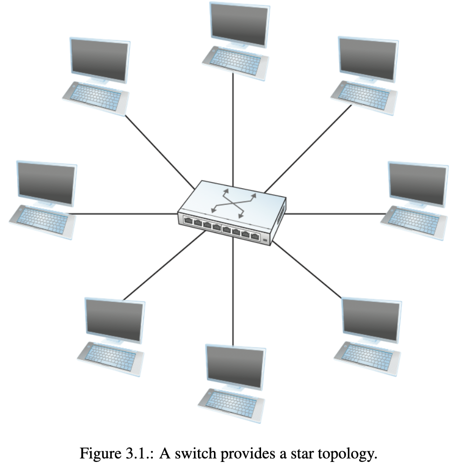

### 3.1.1 Datagrams
The concept behind datagrams is quite straightforward: each packet contains complete destination address information, enabling any switch to determine how to forward it to its destination. In a datagram network, every packet carries the necessary information for forwarding.

Let's consider an example network illustrated in Figure 3.2, where the hosts are labeled A, B, C, and so on. To determine how to forward a packet, a switch consults a forwarding table (also known as a routing table). Table 3.1 provides an example of a forwarding table for switch 2 in the given network. For a simple network like the one depicted, it's relatively easy to create such a table by having a complete network map and configuring the tables statically. However, in large and complex networks with dynamic topologies and multiple paths between destinations, creating forwarding tables becomes much more challenging. This more complex problem is known as routing and will be discussed in a later section. Routing is a process that occurs in the background to ensure that the forwarding tables contain the necessary information for packet forwarding or switching when data packets arrive.

Datagram networks exhibit the following characteristics:

1. Hosts can send packets to any destination at any time, assuming the forwarding table is correctly populated. Datagram networks are often referred to as connectionless because no connection state needs to be established before sending the first data packet. This is in contrast to connection-oriented networks, which require connection establishment before data transmission.
2. When a host sends a packet, it has no way of knowing if the network can deliver it or if the destination host is currently operational.
3. Each packet is forwarded independently of previous packets sent to the same destination. As a result, two successive packets from host A to host B may follow completely different paths, possibly due to changes in the forwarding table at various switches in the network.
4. If a switch or link fails, it may not significantly impact communication if an alternative route can be found and the forwarding table is updated accordingly.

The ability to handle switch or link failures and adapt to alternate routes is particularly important for the robustness of datagram networks. The Internet, in particular, has been designed with a focus on resilience to failures and has proven to be quite effective in achieving this goal. Since datagram-based networks are the primary technology discussed in this book, specific examples will be covered in later sections. For now, let's move on to exploring the two main alternatives to datagram networks.
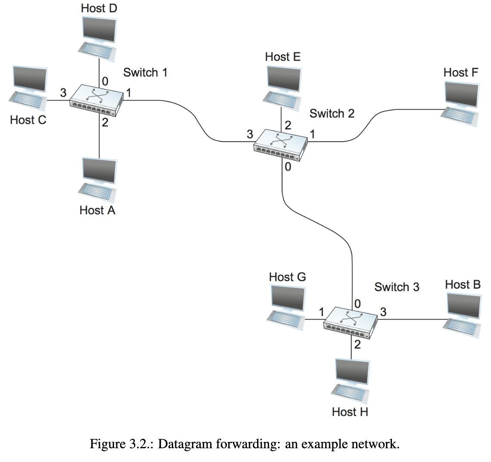
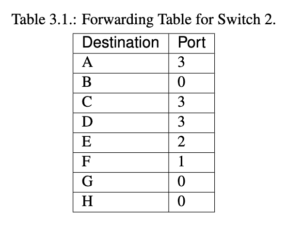

### 3.1.2 Virtual Circuit Switching
Virtual Circuit Switching is a technique for packet switching that involves establishing a virtual connection between the source and destination hosts before data transmission. It is also known as a connection-oriented model. The process consists of two stages: connection setup and data transfer.

In the connection setup phase, a "connection state" is created in each switch along the path between the source and destination hosts. The connection state is stored in a VC (Virtual Circuit) table in each switch and contains the following information for a single connection:

- Virtual Circuit Identifier (VCI): Uniquely identifies the connection at the switch and is carried in the packet headers.
- Incoming interface: The interface on which packets for this VC arrive at the switch.
- Outgoing interface: The interface through which packets for this VC leave the switch.
- Outgoing VCI: The VCI value to be used for outgoing packets.

The VCI and the incoming interface together uniquely identify the virtual connection. Each switch can have multiple virtual connections established at the same time, and the incoming and outgoing VCI values can be different. The VCI has significance only on a given link and doesn't have global significance.

When creating a new connection, a network administrator can configure the connection state, making it a "permanent" virtual circuit (PVC). Alternatively, a host can use signaling to dynamically establish and delete a switched virtual circuit (SVC) without administrator involvement.

In the case of PVCs, the network administrator selects a path through the network and assigns unused VCI values for each link. The VC tables in the switches are configured accordingly.

In the case of SVCs, a host initiates the signaling process by sending a setup message into the network. The setup message contains the complete destination address of the recipient host. The message flows through the switches along the path until it reaches the destination host. Each switch creates a new entry in its VC table and assigns incoming and outgoing VCI values. The setup message is acknowledged by each switch, and the VCI values are communicated back to the sender. Once the setup process is complete, data transfer can begin.

Virtual circuit switching offers several advantages:

- Reduced per-packet overhead: The data packets only contain a small identifier (VCI) instead of the full destination address, reducing the per-packet overhead.
- Fast packet lookup: The VCI can be treated as an index into a table, enabling faster packet lookup compared to datagram-based networks.
- Resource allocation: Virtual circuits allow for resource allocation, such as buffer allocation and hop-by-hop flow control, ensuring that each node has sufficient buffers to handle packets belonging to a specific circuit.
- Quality of Service (QoS): Virtual circuits can provide different QoS levels, allowing the network to allocate resources and meet performance guarantees for specific circuits.

Historically, virtual circuit technologies like X.25, Frame Relay, and Asynchronous Transfer Mode (ATM) were successful. However, with the rise of the Internet's connectionless model, these technologies have lost popularity. Virtual circuits were commonly used in the construction of virtual private networks (VPNs), but even that application is now predominantly supported using Internet-based technologies.
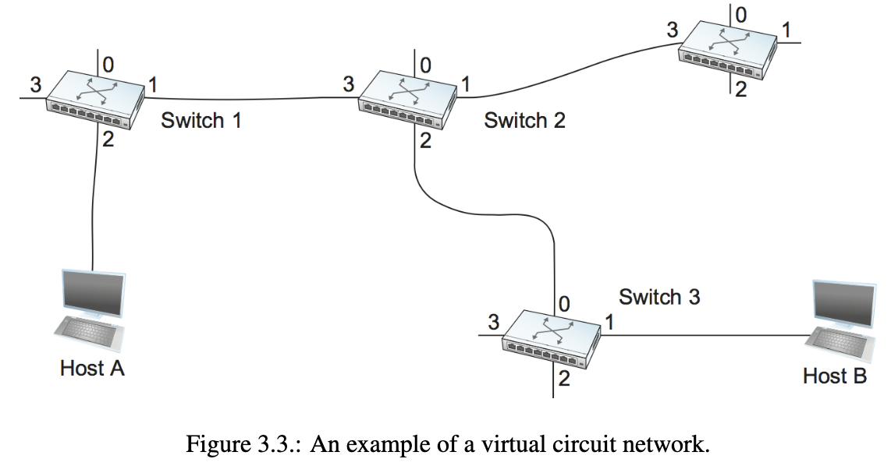
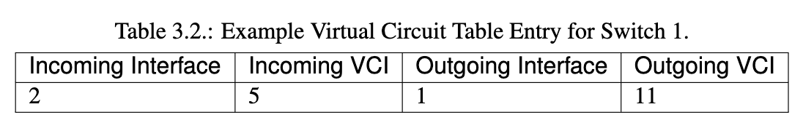
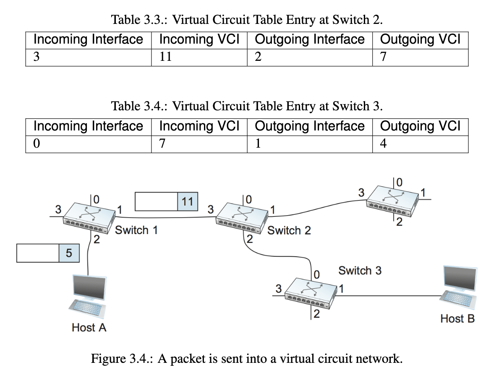
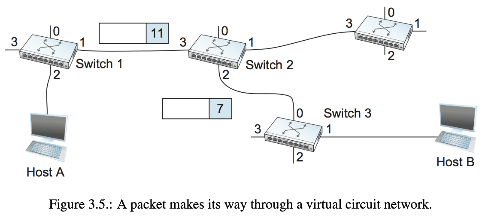

### Asynchronous Transfer Mode (ATM)
Asynchronous Transfer Mode (ATM) is a virtual circuit-based networking technology that gained popularity in the 1980s and early 1990s. It was widely embraced by the telephone industry and provided high-speed switching, which was beneficial as shared media like Ethernet and token rings were becoming insufficient for many network users.

ATM uses a specific packet format called an ATM cell, which is 53 bytes in size. The cell consists of various fields, including the Virtual Path Identifier (VPI) and Virtual Circuit Identifier (VCI). The VPI and VCI together form a 24-bit field that represents the virtual circuit identifier. The separation of VPI and VCI allows for a level of hierarchy, where circuits with the same VPI can be treated as a group (virtual path), simplifying switch operations.

The last byte of the ATM cell contains an 8-bit cyclic redundancy check (CRC) known as the Header Error Check (HEC). It provides error detection and single-bit error correction capability for the cell header, which is crucial because an error in the VCI could cause the cell to be misdelivered.

The use of fixed-length cells was a notable characteristic of ATM. The decision to use 53-byte cells was primarily driven by the aim to facilitate the implementation of hardware switches. Fixed-length packets simplify the design of fast, scalable switches for two main reasons. Firstly, processing packets becomes simpler when their length is known in advance. Secondly, having all packets of the same length enables parallelism, allowing multiple switching elements to perform their tasks simultaneously and improving scalability.

While fixed-length cells are not essential for building fast parallel hardware switches, they provide advantages in terms of switch design and were widely used during the definition of ATM standards. Even in modern switches and routers that handle variable-length packets, the internal forwarding process often involves dividing those packets into some form of cells.

Another benefit of small ATM cells is the improvement in end-to-end latency. ATM was designed to accommodate voice phone calls and data, and by making all packets small (cell-sized), it became possible to interleave the forwarding of voice cells and data cells at each switch along the path. This interleaving helps optimize end-to-end latency, which is particularly important for voice calls with strict delay requirements. This concept of using small cells to enhance latency is still relevant in cellular access networks today.

Choosing the appropriate cell size was a matter of striking a balance. If the cells are too short, the overhead of carrying header information relative to the data increases, reducing the percentage of link bandwidth used for data transmission. Additionally, devices that process cells at a maximum rate are directly affected by cell size, as a shorter cell results in a lower total data rate. Conversely, if the cells are too big, there is wasted bandwidth due to the need for padding to fill a complete cell when transmitting small amounts of data. The ATM cell payload size of 48 bytes was chosen as a compromise, although it didn't satisfy everyone. A power of two would have been preferable for computer processing.

In summary, ATM was a significant networking technology that gained popularity in the 1980s and early 1990s. Its virtual circuit-based approach, fixed-length ATM cells, and support for voice and data traffic made it appealing for various applications. While its deployment has declined over time, its influence and some of its design principles continue to be relevant in modern networking.
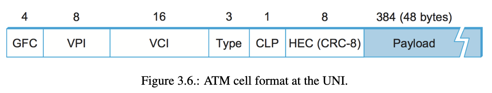

### 3.1.3 Source Routing
Source routing is a switching approach that relies on the source host to provide all the necessary information about the network topology to switch a packet across the network. Instead of using virtual circuits or conventional datagrams, source routing assigns a number to each output of each switch and includes this number in the packet header.

One implementation of source routing involves placing an ordered list of switch ports in the packet header. The list is rotated so that the next switch in the path is always at the front of the list. As the packet traverses each switch, it rotates the list and updates the header accordingly. This ensures that each switch knows which output the packet needs to be placed on.

There are a few important points to note about source routing. Firstly, the responsibility of appending the source route lies with the first switch at the ingress to the network, rather than the end host connected to that switch. Secondly, the size of the header is variable and depends on the number of switches in the path. There is no upper bound unless the maximum number of switches can be predicted with certainty. Finally, there are variations in the implementation, such as stripping the first element of the header instead of rotating it. Another alternative is to have the header carry a pointer to the current "next port" entry.

Source routing can be used in both datagram networks and virtual circuit networks. Datagram networks, like the Internet Protocol (IP), may include a source route option that allows selected packets to be source routed while others are switched as conventional datagrams. Source routing is also used in some virtual circuit networks to establish the initial setup request along the path from source to destination.

Source routes can be categorized as strict or loose. In a strict source route, every node along the path must be specified. In contrast, a loose source route only specifies a set of nodes to be traversed without detailing the exact path between nodes. A loose source route can be seen as a set of waypoints rather than a fully specified route. The loose option can be useful in limiting the amount of information required by the source to construct a source route. While it may be challenging for a host to obtain the complete path information for a strict source route in a large network, both types of source routes have their applications in specific scenarios.
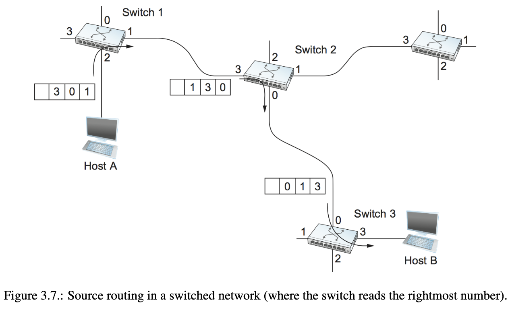
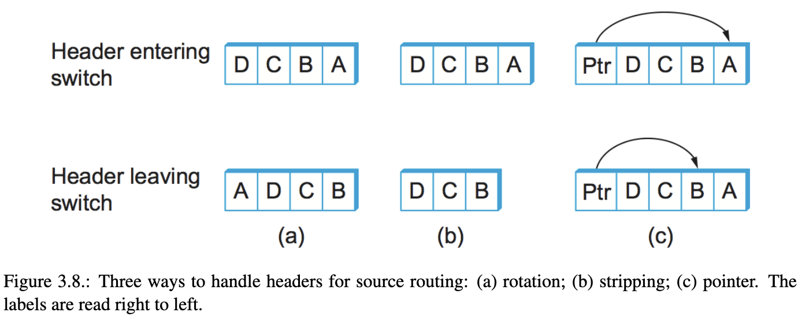

## 3.2 Switched Ethernet
In the context of switching technology, Switched Ethernet (also known as L2 switches) plays a significant role in campus and enterprise networks. These switches are commonly used to interconnect Ethernet segments and create extended LANs. While they were historically referred to as bridges, the term "switch" is now more widely used. However, the behavior and functionality of bridges and switches are essentially the same.

Let's explore the historical perspective first. Suppose you have a pair of Ethernet segments that need to be connected. One possible solution is to use a repeater between them. However, this approach may not be feasible if it exceeds the physical limitations of Ethernet. Remember that Ethernet allows a maximum of two repeaters between any pair of hosts and a total length of 2500 meters. An alternative solution is to introduce a node with two Ethernet adapters between the two segments. This node would function as a bridge, forwarding frames from one Ethernet to the other. Unlike a repeater that operates on bits and blindly copies them from one interface to another, the bridge fully implements Ethernet's collision detection and media access protocols on each interface. As a result, the length and host restrictions of Ethernet, which primarily manage collisions, would not apply to the interconnected pair of Ethernets. The bridge operates in promiscuous mode, accepting all frames transmitted on either of the Ethernets and forwarding them to the other.

Initially, early bridges followed a simple strategy of accepting LAN frames on their inputs and forwarding them out on all other outputs. However, this approach had limitations, as we'll discuss further. Over the years, several refinements were introduced to enhance the effectiveness of bridges in interconnecting LANs. The following sections will delve into these refinements and provide more interesting details.

### 3.2.1 Learning Bridges
In order to optimize the forwarding process, bridges can be designed to selectively forward frames based on the destination host's location. Consider the bridge depicted in Figure 3.9. When a frame from host A, addressed to host B, arrives on port 1, there is no need for the bridge to forward the frame out through port 2. The question then arises: How does the bridge learn on which port each host resides?

One option would be to manually configure a table in the bridge, similar to the one shown in Table 3.5. However, relying on human intervention to maintain this table would be impractical. Instead, bridges employ a simple trick to autonomously learn this information. Each bridge inspects the source address of the frames it receives. When a frame from host A is received on port 1, the bridge records that it just received a frame from host A on that port. By observing the source addresses, the bridge can build a table, similar to Table 3.5.

It's important to note that a bridge utilizing such a table operates based on a version of the datagram or connectionless model of forwarding discussed earlier. Each packet carries a global address, and the bridge determines the appropriate output port by looking up the address in its table.

When a bridge is first powered on, its forwarding table is empty, and entries are added over time as frames are received. Each entry in the table is associated with a timeout, and the bridge removes the entry after a specified period. This timeout mechanism prevents issues when a host, and consequently its LAN address, is moved from one network to another. Therefore, the table may not always be complete. If a frame is received with a destination address that is not currently in the table, the bridge forwards the frame out through all the other ports. In other words, the forwarding table serves as an optimization to filter out unnecessary frames, but it is not essential for the correctness of the forwarding process.
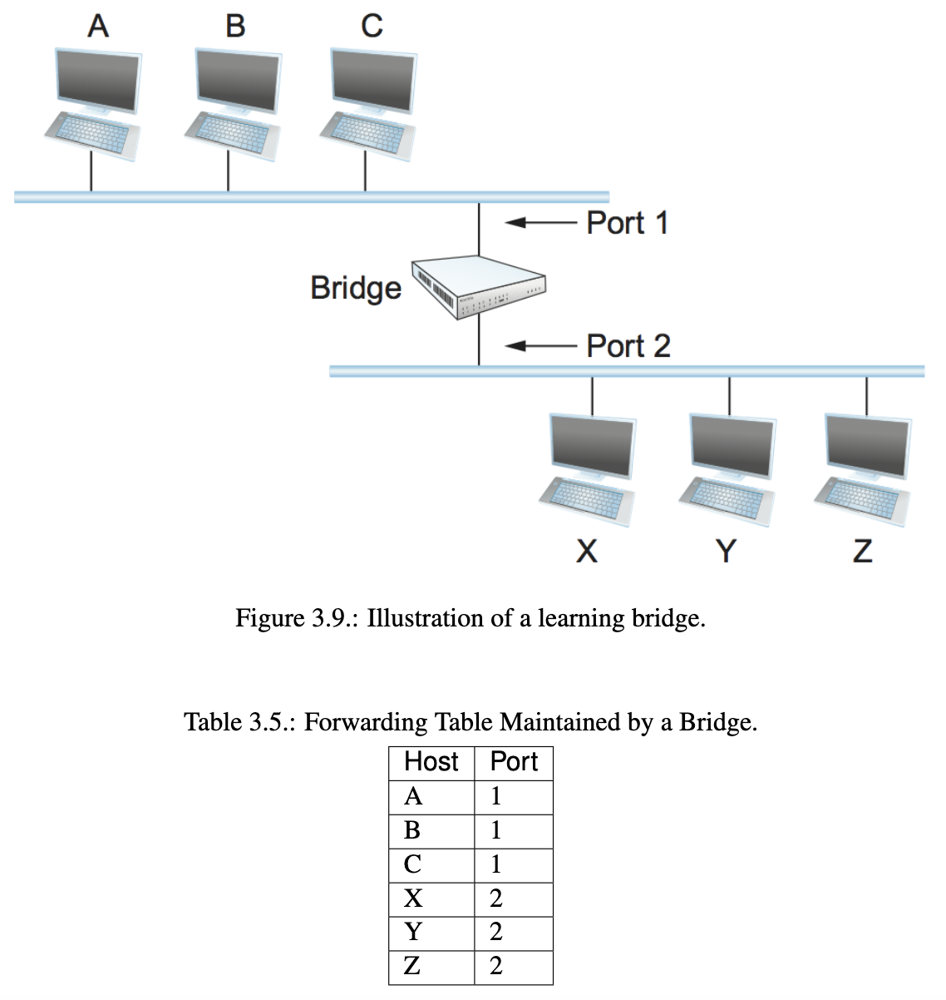

### 3.2.4 Broadcast and Multicast
Switches, in addition to forwarding unicast frames, also need to support broadcast and multicast functionalities in order to extend LANs across multiple networks.

For broadcast, each switch forwards a frame with a destination broadcast address (typically a special address that represents all hosts on a network) out on all active ports except the one on which the frame was received. This ensures that the broadcast frame reaches all hosts connected to the switch, thereby achieving the broadcast functionality.

Multicast, on the other hand, can be implemented in a similar manner. Each host individually decides whether to accept a multicast message. However, since not all hosts are members of a particular multicast group, there is room for optimization. The spanning tree algorithm can be extended to prune networks over which multicast frames do not need to be forwarded. This means that if a host within a network is not a member of a multicast group, the switch connected to that network does not need to forward the multicast frames over that network.

To determine whether a switch should forward a multicast frame over a specific port, it uses the same mechanism as for unicast frames: by observing the source addresses received on that port. However, since multicast groups are not typically the source of frames, a workaround is needed. Each host that is a member of a multicast group periodically sends a frame with the multicast group address in the source field of the frame header. The destination address of this frame would be the multicast address recognized by the switches.

Although a proposed multicast extension suggested using this method, it was not widely adopted. Instead, multicast is typically implemented in the same way as broadcast, where multicast frames are forwarded out on all active ports of the switch.

### 3.2.5 Virtual LANs (VLANs)
Switches have limitations in terms of scalability and broadcast handling, which can hinder their ability to connect a large number of switches and networks. One approach to address these limitations is the use of Virtual LANs (VLANs). VLANs allow a single extended LAN to be partitioned into multiple separate LANs. Each VLAN is assigned an identifier, and packets can only travel between segments with the same VLAN identifier. This helps in limiting the propagation of broadcast packets to a specific set of segments within the extended LAN.

To understand how VLANs work, let's consider an example with four hosts and two switches. Initially, without VLANs, any broadcast packet from any host would reach all the other hosts. However, by defining two VLANs, VLAN 100 and VLAN 200, we can create logical separation. Hosts W and X are associated with VLAN 100, while hosts Y and Z are associated with VLAN 200. The link between switches S1 and S2 is considered to be part of both VLANs.

When a packet sent by host X arrives at switch S2, the switch identifies that it came in through a port configured for VLAN 100. It then adds a VLAN header between the Ethernet header and the packet payload. The VLAN header includes the VLAN ID, which in this case is set to 100. The switch applies its normal forwarding rules to the packet but restricts it from being sent out on interfaces that are not part of VLAN 100. As a result, the packet will not be forwarded to host Z, which is in VLAN 200. The packet is forwarded to switch S1, which follows the same rules and may forward the packet to host W but not to host Y.

A significant advantage of VLANs is that the logical topology can be changed without physically moving any wires or changing addresses. For example, if we want to include the link connecting to host Z in VLAN 100, allowing hosts X, W, and Z to be on the same virtual LAN, we only need to modify the configuration on switch S2.

Supporting VLANs requires a simple extension to the original 802.1 header specification. A 12-bit VLAN ID (VID) field is inserted between the source address (SrcAddr) and type (Type) fields of the Ethernet header. This VLAN ID, also known as a VLAN tag, allows for the identification and separation of packets belonging to different VLANs. The VLAN extension preserves backwards compatibility by using the first 16 bits to indicate that the frame includes the VLAN extension (Type = 0x8100). The remaining four bits are used for control information related to frame prioritization. This allows for the mapping of up to 4096 virtual networks onto a single physical LAN.

It's important to note that L2 switches have limitations in terms of interconnecting heterogeneous networks with different addressing formats. Switches rely on the frame header of the network they connect to, limiting their support to networks with the same address format. While switches can connect Ethernet and 802.11-based networks because of their shared header format, they cannot readily interconnect networks with different addressing formats like ATM, SONET, PON, or cellular networks. The next section will address this limitation and discuss scaling switched networks to even larger sizes.

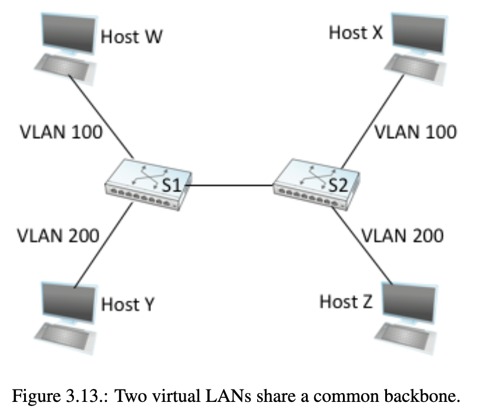
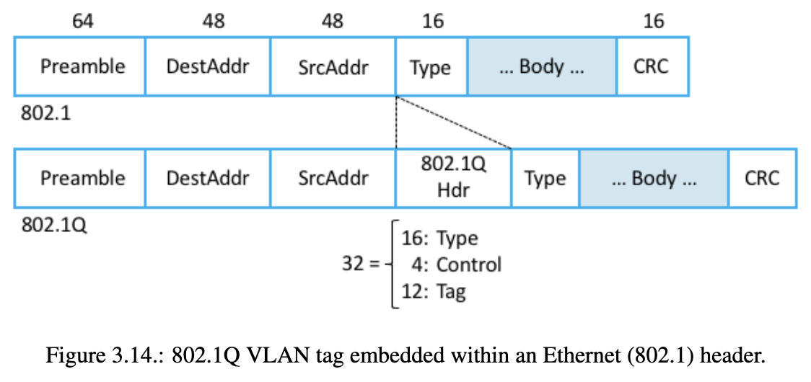

## 3.3 Internet (IP)
An internetwork, as the name suggests, refers to a network of networks. It is a collection of interconnected networks that allows for communication and data exchange between different networks and devices. Internetworks provide the foundation for the Internet as we know it today.

The concept of an internetwork emerged as a solution to overcome the limitations of bridged networks and enable the creation of large-scale, highly heterogeneous networks. Bridged networks were limited in scalability and their ability to connect networks with different addressing formats. To address these limitations, internetworks introduce the concept of routing.

Routing is the process of directing data packets from a source device to a destination device across multiple interconnected networks. Instead of relying solely on the local addressing and forwarding mechanisms of individual networks, routing enables the selection of optimal paths and the efficient delivery of packets across the internetwork.

Internetworks are typically based on the Internet Protocol (IP), which provides a common addressing scheme and a set of protocols for routing and forwarding packets. IP allows devices within an internetwork to be assigned unique IP addresses, which serve as identifiers for communication. These IP addresses are hierarchical and structured, allowing for efficient routing based on network prefixes.

To facilitate the routing process, internetworks employ routers. Routers are devices that connect different networks and make decisions about the best paths for forwarding packets based on routing tables and protocols. They examine the destination IP address of a packet and use this information to determine the next hop along the optimal path towards the destination.

The development of internetworking has led to the creation of a global internetwork, known as the Internet, which connects millions of networks and devices worldwide. The Internet relies on a combination of IP addressing, routing protocols, and other networking technologies to ensure efficient and reliable communication across vast distances.

In the next chapter, we will delve deeper into the structure and mechanisms of the global Internet, exploring how it enables connectivity on a global scale and discussing the challenges and solutions involved in its design and operation.

### 3.3.1 What Is an Internetwork?
An internetwork, also referred to as an internet (with a lowercase 'i'), is a collection of networks that are interconnected to provide host-to-host packet delivery service. It can be seen as a network of networks. For example, a corporation may create a private internetwork by connecting the LANs at different sites using point-to-point links.

When we use the term "Internet" with a capital 'I', we are specifically referring to the widely used global internetwork that connects a large percentage of networks worldwide.

In the context of internetworking, it's important to understand the distinction between networks, subnetworks (subnets), and internetworks. A network refers to a directly connected or switched network that uses a specific technology like Ethernet or 802.11. An internetwork, on the other hand, is an interconnected collection of such networks. To avoid ambiguity, the underlying networks being interconnected are sometimes called physical networks.

Routers, also known as gateways, are the nodes that interconnect networks within an internetwork. They facilitate the routing of packets between networks based on routing tables and protocols. Routers play a crucial role in enabling communication between devices in different networks within the internetwork.

The Internet Protocol (IP) is a key protocol used in building scalable and heterogeneous internetworks. It is the infrastructure that allows nodes (hosts and routers) in different networks to function as a single logical internetwork. IP runs on all the nodes within the internetwork, and higher-level protocols like TCP and UDP typically run on top of IP on the hosts.

IP is the most commonly used protocol for internetworking, especially in the case of the global Internet. Its scalability and widespread adoption make it an interesting case study for understanding internetworking principles and addressing the challenges of building a large-scale internetwork.

In addition to IP, the concept of L2 (Layer 2) and L3 (Layer 3) networks is crucial in understanding internetworking. L2 networks refer to Ethernet networks, where switches are used to connect devices within a single broadcast domain. L3 networks, on the other hand, involve routers and the use of IP for interconnecting multiple networks. The choice between L2 and L3 configuration depends on factors such as whether a single broadcast domain is desired and whether hosts need to be on different networks.

Understanding the duality and implications of L2 and L3 networks is important for mastering modern packet-switched networks and internetworking concepts.

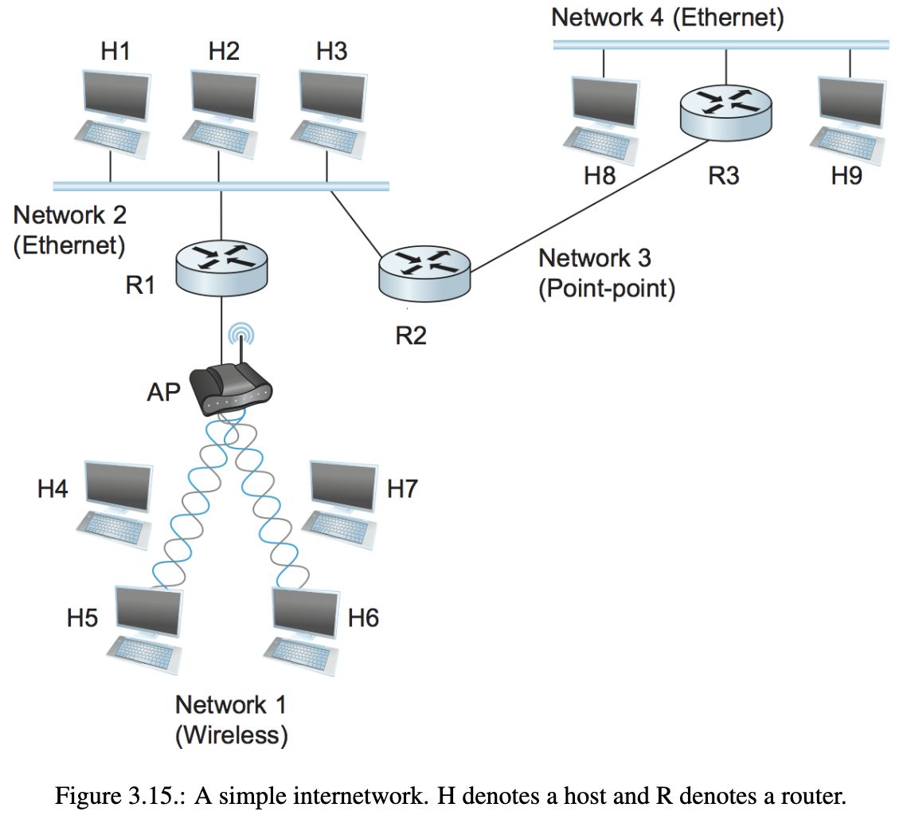
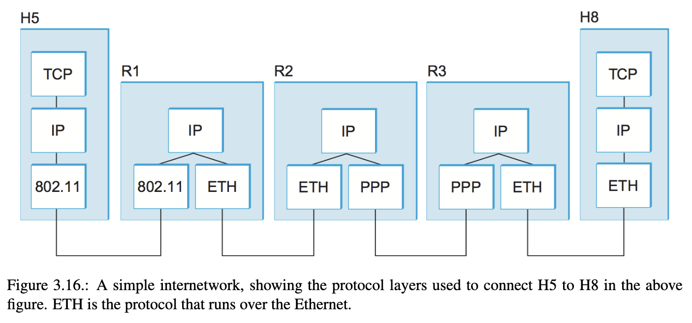

### 3.3.2 Service Model
The service model of an internetwork defines the host-to-host services that are provided over the network. When designing the service model, it is important to consider the capabilities and limitations of the underlying physical networks. The goal is to define a service model that can be supported by all the networks within the internetwork.

In the case of IP, the service model consists of two main components: an addressing scheme and a datagram (connectionless) model of data delivery.

The addressing scheme in IP provides a way to identify all hosts within the internetwork. IP addresses are used to uniquely identify each device connected to the network. The addressing scheme is a fundamental aspect of IP and plays a crucial role in routing packets to their intended destinations.

The data delivery model in IP is based on a datagram approach, which means that data is divided into small, discrete units called datagrams. Each datagram is treated independently and carries the necessary addressing information to reach its destination. The datagram model is connectionless, meaning that there is no establishment of a dedicated path or connection between the source and destination. Instead, each datagram is routed independently based on the destination address.

The IP service model is often referred to as "best effort" because it prioritizes the delivery of datagrams but does not guarantee delivery or provide any quality-of-service guarantees. IP makes every effort to deliver datagrams to their destinations, but factors such as network congestion, errors, and failures can result in packet loss or delays. This service model was designed to be flexible and adaptable to various network technologies, allowing IP to be implemented over a wide range of physical networks.

It's important to note that the IP service model focuses on providing a basic, universal service across the internetwork. Higher-level protocols, such as TCP (Transmission Control Protocol), are built on top of IP to provide additional reliability, flow control, and other features for applications that require them.

In summary, the IP service model for internetworking consists of an addressing scheme to identify hosts and a datagram-based data delivery model that operates on a best-effort basis, making every attempt to deliver packets but without guarantees.

### Datagram Delivery
The IP datagram, which is the basic unit of data in the Internet Protocol, plays a crucial role in delivering packets over a network. A datagram is a type of packet that is sent in a connectionless manner, meaning there is no need for any prior setup or coordination between the sender and receiver. Each datagram contains sufficient information to allow the network to forward it to its intended destination.

The concept of "best effort" is fundamental to the IP datagram delivery model. When a datagram is sent, the network will make its best effort to deliver it to the destination. However, the network does not guarantee delivery or take any measures to recover from failures. If a datagram is lost, corrupted, misdelivered, or fails to reach its intended destination for any reason, the network simply accepts that it made its best effort and takes no further action. This is referred to as an unreliable service.

The simplicity of the best-effort, connectionless service is a strength of IP. It allows IP to be implemented over a wide range of network technologies, regardless of their reliability characteristics. For example, if IP is used over a reliable network, the result is a best-effort service that reliably delivers packets. On the other hand, if IP is used over an unreliable network, no additional complexity needs to be added to the routers to compensate for the network's deficiencies. Keeping the routers simple was an important design goal of IP.

One of the key advantages of IP is its ability to "run over anything." IP has been designed to be adaptable to various networking technologies, including those that were not in existence when IP was initially developed. In principle, IP can be used over any network that can transport messages, even unconventional methods like carrier pigeons.

However, it's important to note that best-effort delivery in IP not only implies the possibility of packet loss but also other failure modes. Packets can be delivered out of order or duplicated, and higher-level protocols or applications that operate above IP need to be aware of these potential failure modes and handle them appropriately.

In summary, the IP datagram delivery model is based on best-effort, connectionless service. IP makes its best effort to deliver packets to their destination without guarantees or recovery mechanisms. This simplicity and adaptability have allowed IP to be widely deployed over various network technologies.

### Packet Format
The IP datagram, like most packets, consists of a header followed by a payload of data. The header format of an IP datagram is structured to align on 32-bit boundaries for ease of processing in software. The header is represented as a succession of 32-bit words, with the top word transmitted first and the leftmost byte of each word transmitted first. Fields that are multiples of 8 bits can be easily recognized in this representation, and field lengths can be determined by looking at the bit positions marked at the top of the packet.

The IP header format includes the following fields:

1. Version (4 bits): Specifies the version of IP being used. The currently assumed version is IPv4, which is denoted by the value 4. This field allows for future versions of IP to redefine the packet format while maintaining backward compatibility.
    
2. HLen (4 bits): Specifies the length of the header in 32-bit words. In most cases, when there are no options, the header length is 5 words (20 bytes).
    
3. TOS (8 bits): Stands for Type of Service. This field has had various definitions over the years but generally serves to allow packets to be treated differently based on application needs. For example, the TOS value might determine whether a packet receives low delay or is placed in a special queue.
    
4. Length (16 bits): Indicates the total length of the datagram, including the header, in bytes. The maximum size of an IP datagram is 65,535 bytes. However, the physical network over which IP is running may have limitations on packet size, so IP supports fragmentation and reassembly processes to handle larger datagrams.
    
5. TTL (8 bits): Stands for Time to Live. This field was originally intended to set a specific number of seconds that a packet would be allowed to live before being discarded. However, it is commonly used as a hop count, where routers decrement the TTL by 1 as they forward the packet. The TTL field helps prevent packets from circulating indefinitely in routing loops. The default TTL value is typically set to 64.
    
6. Protocol (8 bits): Identifies the higher-level protocol to which the IP packet should be passed. Values are defined for protocols such as TCP (6) and UDP (17) and other protocols that may sit above IP in the protocol stack.
    
7. Checksum (16 bits): Calculated by considering the entire IP header as a sequence of 16-bit words and performing ones' complement arithmetic. The result is the ones' complement of the sum. The checksum helps detect errors in the header during transit. If a packet fails the checksum, it is typically discarded.
    
8. SourceAddr (32 bits) and DestinationAddr (32 bits): These fields specify the source and destination IP addresses, respectively. The destination address is crucial for forwarding decisions at each router, while the source address allows recipients to accept the packet and reply if needed.
    
9. Options: At the end of the header, there may be a variable number of options. The presence or absence of options can be determined by examining the HLen field. Although options are used infrequently, a complete IP implementation must be able to handle all defined options.
    

It's worth noting that the IP checksum provides error detection but not as strong as a CRC. However, it is computationally simpler to calculate in software.

In summary, the IP packet format consists of a header and data payload. The header includes various fields such as version, header length, type of service, length, time to live, protocol, checksum, source address, destination address, and optional fields. The header format is designed to align on 32-bit boundaries, and its simplicity allows IP to run over various network technologies while providing best-effort, connectionless service.
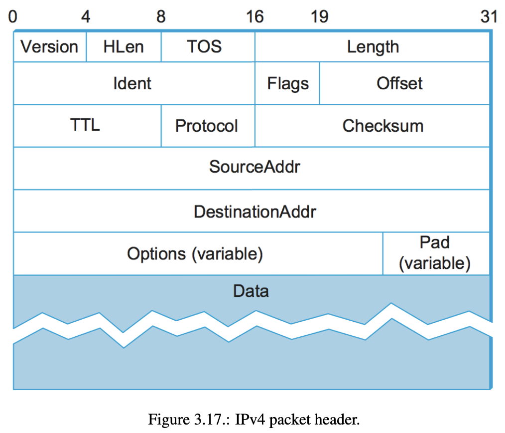

### Fragmentation and Reassembly
Fragmentation and reassembly are mechanisms in the IP protocol that handle the transmission of IP datagrams over networks with different maximum transmission unit (MTU) sizes. Since different network technologies have varying limits on packet sizes, fragmentation and reassembly allow IP datagrams to be divided into smaller pieces (fragments) when they are too large to fit within the MTU of a particular network, and then reassembled at the destination host.

When a host sends an IP datagram, it can choose any size it wants, typically selecting the MTU of the network it is directly connected to. If the transport protocol above IP sends a packet larger than the local MTU, the source host must fragment it. Fragmentation usually occurs in a router when it receives a datagram that needs to be forwarded over a network with a smaller MTU.

To facilitate reassembly at the receiving host, all fragments of a datagram carry the same identifier in the Ident field. This identifier is chosen by the sending host and should be unique among all the datagrams sent from the same source to the same destination within a reasonable time period. The receiving host recognizes and groups fragments with the same identifier together for reassembly.

However, IP does not attempt to recover from missing fragments. If not all fragments arrive at the destination host, the reassembly process is abandoned, and the received fragments are discarded.

The fragmentation process involves dividing the original datagram into smaller fragments, each being a self-contained IP datagram. Each fragment is transmitted independently over the network and is re-encapsulated for each physical network it traverses. Fragments are identified by their offset within the original datagram, which is specified in the Offset field of the IP header.

The reassembly of fragments occurs at the receiving host and not at intermediate routers. It involves recognizing fragments with the same identifier, ordering them based on their offset, and concatenating the data from each fragment to reconstruct the original datagram.

It's important to note that fragmentation should be avoided whenever possible due to its potential drawbacks. It can introduce additional processing overhead, consume network bandwidth, and increase the likelihood of packet loss or reassembly failures. Modern practices encourage the use of "path MTU discovery," where hosts send packets small enough to traverse the network path's smallest MTU, thus avoiding fragmentation altogether.
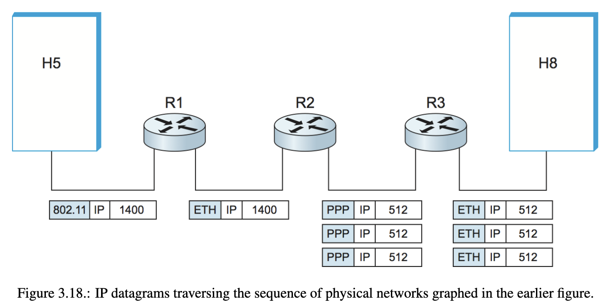
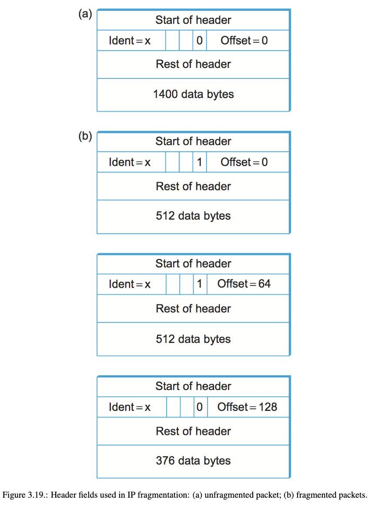

### 3.3.3 Global Addresses
Global addressing in the context of the IP protocol refers to the need for a unique and hierarchical scheme to identify hosts in a large internetwork. While Ethernet addresses are globally unique, they lack structure and provide limited information for routing protocols. In contrast, IP addresses are hierarchical, consisting of a network part and a host part.

The network part of an IP address identifies the network to which a host is attached. All hosts on the same network share the same network part in their IP addresses. The host part of the address uniquely identifies each host within that network. This hierarchical structure aligns with the interconnected nature of internetworks, where multiple networks are linked together.

It's important to note that routers in an internetwork are connected to multiple networks and require an address for each interface. For example, a router sitting between a wireless network and an Ethernet network will have an IP address on each interface, with the network part matching the hosts on the respective networks. Thus, IP addresses can be thought of as belonging to interfaces rather than hosts.

Originally, IP addresses were divided into three classes: A, B, and C. The class of an IP address is determined by the most significant bits of the address. Class A addresses have a 7-bit network part and a 24-bit host part, allowing for a small number of large networks with many hosts. Class B addresses have a 14-bit network part and a 16-bit host part, accommodating a moderate number of networks with a moderate number of hosts. Class C addresses have an 8-bit network part and a 21-bit host part, suitable for a large number of small networks with a limited number of hosts.

Class D addresses are reserved for multicast groups, and class E addresses are currently unused. The class-based addressing scheme was designed to support different network sizes efficiently, with the assumption that the internet would consist of a small number of class A networks, a modest number of class B networks, and a large number of class C networks.

However, this class-based scheme proved to be inflexible for the dynamic growth of the internet. As a result, IP addressing today is typically "classless," where the division between the network and host parts can vary and is not strictly tied to fixed classes.

IP addresses are commonly written as four decimal integers separated by dots, with each integer representing 1 byte (8 bits) of the address. For example, an IP address could be written as 171.69.210.245. It's essential not to confuse IP addresses with internet domain names, which are ASCII strings separated by dots and used for human-readable identification.

IP addresses, not domain names, are carried in the headers of IP packets and used by routers to make forwarding decisions.

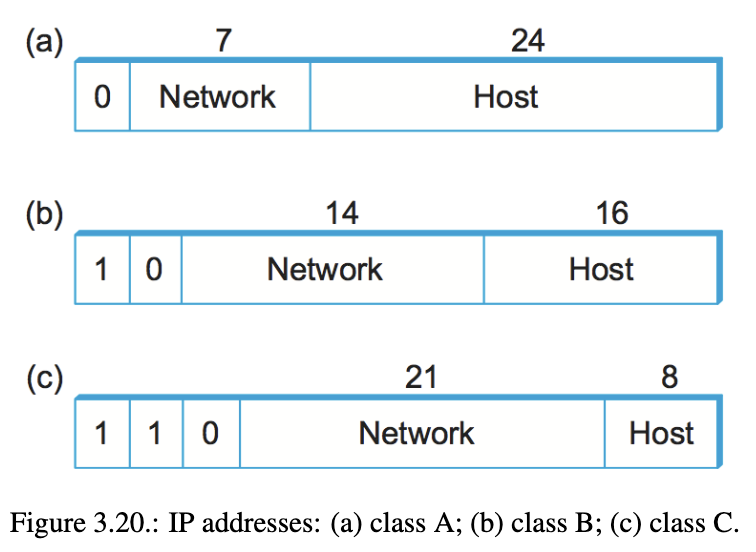

### 3.3.4 Datagram Forwarding in IP
In the IP protocol, the process of forwarding datagrams involves sending packets from a source host to a destination host, potentially passing through multiple routers along the way. Forwarding focuses on the actual delivery of packets, while routing involves building tables to determine the correct output for a packet.

Here are the key points to remember about forwarding IP datagrams:

1. Every IP datagram contains the destination host's IP address.
2. The network part of an IP address identifies a specific physical network within the larger internet.
3. Hosts and routers with the same network part of their address are connected to the same physical network and can communicate by sending frames over that network.
4. Every physical network in the internet has at least one router connected to it, allowing exchange of packets between hosts and routers on different networks.

The process of forwarding IP datagrams follows these steps:

1. The node (host or router) compares the network part of the destination address with the network part of each of its interfaces' addresses to determine if it is on the same physical network as the destination.
2. If a match occurs, the packet can be directly delivered over that network.
3. If the node is not on the same physical network as the destination, it needs to send the datagram to a router.
4. The node consults its forwarding table to determine the next hop router, selecting the best one to get the datagram closer to its destination.
5. The node delivers the packet to the next hop router, using the forwarding table's information.
6. If there is no matching entry in the forwarding table, the packet is sent to the default router.
7. For a host with only one interface and only a default router in its forwarding table, the process is simplified to either direct delivery to the destination (if on the same network) or delivery to the default router.

Let's consider an example using the internetwork depicted in Figure 3.15. Suppose host H1 wants to send a datagram to H2. Since they are on the same physical network, they have the same network number in their IP addresses. Therefore, H1 can deliver the datagram directly to H2 over the Ethernet.

Now, let's assume that H5 wants to send a datagram to H8. As they are on different physical networks with different network numbers, H5 concludes that it needs to send the datagram to a router. In this case, R1 is the default router, so H5 sends the datagram over the wireless network to R1. R1 also realizes that it cannot deliver the datagram directly to H8 because neither of its interfaces is on the same network as H8. Assuming R2 is R1's default router, R1 forwards the datagram to R2 over the Ethernet. R2 looks up H8's network number in its forwarding table and forwards the datagram over the point-to-point network to R3. Finally, R3, being on the same network as H8, delivers the datagram directly to H8.

It's worth noting that forwarding tables can include information about directly connected networks. For instance, router R2 can label its network interfaces as interface 0 for the point-to-point link (network 3) and interface 1 for the Ethernet (network 2), resulting in a forwarding table that reflects the corresponding networks.

Hierarchical addressing, with network and host parts, improves the scalability of large networks. Routers maintain forwarding tables that list network numbers rather than individual hosts, reducing the size of the table. This scalability benefit becomes more significant as network sizes increase, allowing routers to handle a large number of hosts with a relatively small forwarding table.

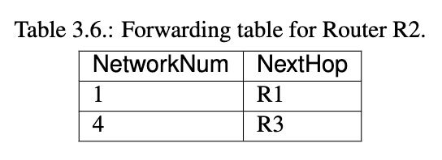
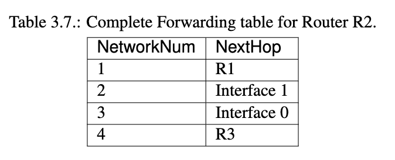

**Key Takeaway**
This illustrates one of the most important principles of building scalable networks: To achieve scalability, you need to reduce the amount of information that is stored in each node and that is exchanged between nodes. The most common way to do that is hierarchical aggregation. IP introduces a two-level hierarchy, with networks at the top level and nodes at the bottom level. We have aggregated information by letting  
routers deal only with reaching the right network; the information that a router needs to deliver a datagram to any node on a given network is represented by a single aggregated piece of information.

### 3.3.5 Subnetting and Classless Addressing
Subnetting and classless addressing were introduced to address the drawbacks of assigning one network number per physical network in the original IP addressing scheme.

The original approach of assigning network numbers resulted in address assignment inefficiency. For example, even a network with only two nodes would require a whole class C network address, wasting 253 addresses. Similarly, a network with slightly more than 255 hosts would require a class B address, wasting over 64,000 addresses. This inefficient allocation of addresses could deplete the available address space faster than necessary.

Furthermore, assigning many network numbers increased the size of forwarding tables in routers. The larger the number of network numbers in use, the bigger the forwarding tables became, leading to increased costs and potentially slower routing performance. This created a need for more careful assignment of network numbers.

Subnetting provides a solution to these issues by allowing a single IP network number to be allocated to multiple physical networks called subnets. Subnets are configured in a way that they appear as a single network from a distant point in the Internet. This means that routers only need to know how to reach the main network containing the subnets, simplifying routing.

To enable subnetting, each node on a subnet is configured with a subnet mask. The subnet mask introduces a subnet number, which is combined with the network number to define the subnet. Hosts on different physical networks can share a single network number but have different subnet numbers. This allows for more efficient utilization of IP addresses.

When a host wants to send a packet to a destination IP address, it performs a bitwise AND operation between its own subnet mask and the destination IP address. If the result matches the subnet number of the sending host, it means that the destination host is on the same subnet, and the packet can be delivered directly. Otherwise, the packet needs to be sent to a router to be forwarded to another subnet.

With subnetting, the forwarding tables of routers also change. Instead of entries of the form (NetworkNum, NextHop), the table now holds entries of the form (SubnetNumber, SubnetMask, NextHop). The router performs a bitwise AND operation between the packet's destination address and the subnet mask for each entry to find the right entry in the table. If the result matches the subnet number of the entry, the packet is forwarded to the next hop indicated.

Subnetting allows for more efficient use of IP addresses and reduces the size of forwarding tables in routers. It enables aggregation of routing information, where different parts of the Internet see the world differently. Routers outside a campus or organization see the collection of subnets as a single network, while routers within the campus need to route packets to the appropriate subnet. This aggregation of routing information is fundamental to scaling the routing system.

Overall, subnetting and classless addressing provide mechanisms to improve the efficiency and scalability of IP address allocation and routing in complex networks.

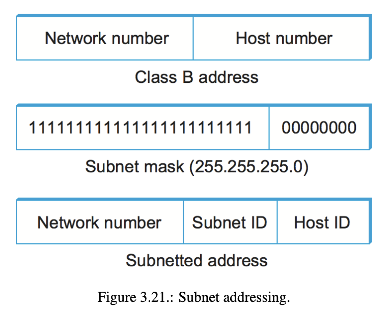
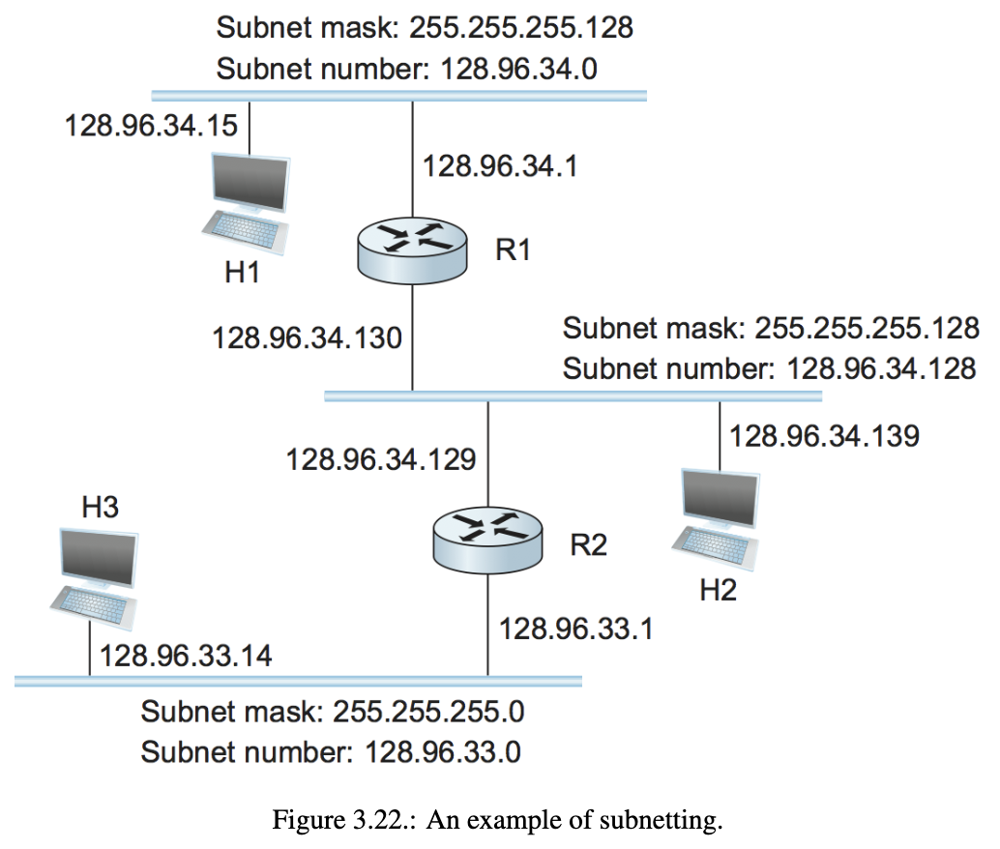
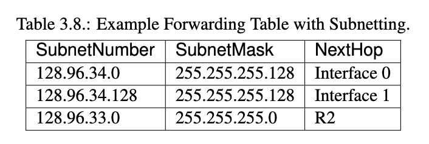

### Classless Addressing
CIDR (Classless Interdomain Routing) is a mechanism that goes beyond subnetting and eliminates the limitations of address classes. While subnetting allows for the division of a classful address into multiple subnets, CIDR enables the aggregation of several classful addresses into a single "supernet." This approach addresses the issues of address space efficiency and routing system scalability.

Subnetting alone is not sufficient because it only allows for the subdivision of a classful address into smaller subnets. However, organizations with more than 255 hosts or those expecting to reach that number would still require a class B address. This leads to address space inefficiency, as a large portion of address space is allocated for a relatively small number of hosts.

One possible solution is to allocate class C addresses to organizations based on their host requirements, rather than assigning a class B address. This approach matches the address space consumption more accurately to the organization's size, resulting in better address utilization. However, it introduces the problem of excessive storage requirements at routers. If multiple class C network numbers are assigned to a site, each network requires an entry in the routing tables of Internet backbone routers. This results in increased storage requirements and decreased address assignment efficiency.

CIDR addresses these challenges by balancing the need to minimize the number of routes in routers with the efficient allocation of addresses. It achieves this by allowing the aggregation of routes, meaning a single entry in a forwarding table can represent multiple networks. CIDR breaks the rigid boundaries between address classes and introduces variable-length prefixes for network numbers.

For example, instead of assigning 16 random class C network numbers to an organization, CIDR enables the allocation of a block of contiguous class C addresses with a common prefix. This prefix represents a network number that falls between a class B and a class C in terms of the number of hosts it can support. By assigning blocks of class C addresses that share a common prefix, address allocation efficiency is improved, and a single network prefix can be used in forwarding tables.

CIDR introduces a new notation for network numbers, using the "/X" format to represent the prefix length in bits. For example, the 20-bit prefix for networks 192.4.16 through 192.4.31 would be represented as 192.4.16/20, while a single class C network number would be represented as 192.4.16/24.

CIDR's ability to aggregate routes is not limited to customer networks but can also be applied at the edge of an Internet service provider network. By assigning adjacent network prefixes to customers that share a common, shorter address prefix, the provider can advertise a single route to reach all of them. This allows for greater route aggregation and reduces the number of routes that need to be stored and processed in the routing system.

In summary, CIDR goes beyond subnetting by enabling the aggregation of routes and eliminating the limitations of address classes. It improves address space efficiency and enhances the scalability of the routing system, making more efficient use of the available IP address space.

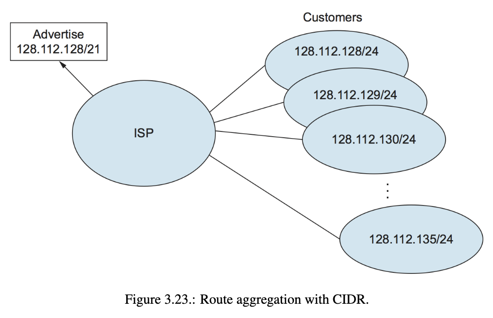

### IP Forwarding Revisited
When CIDR is introduced, the process of IP forwarding needs to be modified to handle variable-length prefixes and potential overlaps in the forwarding table. The longest match rule is applied to determine the best match between an IP address and the prefixes in the table.

In CIDR, prefixes can have any length from 2 to 32 bits. This means that the forwarding table may contain prefixes of different lengths, and there can be cases where some addresses match multiple prefixes. For example, a router's forwarding table might have both a 16-bit prefix (e.g., 171.69) and a 24-bit prefix (e.g., 171.69.10). In such a case, a packet with the destination address 171.69.10.5 would match both prefixes. According to the longest match rule, the packet would be forwarded based on the longest matching prefix, which, in this case, would be 171.69.10.

However, if a packet had a destination address of 171.69.20.5, it would only match the 171.69 prefix and not the 171.69.10 prefix. In the absence of any other matching entry in the routing table, the longest match would be 171.69.

Efficiently finding the longest match between an IP address and the variable-length prefixes in a forwarding table has been an area of research for many years. One well-known algorithm used for this purpose is the PATRICIA (Practical Algorithm to Retrieve Information Coded in Alphanumeric) tree. The PATRICIA tree was actually developed prior to the introduction of CIDR but remains a widely used method for IP address lookup and longest prefix matching. It allows for efficient searching and retrieval of prefixes based on their lengths, making it suitable for handling the variable-length prefixes encountered in CIDR.

### 3.3.6 Address Translation (ARP)
Address Resolution Protocol (ARP) is used to translate IP addresses into link-level addresses (such as Ethernet addresses) within a network. The goal of ARP is to enable hosts on a network to build a table of mappings between IP addresses and link-level addresses.

One simple approach to address translation is to encode a host's physical address in the host part of its IP address. However, this approach has limitations, such as restricting the physical address length to a maximum of 16 bits in some cases, which is insufficient for 48-bit Ethernet addresses.

A more general solution is to have each host maintain a table of address pairs, mapping IP addresses to physical addresses. Instead of relying on a centrally managed table, it is preferable for hosts to dynamically learn the mappings using the network. This is where ARP comes in.

When a host wants to send an IP datagram to another host or router on the same network, it first checks its ARP cache (or ARP table) for a mapping between the IP address and the link-level address. If no mapping is found, the host initiates an ARP query by broadcasting a message onto the network. This query contains the IP address for which it needs the link-level address.

Each host on the network receives the ARP query and checks if the target IP address matches its own IP address. If there is a match, the host sends a response message back to the originator of the query, containing its own link-layer address. The originator then adds this mapping information to its ARP table.

The ARP query message includes the IP and link-layer addresses of the sending host. Consequently, each host on the network can learn the sender's link-level and IP addresses and update its ARP table accordingly. However, not every host adds this information to its ARP table. If an entry for the host already exists, it is refreshed by resetting the expiration time. If the host is the target of the query, it adds the information about the sender to its table. If the host is not the target and does not have an existing entry for the sender, it does not add a new entry to avoid unnecessary clutter.

The ARP packet format includes the IP and link-layer addresses of both the sender and target, as well as fields for specifying the type of physical network, the higher-layer protocol, address lengths, and the operation (request or response).

The results of the ARP process can be added as an additional column in a forwarding table, similar to the example in Table 3.6. This allows routers to not only determine the next hop for forwarding a packet but also find the MAC address to be placed on the packet when sending it to the next hop.

In summary, ARP enables hosts to dynamically learn and maintain mappings between IP addresses and link-level addresses by broadcasting queries and receiving responses from hosts on the network. This allows for efficient address translation within a network.

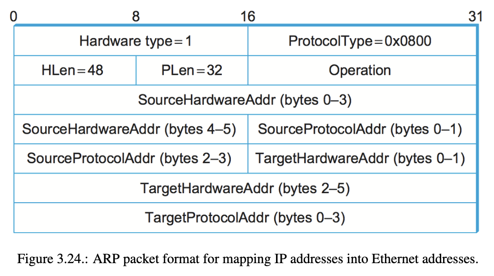

**Key Takeaway**
We have now seen the basic mechanisms that IP provides for dealing with both heterogeneity and scale. On the issue of heterogeneity, IP begins by defining a best-effort service model that makes minimal assumptions about the underlying networks; most notably, this service model is based on unreliable datagrams. IP then  
makes two important additions to this starting point: (1) a common packet format (fragmentation/reassembly is the mechanism that makes this format work over networks with different MTUs) and (2) a global address space for identifying all hosts (ARP is the mechanism that makes this global address space work over net-  
works with different physical addressing schemes). On the issue of scale, IP uses hierarchical aggregation to reduce the amount of information needed to forward packets. Specifically, IP addresses are partitioned into network and host components, with packets first routed toward the destination network and then delivered to the correct host on that network.

### 3.3.7 Host Configuration (DHCP)
Dynamic Host Configuration Protocol (DHCP) is a protocol used for automated host configuration in a network. While Ethernet addresses are preconfigured by manufacturers and globally unique, IP addresses require reconfiguration to ensure uniqueness within an internetwork and to reflect the network structure.

Manual configuration of IP addresses is time-consuming and error-prone, especially in large networks. To automate the configuration process, DHCP relies on a DHCP server, which provides the necessary configuration information to hosts. The server acts as a centralized repository for host configuration data.

In a basic DHCP configuration, the administrator manually assigns IP addresses to each host, and this information is stored in the DHCP server. When a host boots or connects to the network, it retrieves its configuration information from the DHCP server using a unique client identifier, typically the hardware address (e.g., Ethernet address).

A more advanced use of DHCP eliminates the need for manual assignment of IP addresses to individual hosts. Instead, the DHCP server maintains a pool of available addresses and dynamically assigns them to hosts on demand. This reduces the administrative overhead as the administrator only needs to allocate a range of IP addresses to each network.

To discover the DHCP server, a newly booted or attached host sends a DHCPDISCOVER message to the IP broadcast address (255.255.255.255), which is received by all hosts and routers on the network. If the DHCP server is present on the network, it replies to the host's discovery message. However, to avoid the need for a DHCP server on every network, DHCP utilizes relay agents. Each network has at least one relay agent, which is configured with the IP address of the DHCP server. The relay agent receives the DHCPDISCOVER message and unicasts it to the DHCP server. It then relays the server's response back to the requesting client.

DHCP messages are sent using the User Datagram Protocol (UDP), which runs over IP. The format of a DHCP message includes fields such as chaddr (client hardware address) where the client puts its hardware address, and yiaddr (your IP address) where the DHCP server fills in the assigned IP address. Other configuration information, like the default router, can be included in the options field.

To prevent address exhaustion, DHCP leases IP addresses to hosts for a specified period. Once the lease expires, the server can reclaim the address and make it available for other hosts. Hosts with leased addresses periodically renew the lease if they are still connected to the network and functioning correctly.

Overall, DHCP simplifies the host configuration process by automating the assignment of IP addresses and providing other necessary configuration information, reducing manual effort and potential errors.

**Key Takeaway**
DHCP illustrates an important aspect of scaling: the scaling of network management. While discussions of scaling often focus on keeping the state in network devices from growing too fast, it is important to pay attention to the growth of network management complexity. By allowing network managers to configure a range of IP addresses per network rather than one IP address per host, DHCP improves the manageability of a network.

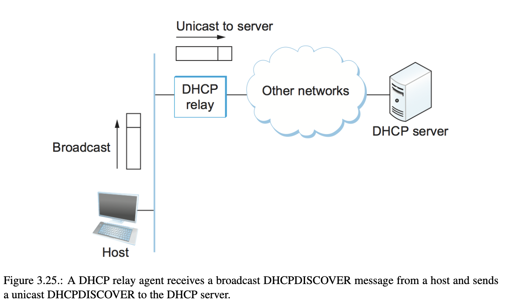
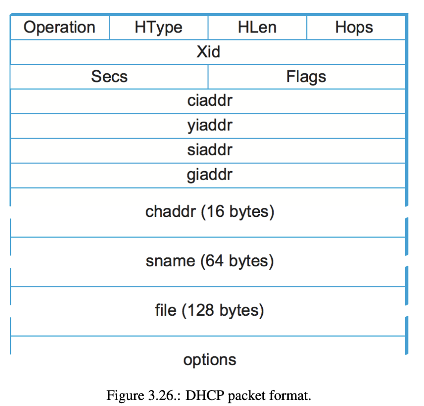

### 3.3.8 Error Reporting (ICMP)
The Internet Control Message Protocol (ICMP) is a companion protocol to IP that handles error reporting and control messages. When IP encounters errors during the processing of a datagram, such as when a router is unable to forward the datagram or when a fragment of a datagram is lost, ICMP is responsible for sending error messages back to the source host.

ICMP defines a variety of error messages that indicate different types of failures. For example, ICMP can generate error messages to indicate that the destination host is unreachable due to a link failure, that the reassembly process failed, that the Time-to-Live (TTL) value reached 0, or that the IP header checksum failed, among others.

Additionally, ICMP defines control messages that routers can send back to a source host. One useful control message is called an ICMP Redirect. When a host is connected to a network with multiple routers (e.g., R1 and R2) and it uses R1 as its default router, R1 can send an ICMP Redirect message to the host if it determines that R2 would be a better choice for a specific destination address. The ICMP Redirect message instructs the host to use R2 as the preferred router for all future datagrams addressed to that destination, and the host updates its forwarding table accordingly.

ICMP also serves as the foundation for two commonly used debugging tools: ping and traceroute. The ping tool utilizes ICMP echo messages to determine if a node is reachable and responsive. By sending an ICMP echo request and waiting for an echo reply, ping can assess the availability of a network node. Traceroute, on the other hand, uses a unique technique to identify the routers along the path to a destination. By manipulating the Time-to-Live (TTL) field in IP packets and analyzing the ICMP Time Exceeded messages received in response, traceroute can trace the route taken by packets from the source to the destination.

In summary, ICMP plays a crucial role in reporting errors to the source host when IP datagrams encounter issues. It also supports control messages, such as ICMP Redirects, and serves as the foundation for networking tools like ping and traceroute.

### 3.3.9 Virtual Networks and Tunnels
In certain scenarios, it becomes necessary to have controlled connectivity instead of unrestricted communication between nodes on different networks. One example of such a situation is a Virtual Private Network (VPN). A VPN can be defined as a virtualized version of a private network. In a private network, communication is limited to the sites within a specific corporation or organization, often for security reasons. To make a private network virtual, the dedicated leased lines used for interconnecting sites are replaced with a shared network.

To achieve controlled connectivity in a virtual private network, a virtual circuit (VC) network can be employed. This network provides logical point-to-point connections between the sites of a corporation. With a virtual circuit, packets can be sent between specific sites, but other corporations cannot reach these sites without establishing their own virtual circuits, which can be administratively prevented.

To create controlled connectivity using an IP network instead of a virtual circuit network, a concept called IP tunneling is introduced. An IP tunnel can be thought of as a virtual point-to-point link between two nodes that may be separated by multiple networks. The tunnel is established within a router at the tunnel entrance by configuring the IP address of the router at the other end of the tunnel. When a packet needs to be sent over the virtual link, the router encapsulates the packet inside an IP datagram. The destination address in the IP header is set to the address of the remote tunnel endpoint, and the source address is set to the encapsulating router's address.

In the forwarding table of the tunnel entrance router, the virtual link appears as a regular link. When a packet arrives on a physical interface that matches the forwarding entry for the tunnel's virtual interface, the router encapsulates the packet and forwards it as if it were just received. The packet traverses the internetwork like a regular IP packet until it reaches the tunnel endpoint router. The tunnel endpoint router then removes the IP header, examines the inner payload, and processes it accordingly.

IP tunneling provides several benefits. It can enhance security when combined with encryption, allowing for private communication over a public network. Tunnels can also be used to connect routers with specific capabilities, such as multicast routing, creating a virtual network where these routers appear directly connected. Furthermore, tunnels enable the transportation of non-IP packets over an IP network as long as the tunnel endpoints can handle the respective protocols.

However, tunneling has some downsides. It increases the packet length, which can lead to bandwidth waste for short packets and potential fragmentation issues for longer packets. The routers at the tunnel endpoints may also experience performance implications as they need to perform additional encapsulation and decapsulation tasks. Additionally, there is a management cost associated with setting up and maintaining tunnels, including ensuring correct handling by routing protocols.

In summary, IP tunneling provides a powerful and flexible technique for establishing virtual links across internetworks, enabling controlled connectivity, security, and the transport of different protocols. While it offers numerous benefits, careful consideration should be given to its potential downsides and management requirements.

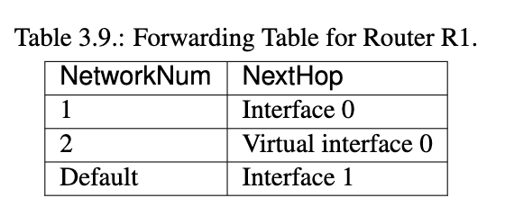
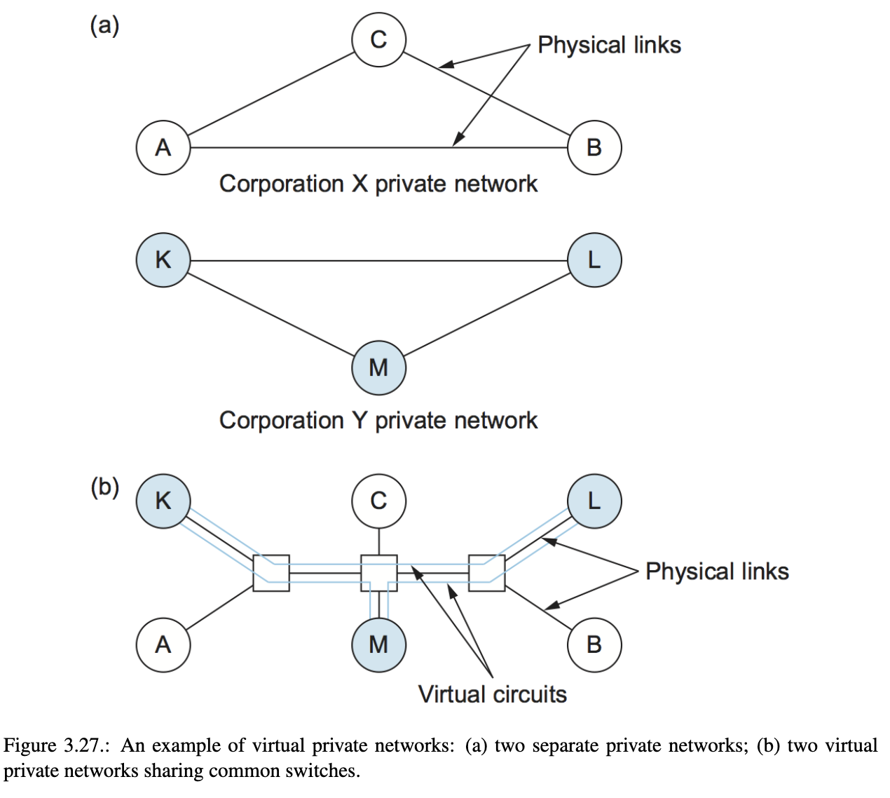
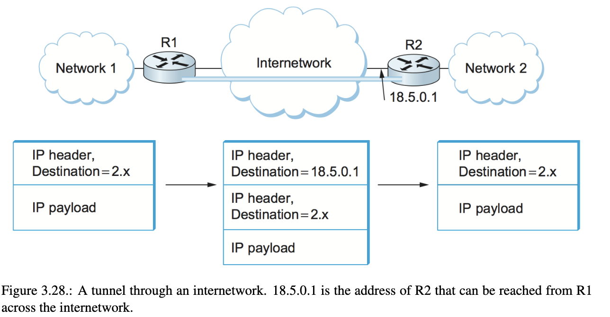
