The transport level of the network architecture is responsible for enabling process-to-process communication between application programs running on interconnected computers. The end-to-end protocol, as it is sometimes called, must meet the requirements of the application-level processes while operating within the limitations of the underlying network.

Common properties expected from a transport protocol include guaranteeing message delivery, preserving the order of messages, ensuring only one copy of each message is delivered, supporting large messages, providing synchronization between sender and receiver, allowing flow control by the receiver, and supporting multiple application processes on each host.

The underlying network typically operates on a best-effort level of service, meaning it may drop messages, reorder them, deliver duplicate copies, limit message size, and introduce variable delays. The challenge lies in developing algorithms that bridge the gap between the network's limitations and the high level of service required by application programs.

Different transport protocols employ various combinations of algorithms to provide specific services. The chapter discusses four representative services: asynchronous demultiplexing, reliable byte-stream, request/reply, and real-time applications.

The Internet's User Datagram Protocol (UDP) and Transmission Control Protocol (TCP) are used to illustrate the demultiplexing and byte-stream services, respectively. The role of the request/reply service in a Remote Procedure Call (RPC) service is also examined, along with three widely used RPC protocols: SunRPC, DCE-RPC, and gRPC. Lastly, the specific demands of real-time applications, such as carrying timing information for audio and video playback, are explored, with a focus on the Real-Time Transport Protocol (RTP).

In summary, the transport level of the network architecture addresses the challenge of providing process-to-process communication, meeting application requirements while operating within the limitations of the underlying network. Different transport protocols and algorithms are used to offer services such as demultiplexing, reliable byte-stream delivery, request/reply interactions, and support for real-time applications.

## 5.1 Simple Demultiplexor (UDP)
The simple demultiplexer protocol, exemplified by the User Datagram Protocol (UDP), extends the host-to-host delivery service of the underlying network to enable process-to-process communication. The protocol includes a level of demultiplexing, allowing multiple application processes on each host to share the network.

Processes indirectly identify each other using an abstract locator called a port. The sender sends a message to a port, and the receiver receives the message from a port. The header of the end-to-end protocol implementing demultiplexing contains identifiers (ports) for both the sender and the receiver.

The challenge is for a process to learn the port of the process it wants to communicate with. Typically, a client process initiates communication with a server process. The server knows the client's port from the message header and can reply to it. Initially, the client needs to learn the server's port, which is often a well-known port published widely. Examples include port 53 for the Domain Name Server (DNS), port 25 for mail services, and port 517 for the Unix talk program. Alternatively, a single well-known port can be used for the port mapper service, where a client requests the appropriate port for a specific service.

A port is an abstraction that can be implemented differently across systems. In one implementation, a port is represented by a message queue. When a message arrives, it is appended to the end of the queue, and if the queue is full, the message is discarded. When an application process wants to receive a message, one is removed from the front of the queue, and if the queue is empty, the process blocks until a message becomes available.

UDP provides demultiplexing and message correctness through a checksum. The checksum algorithm verifies the correctness of the message by summing up 16-bit words, using ones' complement arithmetic, and taking the ones' complement of the result. The input data for the checksum includes the UDP header, message body, and a pseudoheader containing fields from the IP header to ensure that the message is delivered between the correct endpoints.

In summary, the simple demultiplexer protocol (UDP) extends host-to-host delivery to process-to-process communication by using ports for indirect process identification. A header containing port identifiers is used for demultiplexing. Clients learn server ports through well-known ports or a port mapper service. Ports are implemented as message queues, and UDP provides a checksum for message correctness.
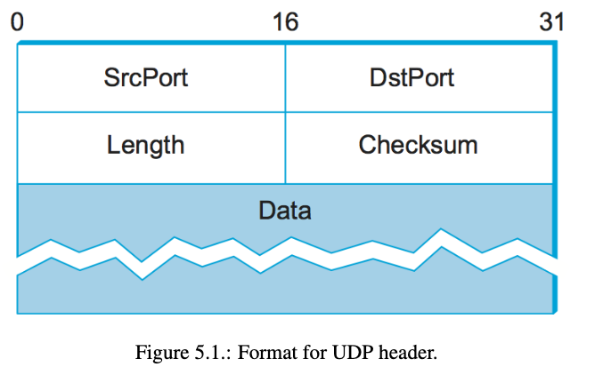
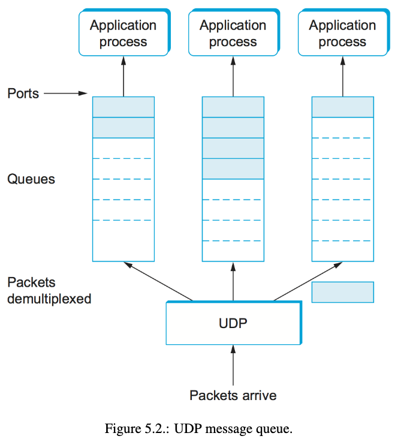

## 5.2 Reliable Byte Stream (TCP)
A more advanced transport protocol, such as the Transmission Control Protocol (TCP), provides a reliable, connection-oriented, byte-stream service. This type of service is widely used by applications as it ensures the delivery of data in the correct order and handles missing or reordered data. TCP is a full-duplex protocol, meaning it supports two simultaneous byte streams, one in each direction. It also incorporates flow control mechanisms for each byte stream, allowing the receiver to limit the amount of data the sender can transmit at a time. Additionally, TCP supports demultiplexing, enabling multiple application programs on a host to communicate with their counterparts.

TCP goes beyond the basic features and includes a highly optimized congestion-control mechanism. This mechanism regulates the rate at which TCP sends data, not only to prevent overwhelming the receiver but also to prevent network overload. Congestion control is different from flow control: flow control focuses on preventing senders from exceeding receiver capacity, while congestion control prevents excessive data injection into the network, which can cause network elements to become overloaded.

It's important to note that the detailed explanation of TCP's congestion-control mechanism is deferred to the next chapter, where it will be discussed in the context of fair allocation of network resources.

In summary, TCP provides a reliable, connection-oriented byte-stream service that guarantees in-order delivery of data. It supports full-duplex communication, includes flow control and demultiplexing mechanisms, and incorporates a sophisticated congestion-control mechanism to prevent network overload.

### 5.2.1 End-to-End Issues
TCP, the Transmission Control Protocol, relies on the sliding window algorithm to provide a reliable and ordered delivery service. However, there are several complications when TCP operates over the Internet compared to a physical point-to-point link:

1. TCP supports logical connections between processes on different computers, requiring an explicit connection establishment and teardown phase. This is different from a dedicated physical link.
2. TCP connections can have widely varying round-trip times (RTT) due to the geographical distance between hosts. The RTT can change dynamically even within a single connection. The timeout mechanism for retransmissions needs to be adaptive to handle these variations.
3. Packets can be reordered as they traverse the Internet, unlike on a point-to-point link. While slightly out-of-order packets can be handled by the sliding window algorithm, TCP needs to be prepared for significant packet delays and potential confusion caused by very old packets arriving at the receiver.
4. Point-to-point links are engineered to support the link's characteristics, including buffering capabilities. However, computers connected to the Internet can vary greatly in resources, making TCP's resource allocation variable. TCP incorporates flow control mechanisms for each side to "learn" the available resources of the other side.
5. Unlike directly connected links, the transmitting side of a TCP connection doesn't have visibility into the links it will traverse. Congestion can occur when faster sending hosts overwhelm slower links in the network. The discussion of network congestion is deferred to the next chapter.

In contrast to virtual-circuit-based networks like X.25, TCP assumes the underlying IP network is unreliable and delivers messages out of order. TCP provides reliable and ordered delivery using the sliding window algorithm on an end-to-end basis. In X.25, the sliding window protocol is used hop-by-hop within the network, assuming that reliable and ordered delivery between each pair of nodes guarantees the same end-to-end service. However, this approach has limitations, as the network path may include heterogeneous links with different service guarantees, and individual nodes along the path may introduce errors or reorder messages. Therefore, true end-to-end checks are still necessary in TCP to ensure reliable and ordered service, even though lower levels of the system may implement similar functionality.

**Key takeaway**
This discussion serves to illustrate one of the most important principles in system design—the end-to-end argument. In a nutshell, the end-to-end argument says that a function (in our example, providing reliable/ordered delivery) should not be provided in the lower levels of the system unless it can be completely and correctly implemented at that level. Therefore, this rule argues in favor of the TCP/IP approach. This rule is not absolute, however. It does allow for functions to be incompletely provided at a low level as a performance optimization. This is why it is perfectly consistent with the end-to-end argument to perform error detection (e.g., CRC) on a hop-by-hop basis; detecting and retransmitting a single corrupt packet across one  
hop is preferable to having to retransmit an entire file end-to-end.

### 5.2.2 Segment Format
TCP is a byte-oriented protocol that operates by sending and receiving packets called segments. These segments carry a portion of the byte stream between the sender and receiver. The TCP segment has a specific format consisting of various fields:

1. SrcPort and DstPort: These fields identify the source and destination ports, respectively, uniquely identifying each TCP connection. Together with the source and destination IP addresses, they form a 4-tuple demux key.
2. Acknowledgement, SequenceNum, and AdvertisedWindow: These fields are involved in TCP's sliding window algorithm. The SequenceNum field indicates the sequence number of the first byte of data in the segment. The Acknowledgement and AdvertisedWindow fields convey information about the flow of data in the opposite direction.
3. Flags: The 6-bit Flags field is used to transmit control information between TCP peers. The flags include SYN (connection establishment), FIN (connection termination), RESET (aborting the connection), PUSH (notifying the receiving side to push data to the receiving process), URG (signifying urgent data), and ACK (indicating the Acknowledgement field is valid).
4. UrgPtr: When the URG flag is set, the UrgPtr field specifies where the urgent data starts within the segment. Urgent data is given priority in processing.
5. Checksum: Similar to UDP, the Checksum field is computed over the TCP header, TCP data, and a pseudoheader consisting of source address, destination address, and length fields from the IP header. It ensures the integrity of the segment.
6. HdrLen (Offset): This field indicates the length of the TCP header in 32-bit words. It accounts for the variable length of the header due to optional fields.

Overall, the TCP segment format enables the reliable and ordered delivery of byte streams by encapsulating the necessary information for connection establishment, data transmission, flow control, and error detection.

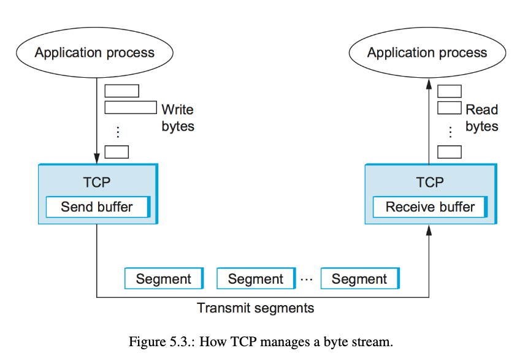
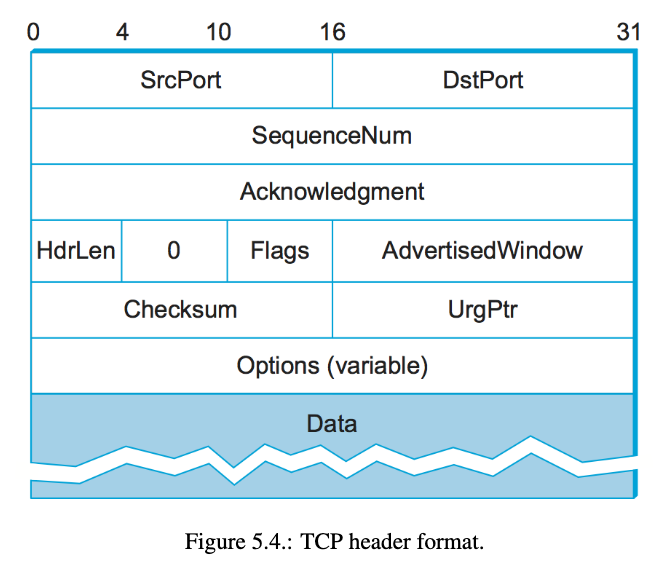
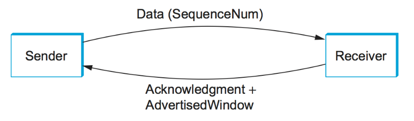

### 5.2.3 Connection Establishment and Termination
TCP connection establishment and termination involve a series of messages exchanged between the client and the server.

1. Connection Establishment:
    - The client initiates an active open to the server, while the server performs a passive open.
    - The client and server engage in a message exchange to establish the connection.
    - This connection establishment phase is necessary before data transmission can begin.
    - The active open is performed by the client, and the passive open is performed by the server.
2. Connection Termination:
    - When a participant finishes sending data, it initiates the closure of one direction of the connection.
    - TCP then starts a round of connection termination messages.
    - Connection teardown is symmetric, meaning that each side independently closes the connection.
    - It is possible for one side to close, preventing data transmission, while the other side keeps the bidirectional connection open and can continue sending data.

In summary, TCP connections start with a client actively opening a connection to a server. They establish the connection through message exchange, after which data transmission begins. When one side finishes sending data, it initiates connection termination, which involves symmetric closure of the connection by both sides.

### Three-Way Handshake
The TCP three-way handshake is an algorithm used to establish a connection between a client and a server. It involves the exchange of three messages:

1. The client (active participant) sends a segment to the server (passive participant) with the initial sequence number it plans to use (Flags = SYN, SequenceNum = x).
2. The server responds with a segment that acknowledges the client's sequence number (Flags = ACK, Ack = x + 1) and states its own beginning sequence number (Flags = SYN, SequenceNum = y).
3. The client sends a final segment that acknowledges the server's sequence number (Flags = ACK, Ack = y + 1).

Each segment carries specific flags indicating the purpose of the message. The SYN flag is used to initiate the connection, while the ACK flag acknowledges the receipt of a message.

The purpose of exchanging starting sequence numbers is to agree upon the initial values for each side's byte stream. TCP requires each side to select a random initial starting sequence number to protect against reusing sequence numbers from previous connections.

During the handshake, timers are set for each segment, and if a response is not received within a specified time, the segment is retransmitted.

The three-way handshake ensures that both the client and server are synchronized with their sequence numbers and ready to exchange data.

In summary, the TCP three-way handshake involves the exchange of three messages between the client and server to establish a connection. It ensures synchronization of sequence numbers and protects against the reuse of sequence numbers from previous connections.

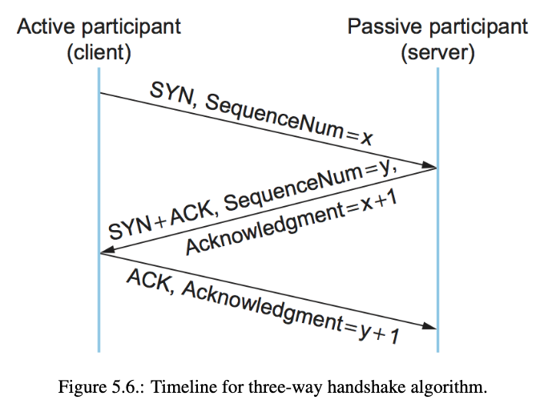

### State-Transition Diagram
The TCP specification includes a state-transition diagram that illustrates the different states involved in establishing and terminating a connection. The diagram shows the states above the ESTABLISHED state for connection establishment and the states below the ESTABLISHED state for connection termination.

Each box in the diagram represents a state that one end of a TCP connection can be in. Transitions between states occur in response to events or actions. Events can be the arrival of a segment from the peer or an operation invoked by the local application process. The diagram defines the semantics of TCP's peer-to-peer and service interfaces.

To establish a connection, the server begins with a passive open, moving to the LISTEN state. The client then performs an active open, sending a SYN segment and transitioning to the SYN_SENT state. When the SYN segment reaches the server, it moves to the SYN_RCVD state and responds with a SYN+ACK segment. Upon receiving the SYN+ACK, the client transitions to the ESTABLISHED state and sends an ACK. Finally, when the ACK reaches the server, it enters the ESTABLISHED state as well, completing the three-way handshake.

Notably, if the client's ACK to the server is lost during the handshake, the connection still functions correctly because the client is already in the ESTABLISHED state. The client can start sending data with ACK flags, and the server will move to the ESTABLISHED state upon receiving the first data segment.

The state-transition diagram also accounts for cases where a passive participant changes its mind and actively establishes the connection, although this feature is not commonly used in practice.

For connection termination, both sides of the connection must independently close their halves. There are three combinations of transitions from the ESTABLISHED state to the CLOSED state depending on which side closes first, which side closes last, or if both sides close simultaneously. Additionally, there is a rare sequence of transitions from FIN_WAIT_1 to TIME_WAIT that leads to the CLOSED state, which is left as an exercise to figure out.

In connection teardown, a connection in the TIME_WAIT state must wait for a period of time (twice the maximum time an IP datagram might live) before moving to the CLOSED state. This waiting period accounts for the possibility of delayed FIN segments and prevents the reuse of the same connection identifiers by different application processes.

Overall, the state-transition diagram provides a visual representation of the various states and transitions involved in TCP connection establishment and termination.

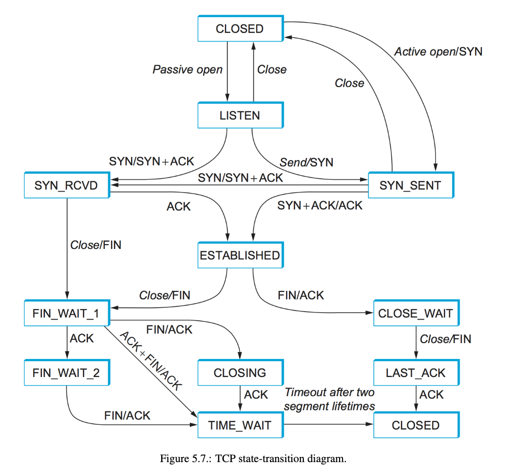

### 5.2.4 Sliding Window Revisited
TCP's variant of the sliding window algorithm serves multiple purposes:

1.  Reliable Delivery: It ensures that data sent over TCP is reliably delivered to the receiver.
2.  Ordered Delivery: It guarantees that the data is delivered in the same order in which it was sent.
3.  Flow Control: It enforces flow control between the sender and receiver, preventing the sender from overwhelming the receiver.

TCP's sliding window algorithm operates similarly to the link-level sliding window algorithm for the first two purposes. However, TCP incorporates flow control within the sliding window algorithm. Unlike a fixed-size sliding window at the link level, TCP allows the receiver to advertise a window size to the sender. The AdvertisedWindow field in the TCP header is used for this purpose. The sender is then restricted to having no more than the advertised window size worth of unacknowledged data at any given time.

The receiver determines the suitable value for the AdvertisedWindow based on the amount of memory allocated for buffering data in the connection. The objective is to prevent the sender from overwhelming the receiver's buffer capacity. By controlling the window size, the receiver can effectively regulate the rate at which the sender sends data, ensuring a balanced flow between the two.

In summary, TCP's sliding window algorithm guarantees reliable and ordered delivery of data while incorporating flow control. The receiver advertises a window size to the sender, limiting the amount of unacknowledged data the sender can have. This approach prevents the sender from overloading the receiver's buffer and helps maintain a controlled and efficient data flow.

### Reliable and Ordered Delivery
On the sending side of TCP, there are three pointers that indicate the progress of data transmission:

1.  LastByteAcked: Points to the last byte that has been acknowledged by the receiver.
2.  LastByteSent: Points to the last byte that has been sent (including retransmissions).
3.  LastByteWritten: Points to the last byte that has been written by the sending application but not yet transmitted.

The relationships between these pointers are as follows:

-   LastByteAcked <= LastByteSent: The receiver cannot have acknowledged a byte that has not been sent.
-   LastByteSent <= LastByteWritten: TCP cannot send a byte that the application process has not written.

Bytes to the left of LastByteAcked have already been acknowledged and do not need to be saved in the send buffer. Bytes to the right of LastByteWritten have not yet been generated and do not need to be buffered.

On the receiving side of TCP, there are also three pointers (sequence numbers) that manage the received data:

1.  LastByteRead: Points to the last byte that has been read by the local application process.
2.  NextByteExpected: Points to the byte immediately after the latest byte that has been received and for which all preceding bytes have also been received.
3.  LastByteRcvd: Points to the last byte that has been received, including out-of-order delivery.

The relationships between these pointers are as follows:

-   LastByteRead < NextByteExpected: The application cannot read a byte until it has been received along with all preceding bytes.
-   NextByteExpected <= LastByteRcvd + 1: If data arrives in order, NextByteExpected points to the byte after LastByteRcvd. If data arrives out of order, NextByteExpected points to the start of the first gap in the data.

Bytes to the left of LastByteRead have already been read by the local application process and do not need to be buffered. Bytes to the right of LastByteRcvd have not yet arrived and do not need to be buffered.

In summary, these pointers and relationships help manage the send and receive buffers in TCP. They ensure that data is transmitted and received in the correct order and that the application processes on both sides have access to the appropriate data.
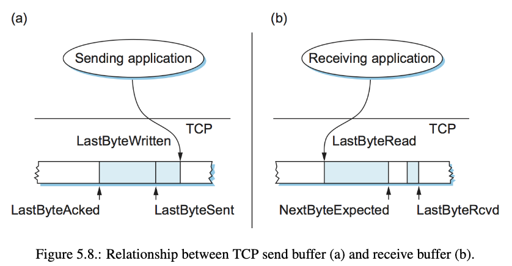

### Flow Control
In TCP, both the sender and receiver maintain buffers to handle data transmission. The sender has a send buffer to store data that has been sent but not yet acknowledged, as well as data written by the sending application. The receiver has a receive buffer to hold out-of-order data and data that the application process has not yet read.

The sender's buffer is managed by three pointers:

1.  LastByteAcked: Points to the last byte that has been acknowledged by the receiver.
2.  LastByteSent: Points to the last byte that has been sent (including retransmissions).
3.  LastByteWritten: Points to the last byte that has been written by the sending application.

The receiver's buffer is managed by three pointers:

1.  LastByteRead: Points to the last byte that has been read by the local application process.
2.  NextByteExpected: Points to the byte immediately after the latest byte that has been received and for which all preceding bytes have also been received.
3.  LastByteRcvd: Points to the last byte that has been received, including out-of-order delivery.

Both buffers have a maximum size: MaxSendBuffer for the sender and MaxRcvBuffer for the receiver.

To avoid buffer overflow, the receiver must ensure that: LastByteRcvd - LastByteRead <= MaxRcvBuffer

The receiver advertises its available window size (AdvertisedWindow) to the sender, which represents the remaining free space in its buffer: AdvertisedWindow = MaxRcvBuffer - ((NextByteExpected - 1) - LastByteRead)

The advertised window can shrink if the receiving process falls behind in reading data. If the application process reads data at the same rate as it arrives, the advertised window remains open (AdvertisedWindow = MaxRcvBuffer). However, if the receiving process lags, the advertised window becomes smaller with each arriving segment until it reaches 0.

The sender must adhere to the advertised window received from the receiver: LastByteSent - LastByteAcked <= AdvertisedWindow

The sender calculates an effective window (EffectiveWindow) that limits the amount of data it can send: EffectiveWindow = AdvertisedWindow - (LastByteSent - LastByteAcked)

The sender can only send data if EffectiveWindow is greater than 0. If the advertised window shrinks due to the receiver falling behind, the sender can free buffer space but cannot send more data until the window opens up again.

The sender also needs to ensure that the send buffer does not overflow: LastByteWritten - LastByteAcked <= MaxSendBuffer

If the sending process attempts to write more data than the remaining buffer space, TCP blocks the process from generating more data.

When the receive buffer fills up and the advertised window reaches 0, the sender is unable to transmit any data. Eventually, the send buffer also fills up, causing TCP to block the sending process. Once the receiving process starts reading data again, the receive-side TCP can open its window, allowing the send-side TCP to transmit data and unblock the sending process.

To determine when the advertised window is no longer 0, the sending side periodically sends 1-byte segments called Zero Window Probes, even though they are not expected to be accepted. Each probe triggers a response from the receiver containing the current advertised window. These probes are sent every 5 to 60 seconds and contain the next byte of actual data just outside the window.

Overall, this mechanism allows TCP to manage the flow of data between sender and receiver, preventing buffer overflow and ensuring reliable and ordered delivery.

**Key takeaway**
Note that the reason the sending side periodically sends this probe segment is that TCP is designed to make the receive side as simple as possible—it simply responds to segments from the sender, and it never initiates any activity on its own. This is an example of a well-recognized (although not universally applied) protocol design rule, which, for lack of a better name, we call the smart sender/ dumb receiver rule. Recall that we saw another example of this rule when we discussed the use of NAKs in sliding window algorithm.

### Protecting Against Wraparound
TCP's SequenceNum field is 32 bits long, providing a sequence number space of 2^32. The relevance of the 32-bit sequence number space is that the sequence number used on a connection might wrap around. This means that a byte with a certain sequence number could be sent at one time, and later a second byte with the same sequence number could be sent. However, TCP needs to ensure that the sequence number does not wrap around within a 120-second period, as packets are not expected to survive in the Internet longer than the recommended Maximum Segment Lifetime (MSL).

The speed at which data is transmitted over the Internet determines how quickly the 32-bit sequence number space can be consumed. Table 5.1 illustrates the time it takes for the sequence number to wrap around for networks with different bandwidths. At modest bandwidths, the 32-bit sequence number space is sufficient. However, with the prevalence of high-speed links like OC-192 and 10Gig Ethernet (10 Gbps) interfaces, the 32-bit space is becoming too small.

To address this limitation, the IETF (Internet Engineering Task Force) has developed extensions to TCP that effectively extend the sequence number space to prevent wrapping around. These extensions and related enhancements are described in later sections, providing a solution for handling larger bandwidths and protecting against sequence number wraparound.

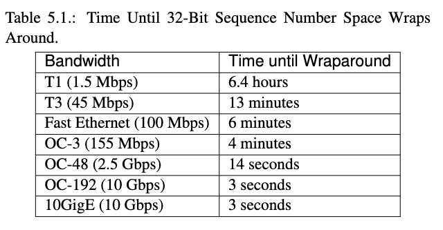

### Keeping the Pipe Full
The 16-bit AdvertisedWindow field in TCP must be large enough to allow the sender to keep the network pipe full. While the receiver has the flexibility to open the window smaller than the maximum size allowed by AdvertisedWindow, we are interested in scenarios where the receiver has sufficient buffer space to handle the maximum possible window size.

The size of the AdvertisedWindow field is determined by the delay × bandwidth product, rather than just the network bandwidth. It needs to be opened wide enough to accommodate a full delay × bandwidth product's worth of data to be transmitted. Assuming a round-trip time (RTT) of 100 ms, Table 5.2 provides the delay × bandwidth product for various network technologies.

However, TCP's AdvertisedWindow field is even more limited than its SequenceNum field. It is not large enough to handle a T3 connection across the continental United States, as a 16-bit field allows for an advertised window of only 64 KB. To address this limitation, the same TCP extension mentioned earlier provides a mechanism for effectively increasing the size of the advertised window.
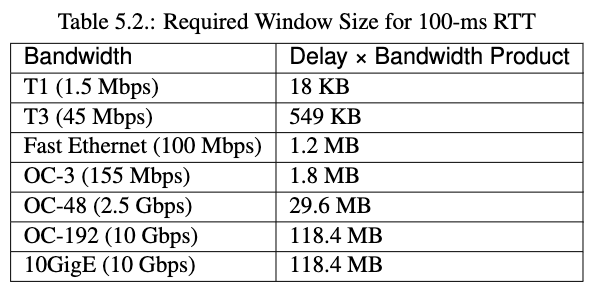

### 5.2.5 Triggering Transmission
When determining when to transmit a segment, TCP considers several factors. In the absence of flow control, TCP relies on three mechanisms to trigger segment transmission.

1. Maximum Segment Size (MSS): TCP maintains a variable called the MSS, representing the maximum segment size it can send without causing fragmentation at the IP layer. TCP sends a segment as soon as it has collected MSS bytes from the sending process.
2. Push operation: TCP supports a push operation, where the sending process can request TCP to flush its buffer of unsent bytes. When the sending process invokes this operation, TCP will transmit a segment containing all the currently buffered bytes.
3. Timer expiration: TCP uses a timer that, when it expires, triggers segment transmission. The segment will contain all the bytes currently buffered for transmission. However, the nature of this timer is more complex than a straightforward timer, as will be explained in subsequent discussions.

These triggers determine when TCP decides to send a segment, allowing for the efficient transmission of data over the network.

### Silly Window Syndrome
Flow control is an essential aspect of TCP that regulates the sender's transmission rate. When determining whether to transmit a segment, TCP considers the available window size. If the sender has accumulated MSS (Maximum Segment Size) bytes of data to send, and the window is open for at least that amount, a full segment is transmitted.

However, a dilemma arises when the sender is accumulating bytes to send, but the window is currently closed. If an ACK arrives that opens the window enough for the sender to transmit, should the sender transmit a half-full segment or wait for the window to open to a full MSS?

Early TCP implementations chose to transmit a half-full segment to take advantage of any available window. This strategy led to a problem known as "silly window syndrome." It occurs when a smaller-than-MSS segment is introduced into the system, and it remains in the system indefinitely. The small segment is continuously filled and emptied, preventing its coalescence with adjacent segments to create larger segments.

To mitigate the silly window syndrome, a rule was established that after advertising a zero window, the receiver must wait for space equal to an MSS before advertising an open window. Although it is not possible to prevent the sender from transmitting small segments, the receiver can delay ACKs to coalesce them. However, this is only a partial solution, as the receiver lacks information about how long it is safe to delay.

Ultimately, the responsibility falls on the sender to decide when to transmit a segment, considering the flow control and avoiding the creation of small segments that can lead to the silly window syndrome.
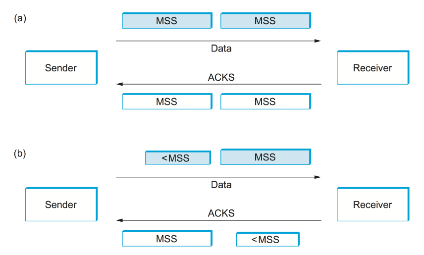

### 5.2.7 Record Boundaries
In TCP, which is a byte-stream protocol, the number of bytes written by the sender may not match the number of bytes read by the receiver. Unlike message-oriented protocols like UDP, TCP does not automatically insert record boundaries between sets of bytes.

However, TCP provides two features that allow the sender to indicate record boundaries to the receiver. These features were originally intended for different purposes but have been repurposed over time.

1.  Urgent data mechanism: TCP includes the URG flag and UrgPtr field in the header to support sending out-of-band data. Originally, this feature allowed the sender to send urgent data that would be delivered immediately, even if it had a later sequence number. However, since this feature is rarely used, it has been utilized to mark special data, such as record markers, instead. The receiving TCP notifies the application of the arrival of urgent data, acting as a signal rather than emphasizing its urgency.
2.  Push operation: TCP includes a push operation to instruct the sender to send whatever data it has collected to the receiver. This operation was designed to flush buffered data. The push operation can also be used to create record boundaries. When the application invokes the push operation, TCP sends any buffered data to the receiver. Additionally, if the receiving side supports the option (not available in the socket interface), it can notify the application when an incoming segment has the PUSH flag set. This way, the push operation can be used to break the TCP stream into records.

It's worth noting that the application can also manually insert record boundaries without relying on TCP. For example, the application can send a field indicating the length of a record or insert its own record boundary markers within the data stream.

These mechanisms provide options for the sender and receiver to establish record boundaries within the TCP byte stream, which can be useful for applications such as databases.

### 5.2.9 Performance
In this section, the authors discuss the performance evaluation of network protocols, focusing on latency and throughput as key metrics. They emphasize that performance measurements are essential for understanding the impact on application programs and are influenced by both hardware and software overhead.

The experimental setup consists of workstations with dual CPU 2.4-GHz Xeon processors running Linux. Ethernet adapters are used to enable speeds above 1 Gbps. The goal is not to showcase the maximum speed achievable by a specific protocol but to illustrate the methodology for measuring and reporting protocol performance.

The throughput test is conducted using a benchmarking tool called TTCP, varying message sizes. The results show that throughput improves as message size increases. This is because the overhead associated with each message becomes less significant when amortized over more bytes. The throughput curve flattens above 1 KB, indicating that the per-message overhead becomes negligible compared to the overall processing load.

It's worth noting that the maximum throughput achieved is less than the available link speed (2 Gbps), suggesting the presence of bottlenecks that need further investigation. Analysis of CPU load, memory bandwidth, and adapter performance may provide insights into the underlying limitations.

The experimental setup represents an ideal network scenario with minimal delay or loss. However, real-world networks often face challenges such as bandwidth constraints and loss-prone wireless links. To understand how these factors affect TCP performance, the next chapter focuses on TCP congestion control.

Over the years, as network speeds have increased, TCP has managed to keep up with the demands. The introduction of window scaling to handle larger bandwidth-delay products has been crucial. However, achieving the theoretical performance of TCP in practice can be challenging due to factors like unnecessary data copying and insufficient buffer memory. The complex dynamics of TCP and its interactions with network and application behavior can significantly impact performance.

Despite these challenges, TCP continues to perform well as network speeds increase. When TCP reaches its limits related to congestion or increasing bandwidth-delay products, researchers work on finding solutions to enhance performance.

In summary, this section emphasizes the importance of performance evaluation, provides insights into the experimental methodology, discusses throughput results, highlights the challenges faced by TCP, and underscores its ability to adapt to evolving network demands while seeking solutions to performance limitations.
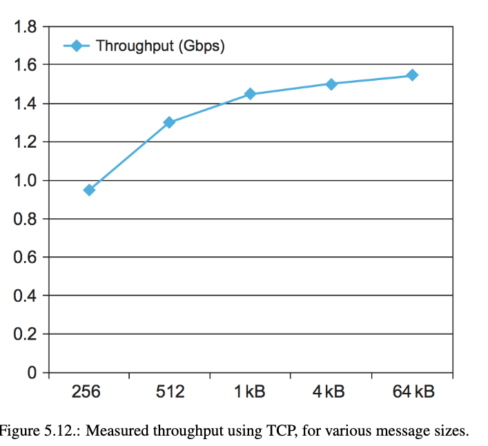

### 5.2.10 Alternative Design Choices (SCTP, QUIC)
In this section, the authors explore alternative design choices and considerations in transport protocols, acknowledging that TCP is not the only valid option in the design space. They discuss different classes of transport protocols, such as stream-oriented (like TCP) and request/reply protocols (like RPC). TCP falls into the stream-oriented category, and within that, it can be further divided into reliable and unreliable subgroups.

Regarding the suitability of TCP for request/reply applications, there are complications. TCP is byte-oriented, while request/reply applications typically deal with messages. Additionally, a well-designed request/reply protocol can accomplish the message exchange in fewer packets compared to TCP, which requires additional overhead for connection setup and teardown. However, under certain circumstances, TCP can still support request/reply functionality efficiently, especially when large messages are involved.

TCP's choice of providing a reliable byte-stream service instead of a reliable message-stream service is explained. Message-oriented protocols must establish an upper bound on message sizes, which may limit their applicability. However, record boundaries can be inserted into a byte stream to achieve message-oriented functionality.

The decision of TCP to deliver bytes in order to the application is discussed. While it is beneficial for many applications, it may not be necessary or advantageous for applications that can process data out of order, such as web pages with multiple embedded objects. To support such applications, alternative transport protocols like SCTP (Stream Control Transmission Protocol) and QUIC (Quick UDP Internet Connections) have been developed, offering partially ordered or optimized delivery services.

TCP's explicit setup and teardown phases are mentioned, noting that alternative approaches are possible. For connection setup, it is feasible to include necessary parameters with the first data message, but TCP allows the receiver to reject the connection before any data transfer. In terms of teardown, TCP closes inactive connections, but this poses challenges for applications that require long-lived connections, necessitating out-of-band messages to maintain connection state.

Finally, TCP is a window-based protocol for flow control, but rate-based designs are an alternative. In rate-based protocols, the receiver informs the sender of the acceptable data rate. The relationship between windows and rates is discussed, highlighting the flexibility of adjusting the advertised window size to control the transmission rate. The frequency of relaying rate information back to the sender is a key consideration.

In summary, this section explores alternative design choices in transport protocols. It highlights the division between stream-oriented and request/reply protocols, discusses the suitability of TCP for different application scenarios, mentions alternative protocols like SCTP and QUIC, addresses explicit setup/teardown phases, and contrasts window-based and rate-based designs for flow control.

### QUIC
QUIC (Quick UDP Internet Connections) is a transport protocol that originated at Google and is currently undergoing standardization at the IETF. It has been moderately deployed in web browsers and popular websites. The motivation behind QUIC is to address the limitations of TCP, particularly in handling HTTP (web) traffic, due to factors such as high-latency wireless networks, multiple network availability, and increased use of encrypted connections.

One key design decision in QUIC is the use of multiple paths or interfaces to improve performance. Multipath TCP is an example where packets are steered over multiple paths, such as using two IP addresses for endpoints. This is beneficial for delivering data to mobile devices connected to both Wi-Fi and cellular networks. However, implementing Multipath TCP is challenging as it disrupts assumptions about TCP flow control, in-order segment reassembly, and congestion control.

QUIC aims to reduce latency by combining connection setup and security handshakes to minimize round trips. With TCP over TLS, three round trips are typically needed before the first HTTP message can be sent. QUIC optimizes this process to establish connections faster. Another design consideration is the ability of QUIC to persist connections across different network layer connections, accommodating scenarios where a device switches from Wi-Fi to cellular.

The reliable byte stream model of TCP is not well-suited for fetching multiple objects in a web page request, where page rendering can begin before all objects have arrived. While opening multiple TCP connections in parallel was a workaround, it had drawbacks. QUIC addresses this by multiplexing several streams onto a single transport connection, avoiding head-of-line blocking and improving performance.

Notably, QUIC rides on top of UDP instead of TCP, as many middleboxes like NATs and firewalls are configured for TCP and UDP and may not support a new transport protocol. QUIC implements fast connection establishment, encryption, and authentication within one round trip time (RTT). It also provides a connection identifier that persists across network changes and maintains TCP's congestion avoidance properties.

QUIC represents a significant development in transport protocols, tackling long-standing limitations of TCP. Its inspiration from HTTP and the web introduces unforeseen consequences of layered designs and showcases the evolution of the internet.
