This chapter focuses on network applications and highlights the importance of understanding the underlying building blocks of a network to build effective applications. It emphasizes the systems approach and the interaction between network protocols and traditional application programs. The chapter explores various popular network applications available today and discusses how they make use of different networking capabilities such as reliable transport, authentication, privacy mechanisms, and resource allocation. It emphasizes that application developers need to be skilled in protocol design and implementation to create successful network applications. The chapter covers a range of applications including email, web browsing, business integration, multimedia applications, network management, peer-to-peer networks, and content distribution networks. It emphasizes the need for applications to select and utilize appropriate building blocks from different layers of the network and host protocol stacks to provide the desired communication service.

## 9.1 Traditional Applications
This section focuses on two popular "traditional" applications: the World Wide Web and email. These applications follow the request/reply paradigm, where users send requests to servers, and the servers respond accordingly. The distinction between application programs and application protocols is emphasized, with examples such as web clients using the HyperText Transport Protocol (HTTP) to communicate with web servers. The importance of published and standardized protocols is highlighted, enabling interoperability among different browsers and servers. The section introduces two widely used application protocols: Simple Mail Transfer Protocol (SMTP) for email exchange and HTTP for web communication. It is noted that many application layer protocols, including SMTP and HTTP, have companion protocols that specify the format of the exchanged data. These protocols are implemented on top of TCP rather than Remote Procedure Call (RPC) transport protocols, with each protocol reinventing a simplified RPC-like mechanism on top of a reliable transport protocol. The power of HTTP's approach has led to its widespread adoption in the Web Services architecture, where general RPC mechanisms are built on top of HTTP.

### 9.1.1 Electronic Mail (SMTP, MIME, IMAP)
Email is one of the oldest network applications and was not originally envisioned as a key application for the ARPANET. However, it turned out to be the Internet's original "killer app." It is important to distinguish between the user interface (mail reader) and the underlying message transfer protocols, such as SMTP (Simple Mail Transfer Protocol) and IMAP (Internet Message Access Protocol). Additionally, a companion standard, including RFC 822 and MIME (Multipurpose Internet Mail Extensions), defines the format of the exchanged messages. The section begins by examining the message format in email communication.

### Message Format
The message format in email communication is defined by RFC 822, which consists of a header and a body. The header contains `<CRLF>` terminated lines, separated from the body by a blank line. Each header line consists of a type and value separated by a colon. RFC 822 was extended by MIME to allow email messages to carry different types of data. MIME includes header lines that describe the data being carried, content type definitions, and a way to encode data types into ASCII using base64 encoding. MIME also defines a multipart type for structuring messages with multiple data types. The base64 encoding scheme maps three bytes of binary data into four ASCII characters. Messages can be encoded using 7-bit ASCII or readable encoding for text-only mail readers. Overall, the message format allows emails to carry various types of data, including plain text, images, and documents.

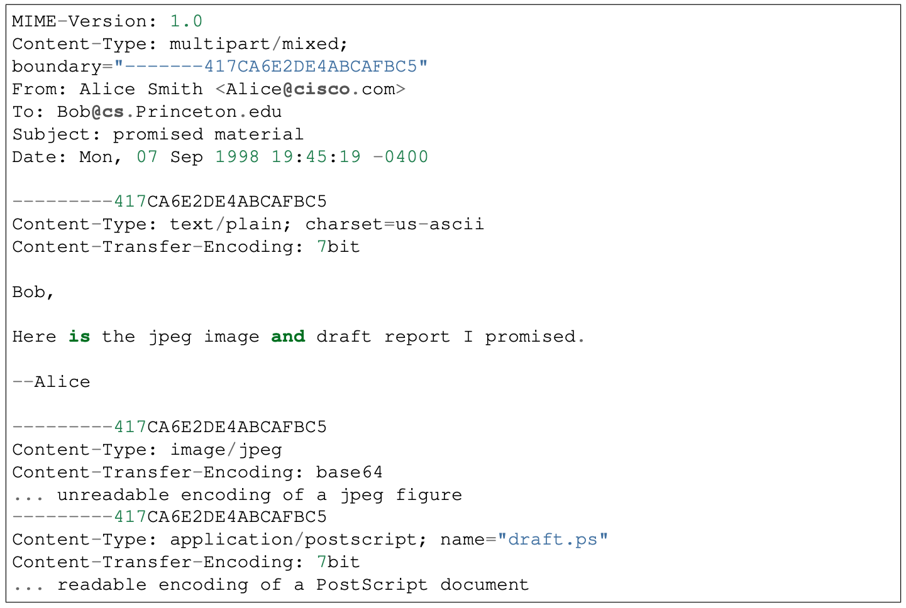

### Message Transfer
Email messages are transferred between hosts using different protocols, with SMTP being the central protocol. SMTP (Simple Mail Transfer Protocol) is responsible for transferring messages from one host to another. Users interact with a mail reader to compose, file, search, and read their email. The mail reader communicates with a mail server using protocols such as POP (Post Office Protocol) or IMAP (Internet Message Access Protocol) to download email messages to the user's device.

On each host that holds a mailbox, there is a mail daemon or message transfer agent (MTA) running. The mail daemon acts as a post office, receiving messages from users or their mail readers and using SMTP over TCP to transmit the messages to the recipient's host. Popular implementations of mail daemons include sendmail and postfix.

In many cases, email messages pass through one or more mail gateways on their route from the sender's host to the receiver's host. These gateways also run a mail transfer agent process and store and forward email messages. They serve a similar function to IP gateways (routers) in storing and forwarding IP datagrams. Mail gateways allow for scalability, hiding specific hosts and accommodating large organizations with multiple machines holding mailboxes.

SMTP sessions involve a dialog between two mail daemons, with one acting as the client and the other as the server. Each SMTP session moves the message closer to the recipient. SMTP commands and return codes are used to exchange information between the client and server. The server verifies the client's domain name, accepts or rejects mail for specific users, and responds with appropriate codes and explanations. Other commands like RCPT (recipient) and VRFY (verify) are also used. The MAIL and RCPT operations specify the sender and recipient addresses, forming an envelope for the message.

Overall, SMTP facilitates the transfer of email messages between hosts, ensuring reliable delivery even through intermediate mail gateways.

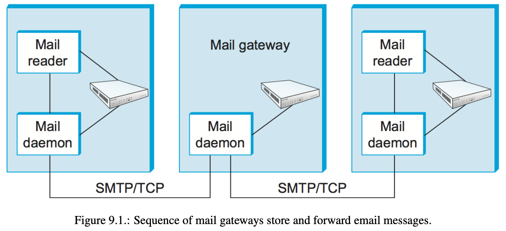
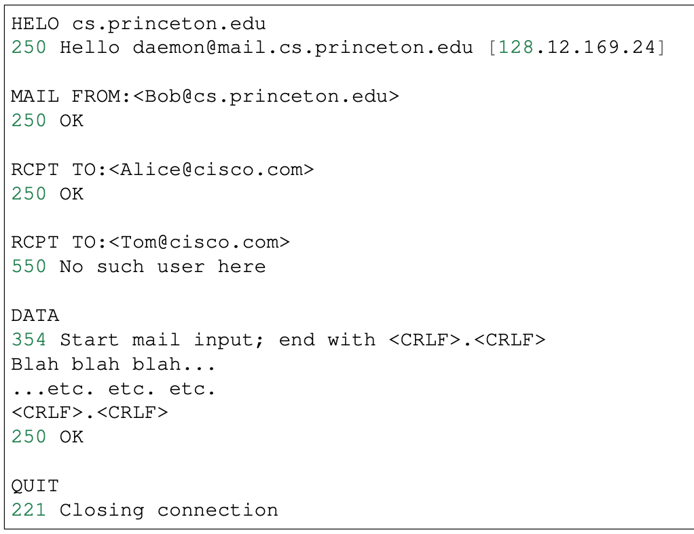

### Mail Reader
After email messages have been delivered to the user's mailbox, the user needs to retrieve and interact with them using a mail reader. In the past, the mail reader was a program running on the same machine as the mailbox. Nowadays, users typically access their mailboxes remotely using protocols like POP or IMAP.

IMAP (Internet Message Access Protocol) is a client/server protocol that operates over TCP. The client, running on the user's desktop machine, sends commands to the mail server (running on the machine hosting the user's mailbox) in the form of ASCII text lines. The server responds accordingly. The interaction starts with the client authenticating and identifying the desired mailbox. Commands like LOGIN and LOGOUT are used, and server responses include OK, NO, and BAD.

When the user wants to fetch a message, the server returns it in MIME format, which the mail reader can decode. IMAP also defines message attributes that are exchanged alongside other commands. These attributes include message size and various flags (e.g., Recent) that help keep the client and server synchronized. For example, when a message is deleted in the mail reader, the client informs the server, and an EXPUNGE command can be used to permanently remove deleted messages.

When the user replies to or sends a new message, the mail reader doesn't use IMAP to forward the message to the mail server. Instead, SMTP is used. The user's mail server acts as the first mail gateway in the path from the desktop to the recipient's mailbox.

In summary, IMAP allows users to access and interact with their mailboxes remotely, providing commands for authentication, retrieving messages, and managing message attributes. SMTP is used for sending and forwarding messages.

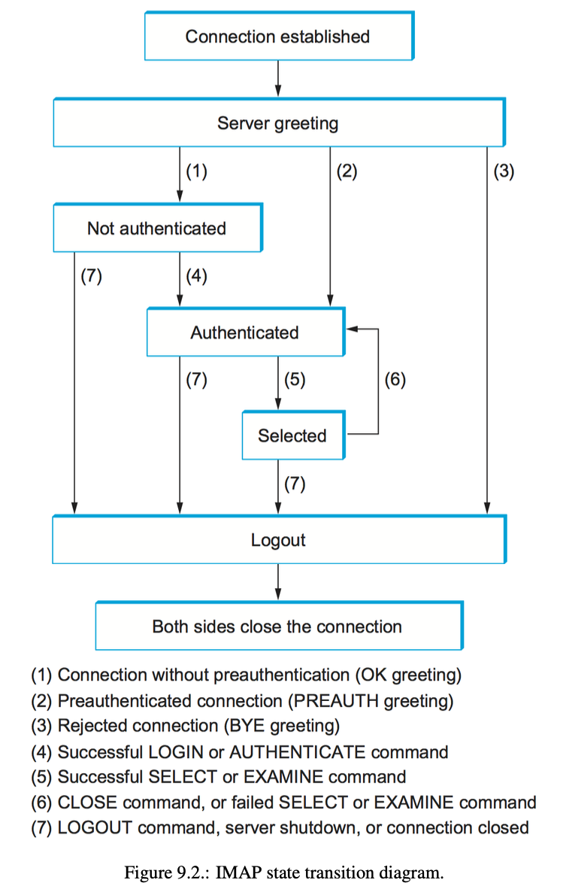

### 9.1.2 World Wide Web (HTTP)
The World Wide Web (Web) is a system designed to organize and retrieve information using hypertext, which allows interlinked documents. It was developed in the late 1980s as a way to make the Internet more accessible. The Web consists of clients (web browsers) and servers that communicate using the HTTP (Hypertext Transfer Protocol) language.

Web browsers like Safari, Chrome, Firefox, or Internet Explorer serve as graphical client programs that display web pages. To retrieve a document, a user can open a URL (Uniform Resource Locator) in their browser. URLs provide the location of objects on the Web. For example, "[http://www.cs.princeton.edu/index.html](http://www.cs.princeton.edu/index.html)" would open a TCP connection to the web server at "[www.cs.princeton.edu](http://www.cs.princeton.edu)" and retrieve the "index.html" file.

Web files typically contain text, images, and other objects like audio or video clips. They often include hypertext links, which are embedded URLs pointing to other files or machines. Clicking on a hypertext link in a web browser opens a new connection and retrieves and displays a new file. This allows users to easily navigate from one document to another, creating a hypertext system.

When a browser fetches a page, it uses HTTP over TCP. HTTP is a text-oriented protocol and follows a request/response model. Each message consists of a start line (indicating request or response), message headers (qualifying the request or response), and a message body (containing the requested page or empty for request messages).

HTTP runs over TCP because TCP provides reliable delivery, flow control, and congestion control, which are crucial for a protocol like HTTP. However, there can be issues when building a request/response protocol on top of TCP if the interactions between the application and transport layer protocols are not carefully considered.

In summary, the Web is a system of interlinked documents accessed through web browsers using HTTP. URLs locate objects on the Web, and hypertext links allow users to navigate between documents. HTTP runs over TCP to ensure reliable data delivery, and the request/response model is used to fetch and display web pages.

### Request Messages
HTTP request messages contain a first line that specifies the operation, web page, and HTTP version. The most common operations are GET (fetch a web page) and HEAD (fetch status information about a web page). GET is used to retrieve and display web pages, while HEAD is used for link validity testing or checking if a page has been modified. Other operations, including POST, allow various actions such as posting content to a server.

The first line of an HTTP request message includes the operation, web page, and version. For example, "GET /index.html HTTP/1.1" requests the server to return the page named "index.html". The request can use an absolute URL or a relative identifier with the host specified in the message headers. Conditional requests can be made using the "If-Modified-Since" header, where the server will return the page only if it has been modified since the specified time.

In summary, HTTP request messages specify the operation, web page, and HTTP version. GET and HEAD are commonly used operations, and additional operations like POST enable various actions. The first line of the request message contains this information, and headers provide additional details such as conditional requests.

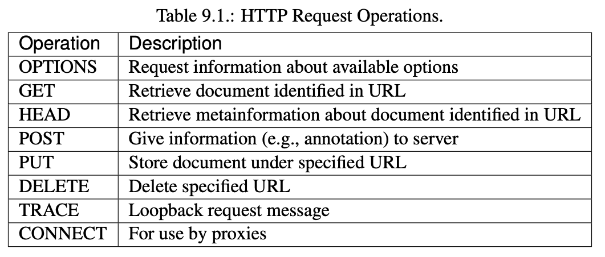

### Response Messages
HTTP response messages start with a START_LINE that includes the HTTP version, a three-digit code indicating the success or failure of the request, and a reason for the response. The response codes are categorized into five types based on the first digit of the code. For example, a response with code 202 indicates that the server accepted the request, while a code 404 means the requested page was not found.

Response messages can include MESSAGE_HEADER lines that provide additional information to the client. For instance, the Location header line can redirect the client to another URL. The response message typically carries the requested page, which is often an HTML document encoded using MIME. The MESSAGE_HEADER lines can specify attributes such as content length, expiration time, and modification time of the page.

It's worth noting that certain response codes, like code 302 for request redirection, play a significant role in Content Distribution Networks (CDNs) by redirecting requests to nearby caches.

In summary, HTTP response messages include a START_LINE indicating the HTTP version, response code, and reason. They can contain MESSAGE_HEADER lines conveying additional information. The response message often carries the requested page, encoded in MIME format, with attributes specified in the MESSAGE_HEADER lines.

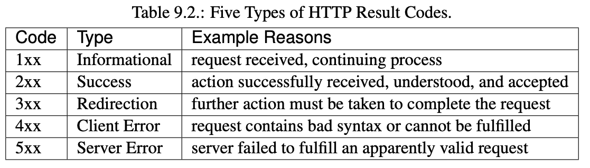

### Uniform Resource Identifiers
A Uniform Resource Identifier (URI) is a character string used to identify a resource, which can be a document, image, service, or anything with identity. URIs are used in HTTP as addresses, and one type of URI is a URL (Uniform Resource Locator).

A URI consists of two parts. The first part is the scheme, which specifies the way of identifying a particular kind of resource. Examples of schemes include "mailto" for email addresses and "file" for file names. The second part, called the scheme-specific part, follows the scheme and is a resource identifier specific to that scheme. For example, "mailto:[santa@northpole.org](mailto:santa@northpole.org)" and "file:///C:/foo.html" are URIs with scheme-specific parts consistent with their respective schemes.

It's important to note that a resource identified by a URI doesn't have to be retrievable or accessible. For instance, XML namespaces are identified by URIs that resemble URLs but are not used for locating resources. Instead, they provide a globally unique identifier for the namespace, without necessarily indicating how to locate it.

In summary, a URI is a string that identifies a resource. URLs are a type of URI used in HTTP. A URI consists of a scheme and a scheme-specific part, and it can identify various types of resources. Not all URIs are used for locating or retrieving resources, as some serve as unique identifiers without providing a means of access.

### TCP Connections
In the original version of HTTP (1.0), a separate TCP connection was established for each data item retrieved from the server. This approach proved to be inefficient, resulting in excessive connection setup and teardown messages, especially when retrieving pages with multiple embedded objects. To address this, HTTP version 1.1 introduced persistent connections, allowing multiple request/response messages to be exchanged over the same TCP connection. Persistent connections offer advantages such as reduced overhead, decreased network load, and improved perceived delay for the user. They also enable TCP's congestion window mechanism to operate more efficiently. However, persistent connections require careful management as neither the client nor the server knows how long to keep a specific connection open. Servers must implement timeouts to close connections that receive no requests for a period of time, and both sides must monitor the other's intent to close the connection. Despite the added complexity, the benefits of persistent connections outweigh the drawbacks.

HTTP/2, a newer version approved in 2015, maintains backward compatibility with 1.1 but introduces two key features. Firstly, it facilitates server-side minification of information sent to web browsers, allowing the server to proactively push required resources (e.g., images, scripts, style files) to the client without the need for subsequent requests. This feature, coupled with compression, aims to minimize latency and accelerate page rendering. Secondly, HTTP/2 enables the multiplexing of several requests on a single TCP connection. It goes beyond the capabilities of version 1.1 by allowing requests to overlap with each other. This is achieved through the use of channels (referred to as streams), permitting multiple concurrent streams labeled with unique stream IDs and limiting each stream to one active request/reply exchange at a time.

In summary, HTTP/1.0 used separate TCP connections for each data item, leading to inefficiency. HTTP/1.1 introduced persistent connections to alleviate this problem. HTTP/2, with its server-side push capability and support for multiplexing requests, further improves performance and reduces latency.

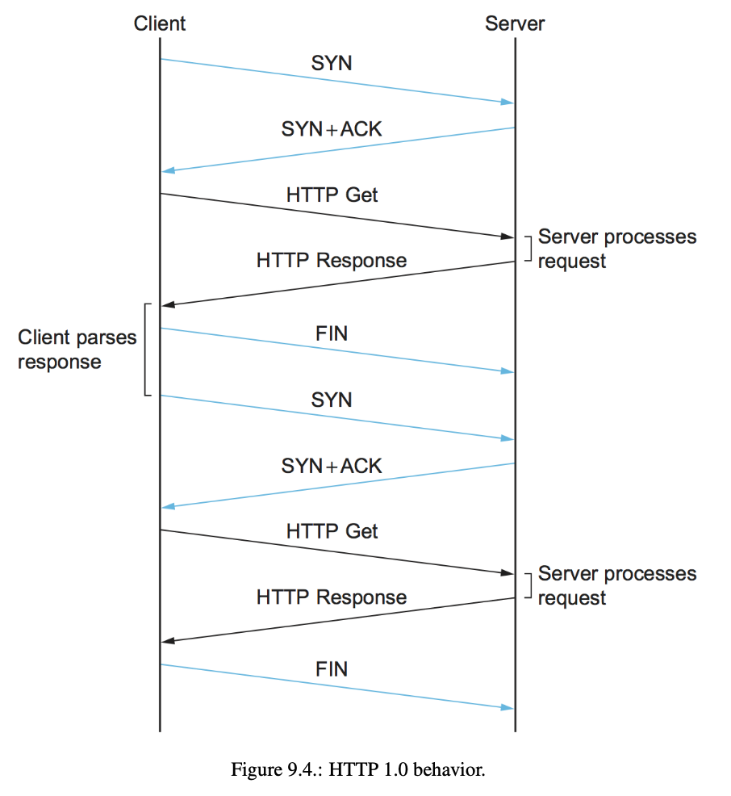
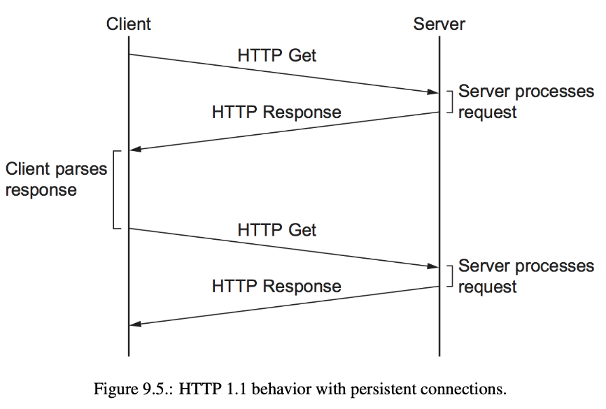

### Caching
Caching plays a crucial role in improving the usability and efficiency of the web. It offers benefits to both clients and servers. From the client's perspective, cached web pages can be retrieved quickly from nearby caches, reducing the perceived loading time. From the server's perspective, offloading requests to caches decreases the server's workload. Caching can be implemented at various levels, including the user's browser, site-wide caches, and Internet Service Providers (ISPs). Each level of caching provides advantages in terms of speed and load reduction.

HTTP has built-in mechanisms to facilitate caching. Pages sent by the server to the client or caches are assigned expiration dates using the "Expires" header field. Caches store these expiration dates and avoid revalidating the page until after the expiration date has passed. To verify the freshness of a cached page, conditional GET operations, such as HEAD or GET with a header line, can be used. Additionally, cache directives dictate caching rules and specify whether a document can be cached, how long it can be cached, and the freshness requirements.

Caching is an essential aspect of HTTP, enabling faster page retrieval and reducing server load. It is supported by mechanisms such as expiration dates, conditional GET operations, and cache directives.

### 9.1.3 Web Services
The increasing demand for computer-to-computer interaction has led to the development of web services. Web services enable direct application-to-application communication, reducing manual steps and enabling efficient interactions between enterprises. For example, an ordering application can communicate with an order fulfillment application to determine product availability or explore alternative suppliers.

Web services require protocols to facilitate communication between applications. A protocol, such as the Package Tracking Protocol, allows systems to exchange information and display it to users seamlessly. With the multitude of potential protocols, tools are needed to simplify their specification and implementation.

There are two advocated architectures for web services: SOAP and REST. SOAP focuses on generating customized protocols for each application using a protocol specification framework and software toolkits. It emphasizes modularity and reuse of specifications. On the other hand, REST views web services as resources accessed via URIs and HTTP. It leverages the strengths of the web architecture, such as stability and scalability. Although REST may not align with the traditional procedural style of invoking remote services, it can effectively expose rich services using a data-oriented or document-passing approach compatible with HTTP.

### Custom Application Protocols (WSDL, SOAP)
The SOAP architecture, based on the Web Services Description Language (WSDL) and SOAP standards, is commonly used for custom application protocols in web services. WSDL is used to specify the details of the application, including supported operations, data formats, and whether a response is involved. SOAP, on the other hand, defines the transport protocol with desired features like reliability and security.

Both WSDL and SOAP utilize XML-based languages to enable easy specification and accessibility for software tools. These tools, such as stub compilers and directory services, automate the generation of protocol implementations. This automation is crucial in a world with numerous custom protocols, as it saves effort by avoiding manual implementation for each protocol. Third-party vendors offer toolkits and application servers to support the development of individual web services, allowing developers to focus more on solving the specific business problems at hand, such as tracking a customer's purchased package.

### Defining Transport Protocols
SOAP is a framework for defining protocols rather than being a protocol itself. It provides a messaging framework with extensibility, allowing the definition of transport protocols tailored to specific application protocols. SOAP uses strategies similar to WSDL, such as XML Schema for message formats, bindings to underlying protocols, and reusable specification elements using XML namespaces.

SOAP introduces the concept of SOAP features, which are extensions of the SOAP messaging framework. These features can include reliability, security, correlation, routing, and message exchange patterns (MEPs) such as request/response and one-way. A SOAP feature specification includes a URI to identify the feature, the required state information and processing at each SOAP node, the information to be relayed to the next node, and, if applicable, the life cycle and temporal/causal relationships of the exchanged messages.

There are two approaches to defining a SOAP protocol with specific features. One approach is layering, where SOAP is bound to an underlying protocol to derive the desired features. For example, SOAP can be bound to HTTP to create a request/response protocol. The second approach involves the use of header blocks. SOAP messages consist of an Envelope, which contains a Header with header blocks, and a Body with the payload. Header blocks encapsulate header information corresponding to specific features. Multiple header blocks may be involved in a single feature, and a single header block can be used in multiple features. SOAP modules define the syntax and semantics of header blocks and are used to compose a protocol with desired features by including the corresponding module specifications.

SOAP modules provide a modular approach to protocol services, allowing the composition of protocols with specific features. However, the potential for interference between modules is a weakness of this approach. While module specifications are required to specify known interactions with other SOAP modules, it may not fully address the problem. Nonetheless, a core set of features and modules that provide important properties can be well known and well understood. The effectiveness of SOAP features and modules introduced in SOAP version 1.2 remains to be seen in practice.

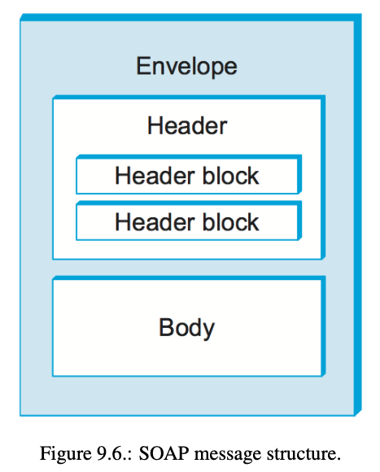

### Standardizing Web Services Protocols
In the context of Web Services, standardization is crucial for ensuring interoperability between different enterprises implementing these services. While WSDL and SOAP provide standards for specifying protocols, specific protocols need to be standardized for effective communication and tool support. This standardization addresses the tension between customization and standardization.

To address this tension, partial standards called profiles are established. Profiles narrow down choices and constraints within WSDL, SOAP, and other referenced standards, resolving ambiguities and filling gaps. Profiles often formalize emerging de facto standards. One widely adopted profile is the WS-I Basic Profile, proposed by the Web Services Interoperability Organization (WS-I). It addresses basic choices in Web Services, requiring exclusive binding of WSDL to SOAP, exclusive binding of SOAP to HTTP using the HTTP POST method, and specifying versions of WSDL and SOAP to be used.

The WS-I Basic Security Profile builds upon the Basic Profile by adding security constraints. It specifies the usage of the SSL/TLS layer and requires conformance to WS-Security, which defines security features in SOAP protocols using techniques like X.509 public key certificates and Kerberos.

The industry consortium OASIS (Organization for the Advancement of Structured Information Standards) has established a suite of SOAP-level standards known as WS-* (WS-star). These standards include WS-Reliability, WS-ReliableMessaging, WS-Coordination, and WS-AtomicTransaction, among others.

By standardizing protocols through profiles and additional specifications like WS-Security and WS-, Web Services can achieve interoperability and provide reliable and secure communication between different systems and organizations.

### A Generic Application Protocol (REST)
The REST (Representational State Transfer) Web Services architecture takes a different approach compared to the WSDL/SOAP architecture. It is based on reapplying the model underlying the World Wide Web architecture, eliminating the need for a separate REST architecture for Web Services. In REST, individual Web Services are considered as resources identified by URIs and accessed via HTTP, which serves as a single generic application protocol with a generic addressing scheme.

Unlike WSDL with user-defined operations, REST utilizes the available set of HTTP methods such as GET and POST to provide an interface to Web Services. The complexity is shifted from the protocol to the payload in REST. The payload represents the abstract state of a resource, and HTTP methods like GET can retrieve the current state representation, while POST can send a representation of the desired state.

The representation of a resource state is abstract and doesn't necessarily resemble the internal implementation of a specific Web Service instance. It's possible to transmit only the parts of a state that are relevant, reducing message size. Additionally, since Web Services share the same protocol and address space as other web resources, parts of states can be passed by reference using URIs, even if they are other Web Services.

REST follows a data-oriented or document-passing style, focusing on defining the structure of the document (state representation) for the application protocol. XML and JSON are commonly used presentation languages for representing the state. Interoperability relies on agreement between the Web Service and its clients on the state representation. While SOAP architecture also requires agreement on payload format, it additionally depends on agreement on the protocol. In REST, the protocol is always HTTP, eliminating this potential source of interoperability issues.

One of the advantages of REST is its leverage of the existing Web infrastructure. Web proxies can enforce security and cache information, and content distribution networks (CDNs) can support RESTful applications. The Web has had time to stabilize and demonstrate scalability, and it provides some inherent security through SSL/TLS.

In terms of evolvability, REST and the Web have an advantage. HTTP, as a standardized protocol, allows for backward-compatible extensions through headers, new methods, and new content types. In contrast, protocol designers using WSDL/SOAP need to incorporate extensibility into each custom protocol they define. However, when it comes to adapting or wrapping legacy applications, WSDL/SOAP may have an advantage due to their compatibility with procedural interfaces.

While there is competition between REST and WSDL/SOAP, it may depend on the individual Web Service and how easy or difficult it is to design REST-style interfaces for them. Amazon, as an early adopter of Web Services, provided both REST and SOAP interfaces, with reports suggesting that a majority of developers prefer the REST interface. However, this is just one example, and the choice between the two architectures can vary based on specific factors and requirements.

### From Web Services to Cloud Services
When both applications are deployed in the cloud to support scalable workloads, we can refer to them as Cloud Services. However, there is a distinction between legacy web services deployed in the cloud and applications designed from scratch to run on a scalable cloud platform, known as cloud-native applications.

In the case of moving a server process from a physical machine to a virtual machine in a cloud provider's datacenter, the responsibility for maintaining the machine shifts from the system administrator to the cloud provider's operations team. However, the application itself still follows the Web Services architecture.

On the other hand, a cloud-native application is specifically designed to leverage the capabilities of a scalable cloud platform. It may adhere to the microservices architecture, which involves breaking down the application into smaller, loosely coupled services that can be independently deployed, scaled, and managed. Cloud-native applications take advantage of cloud-specific features, such as auto-scaling, dynamic resource allocation, and containerization, to achieve greater scalability, resilience, and agility.

Regarding the choice of RPC mechanisms for implementing microservices, there is an ongoing debate between REST+JSON and gRPC+Protocol Buffers. Both can run on top of HTTP, but they have different characteristics and trade-offs. REST+JSON is widely used and understood, leveraging the simplicity and ubiquity of HTTP, while gRPC+Protocol Buffers provides a more efficient binary serialization format and supports multiple programming languages. The choice between the two depends on specific requirements, preferences, and the ecosystem in which the microservices operate.

In conclusion, the distinction between Web Services and Cloud Services lies in whether the applications are legacy web services deployed in the cloud or cloud-native applications designed to fully leverage the capabilities of a scalable cloud platform. The industry trend currently favors cloud-native architectures like microservices, and the choice between REST+JSON and gRPC+Protocol Buffers for implementing microservices depends on various factors.

## 9.3 Infrastructure Applications
The Domain Name System (DNS) is a fundamental protocol that plays a crucial role in the functioning of the Internet. It serves as a distributed naming system that translates human-readable domain names (such as [www.example.com](http://www.example.com)) into IP addresses (such as 192.0.2.1) that computers can understand. DNS allows users to refer to remote hosts by their domain names, making it easier to navigate and access resources on the Internet. While DNS is not typically invoked directly by users, it is a service that is relied upon by virtually all other applications.

Overall, DNS and network management are critical infrastructure applications that underpin the functionality, accessibility, and reliability of the Internet. They ensure that users can seamlessly access online resources and that network operators can effectively manage and maintain the underlying network infrastructure.

### 9.3.1 Name Service (DNS)
In computer networks, host names are assigned to hosts to provide user-friendly identifiers that are easier to remember than numerical addresses. However, routers and network devices operate more efficiently with numerical addresses. To bridge this gap between user-friendly names and router-friendly addresses, a naming service, also known as a name service or middleware, is used. The naming service maps human-readable names to corresponding network addresses.

There are two key differences between host names and host addresses. First, names are usually variable in length and designed to be mnemonic, making them easier for humans to remember. In contrast, addresses are fixed-length numerical values that are more suitable for processing by routers. Second, names typically do not contain embedded routing information, whereas addresses may have routing information included.

To establish a naming system, certain fundamental terminology is introduced. The name space defines the set of possible names and can be either flat (non-hierarchical) or hierarchical (such as Unix file names). The naming system maintains bindings of names to corresponding values, which can be addresses or any other desired value. The resolution mechanism is a procedure that, when given a name, retrieves the associated value. A name server is an implementation of a resolution mechanism available on a network that can be queried to obtain name-to-value mappings.

For the Internet, the Domain Name System (DNS) is the widely used naming system. DNS utilizes a hierarchical namespace and distributes the table of name-to-address bindings across the Internet. The namespace is divided into disjoint pieces, and each piece is stored in name servers that can be queried over the network. DNS replaced the earlier flat table approach used in the early days of the Internet, where a central authority manually maintained a table of name-to-address bindings called HOSTS.TXT.

In the context of the Internet, when a user provides a host name to an application program (such as an email address or URL), the program utilizes the naming system to translate the name into a corresponding host address. The application then establishes a connection to the host using a transport protocol (e.g., TCP) and the host's IP address.

While the process of name resolution may appear straightforward, there are additional complexities involved, as will be explored further.

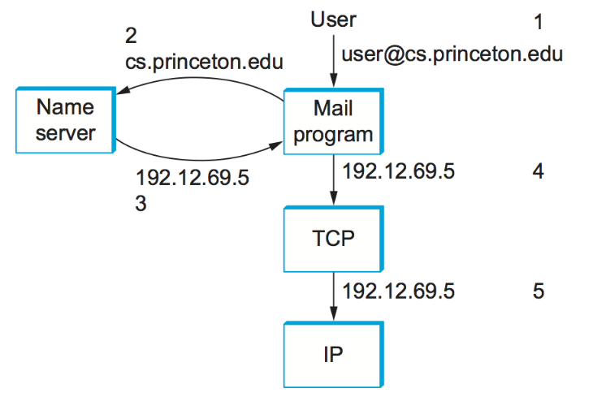

### Domain Hierarchy
In computer networks, host names are assigned to hosts to provide user-friendly identifiers that are easier to remember than numerical addresses. However, routers and network devices operate more efficiently with numerical addresses. To bridge this gap between user-friendly names and router-friendly addresses, a naming service, also known as a name service or middleware, is used. The naming service maps human-readable names to corresponding network addresses.

There are two key differences between host names and host addresses. First, names are usually variable in length and designed to be mnemonic, making them easier for humans to remember. In contrast, addresses are fixed-length numerical values that are more suitable for processing by routers. Second, names typically do not contain embedded routing information, whereas addresses may have routing information included.

To establish a naming system, certain fundamental terminology is introduced. The name space defines the set of possible names and can be either flat (non-hierarchical) or hierarchical (such as Unix file names). The naming system maintains bindings of names to corresponding values, which can be addresses or any other desired value. The resolution mechanism is a procedure that, when given a name, retrieves the associated value. A name server is an implementation of a resolution mechanism available on a network that can be queried to obtain name-to-value mappings.

For the Internet, the Domain Name System (DNS) is the widely used naming system. DNS utilizes a hierarchical namespace and distributes the table of name-to-address bindings across the Internet. The namespace is divided into disjoint pieces, and each piece is stored in name servers that can be queried over the network. DNS replaced the earlier flat table approach used in the early days of the Internet, where a central authority manually maintained a table of name-to-address bindings called HOSTS.TXT.

In the context of the Internet, when a user provides a host name to an application program (such as an email address or URL), the program utilizes the naming system to translate the name into a corresponding host address. The application then establishes a connection to the host using a transport protocol (e.g., TCP) and the host's IP address.

While the process of name resolution may appear straightforward, there are additional complexities involved, as will be explored further.

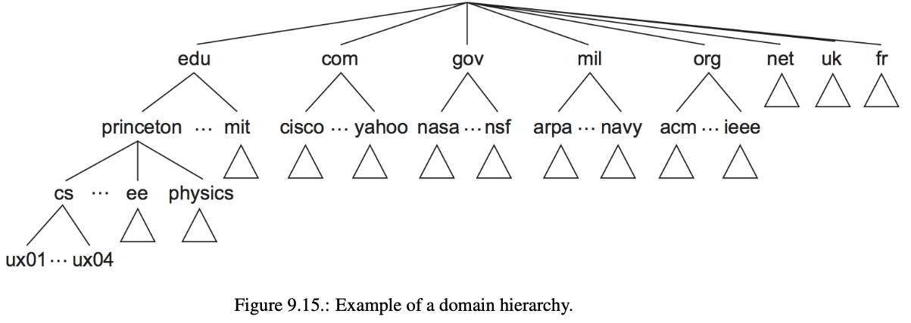

### Name Servers
The implementation of the DNS hierarchy involves partitioning the hierarchy into subtrees called zones. Each zone corresponds to an administrative authority responsible for managing that portion of the hierarchy. For example, the top level of the hierarchy forms a zone managed by ICANN (Internet Corporation for Assigned Names and Numbers). Below that, each organization or institution may have its own zone, such as Princeton University, and within that zone, further subdivisions can be managed by different departments or units.

Zones are implemented using name servers, which are programs accessible over the Internet. Name servers respond to client queries by providing the requested information or pointing to another server that can handle the query. The DNS system can be seen as a hierarchy of name servers rather than a hierarchy of domains.

Each zone is typically implemented in two or more name servers to ensure redundancy and availability of information. Conversely, a name server can handle multiple zones.

The information within each zone is represented by resource records, which are name-to-value bindings. A resource record consists of a 5-tuple with fields including Name, Value, Type, Class, and TTL (time-to-live). The Name field represents the domain name, the Value field represents the corresponding value (e.g., IP address), and the Type field specifies the interpretation of the value. Common types include A (address), NS (name server), CNAME (canonical name or alias), and MX (mail exchange).

To illustrate how resource records represent information in the domain hierarchy, let's consider examples using the domain hierarchy from Figure 9.15:

- Root Name Server:
    
    - NS record: (edu, a3.nstld.com, NS, IN)
    - A record: (a3.nstld.com, 192.5.6.32, A, IN)
    - NS record: (com, a.gtld-servers.net, NS, IN)
    - A record: (a.gtld-servers.net, 192.5.6.30, A, IN)
- Zone within Princeton University:
    
    - NS record: (princeton.edu, dns.princeton.edu, NS, IN)
    - A record: (dns.princeton.edu, 128.112.129.15, A, IN)
    - A record: (email.princeton.edu, 128.112.198.35, A, IN)
- Third-level Name Server within the cs.princeton.edu domain:
    
    - A record: (penguins.cs.princeton.edu, 128.112.155.166, A, IN)
    - CNAME record: ([www.cs.princeton.edu](http://www.cs.princeton.edu), coreweb.cs.princeton.edu, CNAME, IN)
    - A record: (coreweb.cs.princeton.edu, 128.112.136.35, A, IN)
    - MX record: (cs.princeton.edu, mail.cs.princeton.edu, MX, IN)
    - A record: (mail.cs.princeton.edu, 128.112.136.72, A, IN)

It's important to note that DNS is primarily used to name hosts and sites rather than individual people or other objects like files or directories. Other naming systems, such as X.500 and LDAP, are typically used for identifying people and providing additional attributes like names, titles, phone numbers, and addresses.
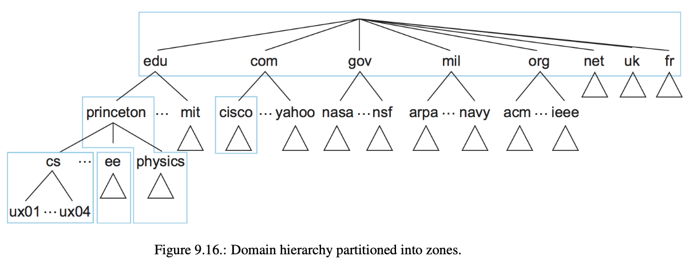
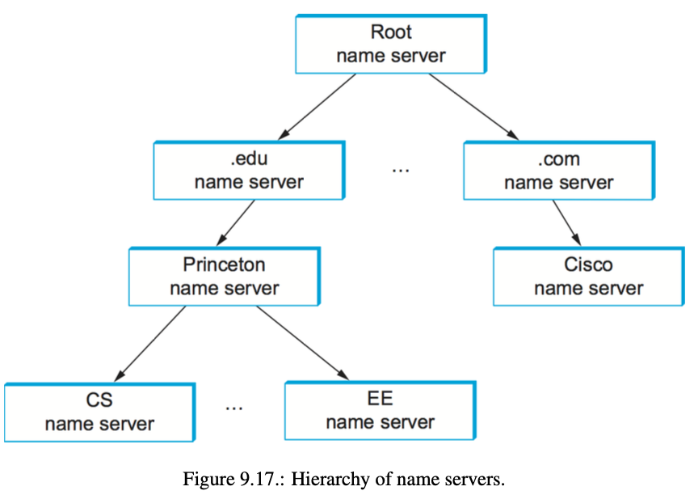

### Name Resolution
When a client wants to resolve a domain name, such as "penguins.cs.princeton.edu," the name resolution process involves engaging a hierarchy of name servers. Here's a step-by-step illustration of how the resolution occurs using the set of servers mentioned in the previous subsection:

1. The client initially sends a query for "penguins.cs.princeton.edu" to one of the root servers. Although this is not common in practice, it helps demonstrate the basic operation. The root server, unable to match the entire name, returns the best match it has, which is the NS record for the "edu" domain. It also returns the associated A record for the "a3.nstld.com" server.
    
2. The client then sends the same query to the "a3.nstld.com" server (192.5.6.32). Again, the server cannot fully match the name and returns the NS and A records for the "princeton.edu" domain.
    
3. The client sends the same query to the server responsible for the "princeton.edu" domain (128.112.129.15), which returns the NS and A records for the "cs.princeton.edu" domain.
    
4. Finally, the client queries the server responsible for the "cs.princeton.edu" domain (128.112.136.10) and receives the A record for "penguins.cs.princeton.edu," indicating that its corresponding IP address is 128.112.155.166.
    

This example raises two additional questions about the resolution process. The first question is how the client initially locates the root server or the server that knows how to resolve names. This issue is addressed by bootstrapping the system. The mapping of name-to-address for one or more root servers is well known and published through means outside the naming system itself.

In practice, clients typically don't need to know about the root servers directly. Instead, each client program running on an Internet host is configured with the address of a local name server. For example, hosts within the Department of Computer Science at Princeton may be aware of the server on "dns1.cs.princeton.edu." This local name server, in turn, has resource records for one or more root servers.

Therefore, the name resolution process involves the client querying the local server, which acts as a client on behalf of the original client, querying the remote servers. This client-server interaction allows the local server to cache responses and potentially resolve future queries without needing to go out over the network. The TTL field in resource records indicates the duration for which the records can be cached. This caching mechanism can also be utilized higher up in the hierarchy, reducing the load on root and top-level domain (TLD) servers.

The second question concerns resolving partial names. When a user submits a partial name (e.g., "penguins") instead of a complete domain name (e.g., "penguins.cs.princeton.edu"), the client program is configured with the local domain in which the host resides (e.g., "cs.princeton.edu"). The client appends this local domain to any simple names before sending the query. This ensures that the query is made within the appropriate context.

**Key Takeaway**
Just to make sure we are clear, we have now seen three different levels of identifiers—domain names, IP addresses, and physical network addresses—and the mapping of identifiers at one level into identifiers at another level happens at different points in the network architecture. First, users specify domain names when interacting with the application. Second, the application engages DNS to translate this name into an IP address; it is the IP address that is placed in each datagram, not the domain name. (As an aside, this translation process involves IP datagrams being sent over the Internet, but these datagrams are addressed to a host that runs a name server, not to the ultimate destination.) Third, IP does forwarding at each router, which often means that it maps one IP address into another; that is, it maps the ultimate destination’s address into the address for the next hop router. Finally, IP engages the Address Resolution Protocol (ARP) to translate the next hop IP address into the physical address for that machine; the next hop might be the ultimate destination or it might be an intermediate router. Frames sent over the physical network have these physical addresses in their headers.

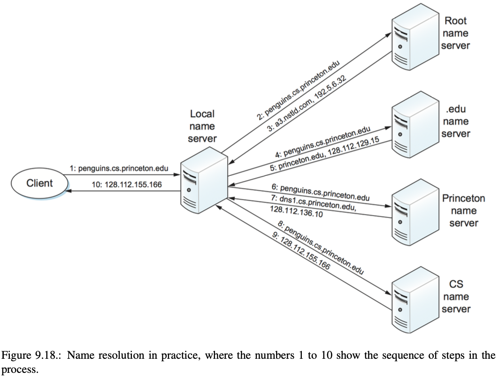

## 9.4 Overlay Networks
Overlay networks have emerged as a means of introducing new functionality into the Internet, blurring the line between packet forwarding and application processing. An overlay network can be seen as a logical network built on top of an underlying network. In this context, the Internet itself can be viewed as an overlay network implemented on top of the infrastructure provided by the old telephone network.

In an overlay network, each node exists in both the overlay and the underlying network. These nodes process and forward packets in an application-specific manner. The links connecting the overlay nodes are created as tunnels through the underlying network. It is possible to have multiple overlay networks coexisting on the same underlying network, each implementing its own application-specific behavior. Furthermore, overlay networks can be nested, with one overlay network built on top of another. In this case, the Internet serves as the underlying network for all the discussed overlay networks.

Tunneling is a technique frequently used to implement overlay networks. It involves treating the multi-hop path between two nodes as a single logical link. The nodes at both ends of the tunnel encapsulate packets within an outer header and forward them through the underlying network. The intermediate routers only examine the outer header and are unaware of the inner header added by the end nodes. This allows for application-specific forwarding decisions to be made within the overlay network.

In a tunneling scenario, the overlay nodes (e.g., A, B, and C) are capable of interpreting both the inner and outer headers, while the intermediate routers handle only the outer header. The overlay nodes can have different addresses in the overlay network compared to the underlying network. For example, their underlying addresses might be conventional 32-bit IP addresses, while their overlay addresses could be experimental 128-bit addresses. It's even possible for the overlay network to route based on other factors such as URLs, domain names, XML queries, or packet content, rather than traditional addresses.

Overlay networks offer a flexible way to introduce new functionality and application-specific processing into the Internet by building logical networks on top of the existing infrastructure.
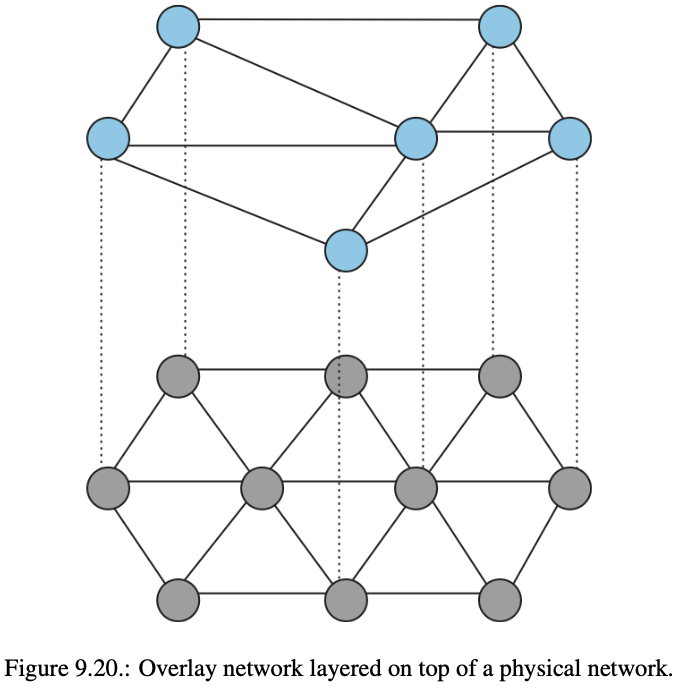
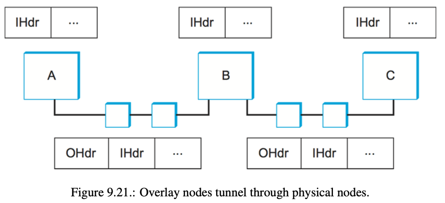

### 9.4.1 Routing Overlays
In the context of routing overlays, the simplest form is one that is designed to support an alternative routing strategy without involving additional application-level processing at the overlay nodes. A virtual private network (VPN) can be considered an example of a routing overlay. However, VPNs primarily involve defining alternative routing table entries rather than introducing new routing algorithms. These routing overlays use "IP tunnels" and are supported by many commercial routers.

But what if you want to use a routing algorithm that is not included in commercial router products? In such a case, you can implement your algorithm on a set of end hosts and establish tunnels through the Internet routers. These end hosts would act as routers within the overlay network. While they may be physically connected to the Internet through a single link as hosts, within the overlay network, they would be connected to multiple neighbors via tunnels.

Since overlays are typically used to introduce new technologies independently of the standardization process, there are no standard overlays that can be cited as examples. Instead, let's explore several experimental systems created by network researchers to illustrate the concept of routing overlays.

### Experimental Versions of IP
Overlays are well-suited for deploying experimental versions of IP that have the potential to become widely adopted in the future. One example is IP multicast, which initially started as an extension to IP and is still not universally enabled in Internet routers. To implement IP multicast, the MBone (multicast backbone) was created as an overlay network built on top of the existing unicast routing infrastructure of the Internet. The MBone facilitated the development and deployment of multimedia conference tools, including broadcasting IETF meetings to thousands of participants over the network. However, with the availability of commercial conferencing tools today, the need for the MBone has diminished.

Similar to VPNs, the MBone utilized IP tunnels and IP addresses. However, it implemented a different forwarding algorithm, forwarding packets to all downstream neighbors within the shortest path multicast tree. As an overlay, multicast-aware routers tunneled through legacy routers, with the aspiration of eventually eliminating the need for legacy routers altogether.

Another overlay network called the 6-BONE was created to facilitate the incremental deployment of IPv6. Like the MBone, the 6-BONE used tunnels to forward packets through IPv4 routers. However, unlike the MBone, the 6-BONE didn't merely reinterpret IPv4's 32-bit addresses but instead utilized IPv6's 128-bit address space for packet forwarding. The 6-BONE also supported IPv6 multicast. Although commercial routers now widely support IPv6, overlays remain a valuable approach for evaluating and refining new technologies during their early stages.

### End System Multicast
End system multicast is an alternative strategy to IP multicast that addresses the limited deployment of IP multicast in the global Internet. Instead of relying on Internet routers, end system multicast allows participating end hosts to implement their own multicast trees for specific multicast-based applications.

In end system multicast, the overlay network consists only of internet hosts, not routers. Communication between hosts occurs through UDP tunnels rather than IP tunnels, making it simple to implement as regular application programs. This approach considers the underlying network as a fully connected graph, where each host can send messages to every other host. The goal is to find the multicast tree that spans all the group members within this graph.

To construct the intermediate mesh overlay, multiple levels of overlay networks are used. The first step involves creating a simple mesh overlay on top of the fully connected Internet. Each host measures roundtrip latency to other nodes and selectively adds links to the mesh based on favorable latency conditions. Nodes exchange membership lists with their neighbors, incorporating the information into their own lists and forwarding them further. When a host wants to join the multicast overlay, it sends a "join mesh" message to an existing node, connecting itself to the mesh. Keep-alive messages are periodically sent to neighbors to indicate continued participation.

When a node leaves the group, it sends a "leave mesh" message to its neighbors, and this information propagates through the mesh. In case of partitioning, where the mesh becomes divided, nodes can create new edges to nodes in the other partition by sending a "join mesh" message. The mesh gradually evolves based on the evaluation of edge utility and cost. Each node periodically probes random members it is not connected to, measures round-trip latency, and evaluates the utility of adding new edges. Similarly, the cost of each existing link is evaluated, and links with low cost can be removed.

Once the mesh overlay is constructed, a multicast routing algorithm such as DVMRP can be run on top of it to build the multicast tree. The scalability issue faced by Internet-wide multicast is mitigated because the intermediate mesh can include only the nodes interested in the particular multicast group.

Although the protocol for constructing the mesh overlay does not guarantee an optimum network, simulations and practical experience suggest that it performs well in practice. The resulting multicast tree within the mesh provides an efficient solution for end system multicast applications.
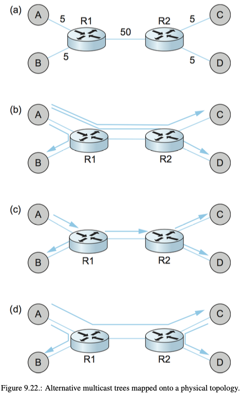
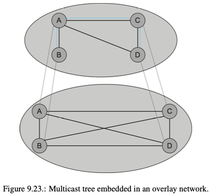

### Resilient Overlay Networks
Resilient Overlay Networks (RON) are overlays that take advantage of the observation that the triangle inequality does not hold in the Internet, meaning that sometimes it's more efficient to send packets indirectly through an intermediate node rather than sending them directly to the destination. RONs aim to find alternative routes for traditional unicast applications by closely monitoring path quality and selecting the optimal route based on latency, available bandwidth, and loss probability.

Unlike scalable routing algorithms like the Border Gateway Protocol (BGP), RON focuses on a smaller network scale, typically a few dozen nodes. It actively probes and monitors the quality of paths between every pair of sites in terms of latency, available bandwidth, and loss probability. This allows RON to dynamically select the best route at any given moment and quickly adapt to network changes or outages. RON has demonstrated the ability to deliver modest performance improvements to applications and significantly reduce recovery time from network failures.

However, RON is not designed to be a scalable solution for arbitrary communication between random hosts. Hosts need to know in advance that they are likely to communicate and join the same RON. This makes RON suitable for specific settings such as connecting a few dozen corporate sites spread across the Internet or establishing private overlays for specific applications, like Software-Defined WAN (SD-WAN) in today's terminology.

The scalability of RON becomes a concern when multiple RONs are deployed, and everyone starts running their own overlays. The impact of millions of RONs actively probing paths and competing for the same routes is yet to be fully understood. Questions remain regarding the potential overhead on the network and the overall behavior and performance when numerous RONs coexist and contend for resources. These questions remain unanswered and require further research and investigation.

**Key Takeaway**
All of these overlays illustrate a concept that is central to computer networks in general: virtualization. That is, it is possible to build a virtual network from abstract (logical) resources on top of a physical network constructed from physical resources. Moreover, it is possible to stack these virtualized networks on top of each other and for multiple virtual network to coexist at the same level. Each virtual network, in turn, provides new capabilities that are of value to some set of users, applications, or higher-level networks.

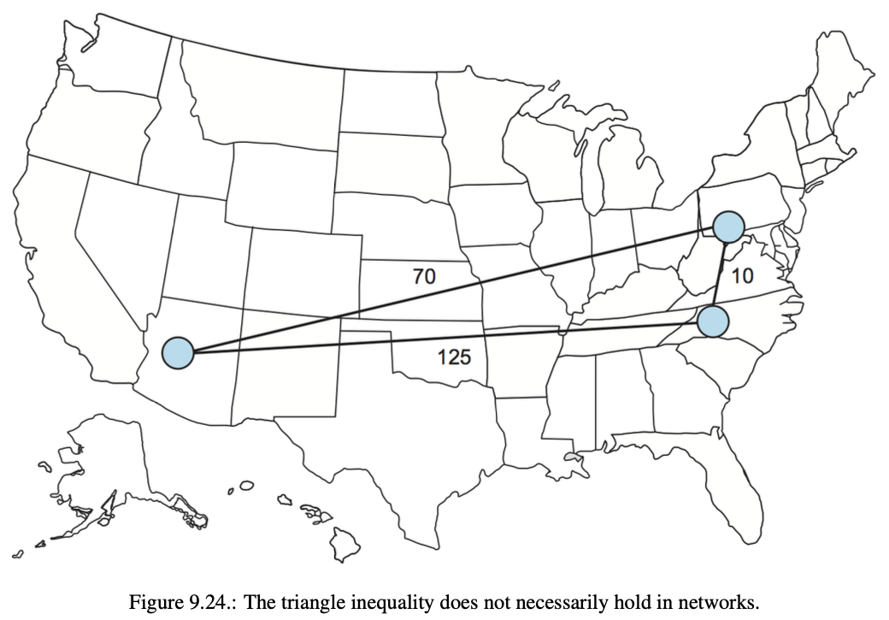

### 9.4.2 Peer-to-Peer Networks
In the context of peer-to-peer networks, the term "peer-to-peer" refers to a system where users can directly share resources (such as files, storage, bandwidth, and computing power) with each other without relying on a central server. It allows a community of users to collaborate and pool their resources, creating a larger network that offers benefits like a larger archival store, more significant video/audio conferences, complex searches, and computations than what individual users could achieve on their own.

Peer-to-peer networks are often described as decentralized and self-organizing, meaning that the network nodes organize themselves without the need for central coordination. However, it's important to note that not all systems labeled as peer-to-peer truly meet these criteria. For example, Napster, despite being referred to as peer-to-peer, relied on a central registry of known files, and users had to search this directory to find the machine offering a specific file. The actual file download process occurred between two users' machines, resembling a traditional client/server transaction.

A true peer-to-peer system operates in a decentralized manner, where both the process of locating an object of interest and the process of downloading that object onto a local machine occur without the need for a centralized authority. Additionally, a scalable peer-to-peer system can accommodate millions of nodes. In such a system, the nodes represent hosts that are willing to share objects of interest (e.g., files), and the links connecting these nodes form tunnels that users traverse to track down the desired objects. This concept of an overlay network, where nodes and links represent users and their connections, respectively, helps clarify the structure and functioning of peer-to-peer systems.

### Gnutella
Gnutella is an early peer-to-peer network that aimed to differentiate between sharing music (potentially violating copyrights) and general file sharing. Unlike previous systems, Gnutella did not rely on a centralized registry of objects. Instead, Gnutella participants formed an overlay network, similar to the one depicted in Figure 9.25. Each node running the Gnutella software had knowledge of other Gnutella nodes. The relationship "A and B know each other" represented edges in the graph.

When a user on a Gnutella node wanted to find an object, they would send a QUERY message to their neighbors in the graph, specifying the file's name. If one of the neighbors had the object, it would respond with a QUERY RESPONSE message, providing information on where the object could be downloaded (such as an IP address and TCP port number). The node could then use GET or PUT messages to access the object. If the node couldn't resolve the query, it forwarded the QUERY message to its neighbors (excluding the one that sent the query), and the process repeated. In essence, Gnutella flooded the overlay network to locate the desired object. To prevent indefinite flooding, each query had a Time-to-Live (TTL) value.

Each QUERY message contained a unique query identifier (QID), but it didn't include the identity of the original message source. Instead, each node kept a record of recently seen QUERY messages, storing both the QID and the neighbor that sent it. This history served two purposes. First, if a node received a QUERY with a matching QID to a recent one, it would not forward the message, cutting off forwarding loops faster than the TTL alone. Second, when a node received a QUERY RESPONSE from a downstream neighbor, it knew to forward the response to the upstream neighbor that originally sent the QUERY message. This way, the response reached the original node without revealing who initiated the query to intermediate nodes.

Regarding the evolution of the graph, when a node joined the Gnutella overlay, it needed to know at least one other node. This initial node served as its link to the overlay. After joining, a node learned about other nodes through QUERY RESPONSE messages for requested objects and responses passing through it. Each node had the freedom to choose which discovered nodes it wanted to keep as neighbors. The Gnutella protocol included PING and PONG messages for a node to probe the existence of a particular neighbor and receive a response, respectively.

It's worth noting that Gnutella, as described, is not considered a particularly sophisticated protocol, and subsequent systems have aimed to improve upon it. One area of potential improvement is how queries are propagated. While flooding guarantees finding the desired object in the fewest hops possible, it doesn't scale well. Other approaches include forwarding queries randomly or based on past success probabilities. Another dimension for improvement is proactively replicating objects, as having multiple copies makes finding a specific object easier. Alternatively, entirely different strategies can be developed, which will be explored in the following discussion.
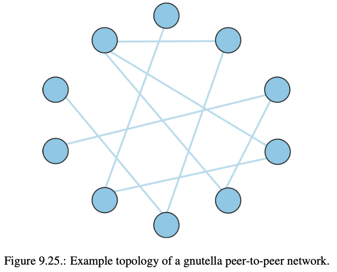

### Structured Overlays
Structured overlays, as opposed to unstructured overlays like Gnutella, are designed to provide reliable and efficient object location in peer-to-peer networks. They achieve this by conforming to a specific graph structure during overlay construction and maintenance. In structured overlays, two main questions need to be addressed: (1) How do we map objects to nodes? and (2) How do we route requests to the node responsible for a specific object?

To map objects to nodes in a structured overlay, a technique called consistent hashing is commonly used. Consistent hashing involves hashing a set of objects uniformly across a large ID space. Each object is placed on the node whose ID is numerically closest to the object's ID in the ID space. This approach ensures that objects are distributed evenly across nodes and minimizes the number of object relocations when nodes join or leave the network.

Routing in structured overlays is achieved by routing messages towards the node responsible for the target object. Each node maintains a routing table, which is a two-dimensional array. The routing table contains entries based on the shared prefixes of node IDs. When a node receives a message, it determines if the target node is within the range of its leaf set (a set of numerically larger and smaller node IDs). If it is, the message is forwarded to the numerically closest member in the leaf set. If not, the node routes the message based on the entries in its routing table, selecting the entry that matches the shared prefix with the target ID. This process continues until the message reaches the node responsible for the object.

Adding a node to the structured overlay involves routing an "add node message" to the node numerically closest to the joining node's ID. Through this routing process, the new node learns about other nodes with shared prefixes and populates its routing table. Existing nodes also have the option to update their routing tables when a new node joins and adds a longer prefix.

Structured overlays provide a probabilistic bound on the number of routing hops required to locate an object, typically logarithmic in the number of nodes in the overlay. However, the delay introduced by each hop can be substantial, as intermediate nodes may be located in different parts of the Internet. To mitigate this, routing table entries can be chosen to refer to nearby nodes in the physical network, reducing the end-to-end routing delay.

Once the routing infrastructure is established, various services can be built on top of structured overlays. For example, a file sharing service can utilize object names as file names and replicate files across multiple nodes for improved availability. Other services, such as multicast applications, can also benefit from the structured overlay by constructing multicast trees from the overlay edges, reducing the overhead of separate multicast tree construction and maintenance.

Overall, structured overlays provide a more reliable and efficient approach to object location in peer-to-peer networks compared to unstructured overlays like Gnutella.
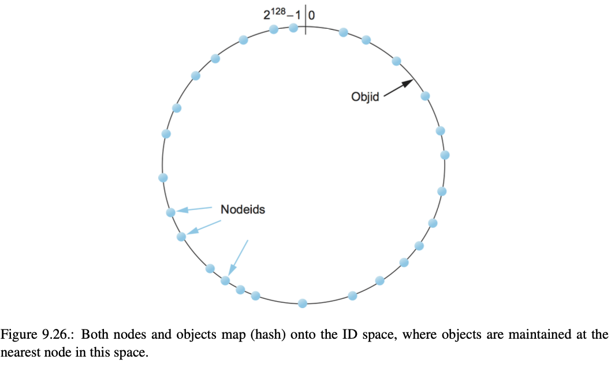
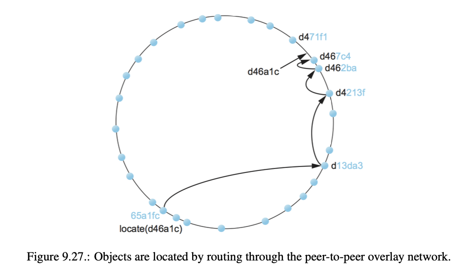
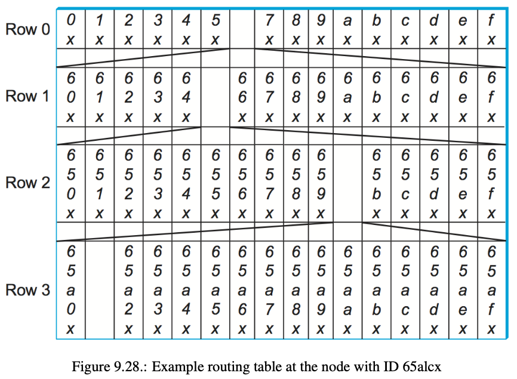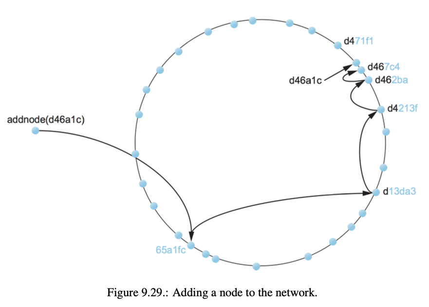

### BitTorrent
BitTorrent is a peer-to-peer file sharing protocol that enables efficient distribution of files by replicating and sharing file pieces among multiple peers. It was created by Bram Cohen and has become widely used for downloading and sharing large files over the internet.

Here's a summary of how BitTorrent works:

1. Swarm Formation: A BitTorrent swarm is formed when a file is shared. It starts with a single peer that has a complete copy of the file.
    
2. Joining the Swarm: When a new peer wants to download the file, it joins the swarm by downloading a file containing meta-information about the file and swarm. This file typically includes the file's size, piece size, SHA-1 hash values for each piece, and the URL of the swarm's tracker.
    
3. Tracker: The tracker is a server that keeps track of the swarm's current members. Upon joining the swarm, the new peer sends a message to the tracker with its network address, a randomly generated peer ID, and a SHA-1 hash of the main part of the file (used as the swarm ID).
    
4. Peer Connections: The tracker responds to the new peer with a partial list of peers in the swarm, including their IDs and network addresses. The new peer establishes connections, typically over TCP, with some of these peers. It can also request additional peers from the tracker.
    
5. BitTorrent Connection: A BitTorrent connection is established between peers after their TCP connections are set up. Each peer sends a bitmap indicating which pieces it has downloaded. This allows peers to know the initial state of the other peers in terms of the downloaded pieces.
    
6. Piece Downloading: Peers download pieces of the file from each other. When a peer finishes downloading a piece, it notifies its connected peers about the availability of that piece. Peers keep track of which connected peers have specific pieces.
    
7. Random Piece Downloading: Peers download pieces in random order to prevent situations where peers have strict subsets or supersets of pieces compared to other peers. This randomization helps ensure fair distribution and availability of pieces within the swarm.
    
8. Choking and Unchoking: BitTorrent incorporates mechanisms to encourage good behavior and discourage bad behavior among peers. Peers are expected to upload pieces to other peers while downloading. If a peer fails to upload adequately, another peer can choose to "choke" it, temporarily stopping uploads. There are also mechanisms for unchoking peers and limiting the number of active connections to maintain good network performance.
    
9. Trackerless Swarms: While BitTorrent initially relied on a central tracker, newer versions support "trackerless" swarms using Distributed Hash Table (DHT) implementations. Peer finders form an overlay network using UDP to implement DHT, allowing peers to discover other peers without relying on a central tracker.
    

By leveraging the replication and sharing of file pieces, BitTorrent maximizes download speeds, reduces the load on individual sources, and ensures efficient distribution of files across the network.

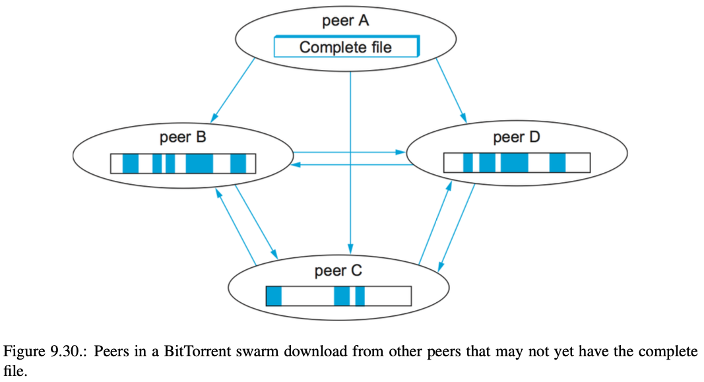

### 9.4.3 Content Distribution Networks
Content Distribution Networks (CDNs) are systems designed to address the bottlenecks in web page downloading and improve the overall performance of content delivery. CDNs involve the geographical distribution of server surrogates or caches that store and serve cached copies of web pages. Instead of users having to access a single backend server, they can retrieve content from a surrogate server that is closer to their location, reducing latency and improving response time.

The primary objectives of CDNs are to enhance response time for clients and increase the system throughput. CDNs achieve this by employing redirectors, which are responsible for forwarding client requests to the most suitable server. The selection of the server can be based on various factors, such as network proximity, load balancing, and locality.

By distributing surrogate servers across different geographic locations and backbone ISPs, CDNs can mitigate the limitations imposed by the last mile, overloaded servers, and peering points. Flash crowds, where a sudden surge in demand occurs due to popular events or breaking news, can be handled more effectively by distributing the load across multiple servers. Additionally, CDNs reduce the need for client requests to traverse multiple ISPs, improving efficiency and reducing the chances of congestion at peering points.

CDNs operate based on proactive replication, where the backend servers replicate content across the surrogate servers in advance. This approach ensures that the surrogates have the requested content readily available, rather than needing to fetch it on demand. However, dynamic and frequently changing content still needs to be retrieved from the backend servers, while static content is distributed across the surrogates.

The use of CDNs allows multiple websites to benefit from the infrastructure and services provided by commercial CDNs like Akamai. These CDNs can manage the cost of maintaining geographically distributed surrogate servers by serving multiple customers and amortizing the expenses.

Determining the optimal distribution of client requests is a complex task for CDNs. Factors such as response time, system throughput, load balancing, and cache locality need to be considered. The selection of the appropriate combination of factors depends on the specific requirements and goals of the CDN.

### Mechanisms
There are several mechanisms that can be used to implement redirection within Content Distribution Networks (CDNs):

1. DNS-based redirection: One approach is to augment the Domain Name System (DNS) to return different server addresses to clients. For example, the DNS server can return the IP address of a server with the lightest load or use round-robin fashion to distribute requests among a set of servers. However, DNS-based redirection typically operates at the level of a site rather than a specific URL. To address this limitation, servers can rewrite the embedded URLs in the response, directing the client to the most appropriate server for that specific object. Commercial CDNs often use a combination of URL rewriting and DNS-based redirection. The DNS servers used by CDNs have short Time-to-Live (TTL) values for resource records to ensure that clients frequently update their cached mapping of URLs to server addresses.
    
2. HTTP redirect feature: The HTTP redirect feature involves the server responding to a client's request with a new server address that the client should contact for the requested page. However, server-based redirection introduces additional round-trip time and can potentially overload servers due to the redirection tasks. An alternative approach is to have a node, such as a local web proxy, close to the client that intercepts the request and instructs the client to request the page from the appropriate server. In this case, the redirector needs to be positioned on a choke point where all requests leaving the site pass through it, or the client explicitly addresses the proxy.
    

CDNs employ these mechanisms to facilitate the redirection of client requests to the most suitable servers within the network. While CDNs may share similarities with overlay networks in terms of application-level routing decisions, they are not typically considered traditional overlay networks. In today's Internet architecture, redirection is implemented indirectly, with the redirector returning the appropriate destination address to the client, which then contacts the server directly.
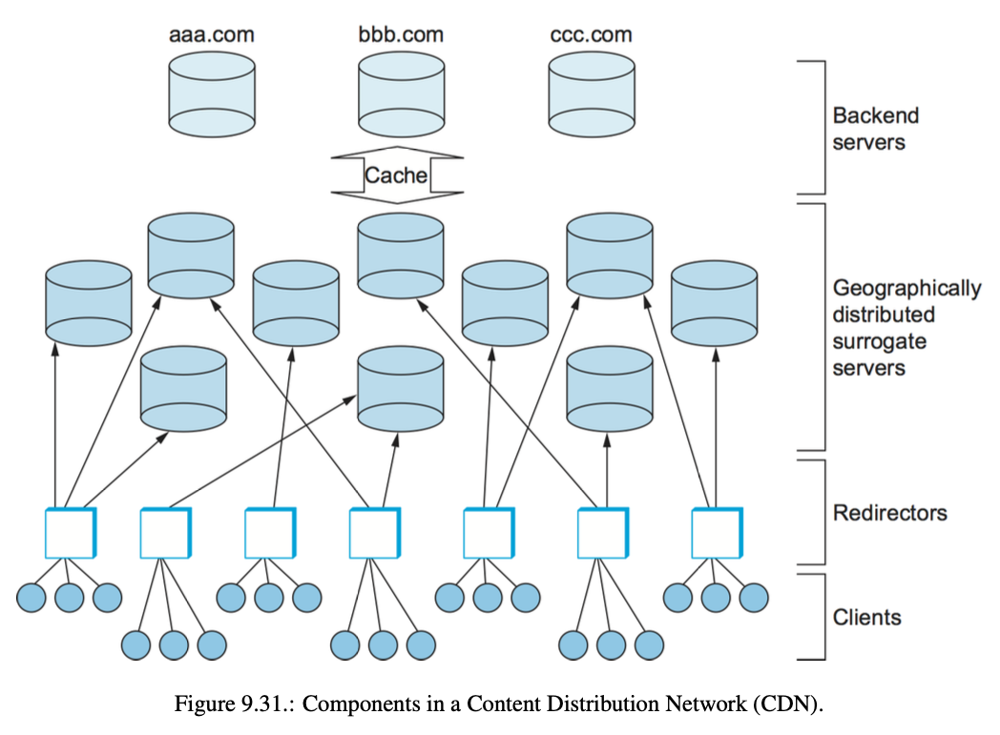

### Policies
When it comes to selecting servers and distributing requests within Content Distribution Networks (CDNs), redirectors employ various policies to optimize load balancing and response time. Here are some example policies:

1. Round-robin and random selection: These simple policies evenly distribute the load across the available servers. However, they may not effectively reduce the client-perceived response time as requests for the same URL are forwarded to different servers, reducing the likelihood of serving the page from a server's cache.
    
2. Hashing: Redirectors use hashing schemes to deterministically map URLs to a small range of values, ensuring that requests for the same page are directed to the same server (or a small set of servers) without the need for global coordination. The classic modulo hashing scheme is not ideal for CDNs as it leads to significant reassignment of pages when the number of servers changes. Instead, a consistent hashing algorithm is often used, where each redirector hashes both the servers and the URL to assign the URL to the server closest to its hash value on a unit circle. This approach allows for local changes in request assignments when servers are added or removed.
    
3. Server load balancing: Redirectors can take server load into account to balance the workload. The redirector maintains information about the current load of each available server. Upon receiving a URL, the redirector hashes the URL with each server and sorts the resulting values. The redirector then considers the servers in decreasing order of weight (based on the sorted list) and selects the server with the load below a certain threshold. This approach ensures that server load is distributed evenly among the servers and that heavily loaded servers are bypassed in favor of less busy ones.
    
4. Network proximity: Network proximity can be factored into the redirection decision to improve performance. One approach is to use response time as a proxy for server load and prioritize servers that respond faster. Another approach is to limit the candidate set of servers considered by the redirector to those that are physically close to the client. This can be achieved by selecting servers within the same ISP or within a certain number of network hops from the client. Balancing network proximity and server cache locality is an ongoing research area.
    

These policies aim to balance the load, improve response time, and make efficient use of server resources within CDNs. The specific policy used may vary depending on the CDN provider and the specific requirements of the application or website being served.

### Perspective: The Cloud is the New Internet
The perspective presented here is that the cloud has become the new internet, reshaping the way network applications are implemented. The combination of commodity clouds and overlay networks has significant implications.

Traditionally, internet applications like email and web servers were hosted on-premises, but there has been a shift towards running them on virtual machines in commodity clouds. This migration has led to a change in terminology, from "Web Services" to "Cloud Services," and the adoption of cloud-native microservices.

However, the impact of the cloud on network applications goes beyond this migration. Overlay-based applications require a wide footprint with many points of presence globally. While using existing IP routers would be ideal, it's not feasible for random people to load overlay software onto these routers. Crowdsourcing hosting sites is also challenging as it's difficult to ensure sufficient capacity and reliability.

Commodity clouds, such as Amazon AWS, Microsoft Azure, and Google Cloud Platform, provide a solution to these challenges. They offer a vast number of servers distributed across well-connected sites globally. This allows developers to pay for the right to load and run their software on servers spread worldwide.

For example, in scenarios like streaming live video or audio channels to millions of users or supporting large-scale video conferencing sessions, overlay multicast trees can be constructed with overlay nodes located at cloud sites. End-users can connect to the multicast trees of their choice through web browsers or smartphone apps. Additionally, developers can purchase storage capacity at cloud sites to create their own Content Distribution Network (CDN) for storing and delivering content.

Looking ahead, the distinction between the internet and the cloud is becoming increasingly blurred. Application software is embedded within or distributed across the network, making it challenging to differentiate between the two. This convergence will deepen as the cloud expands closer to the network edge and hardware devices used in internet/cloud sites become more standardized due to economies-of-scale.

Overall, the cloud's wide distribution of servers and its integration with overlay networks have revolutionized the implementation of network applications, enabling scalable, globally accessible services.